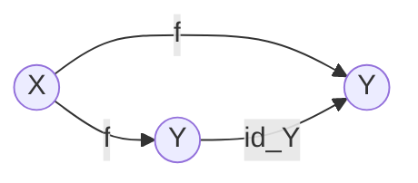
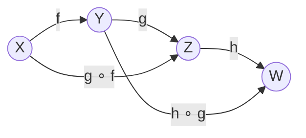
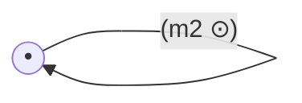
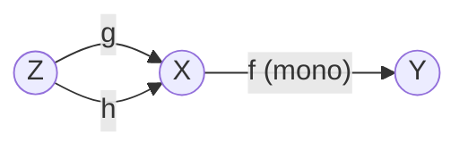
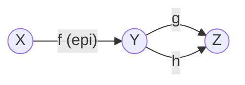
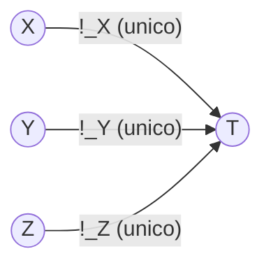
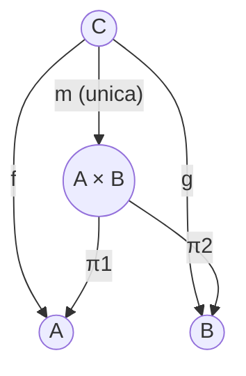
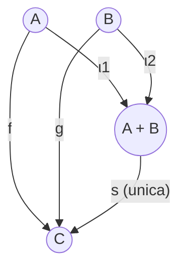
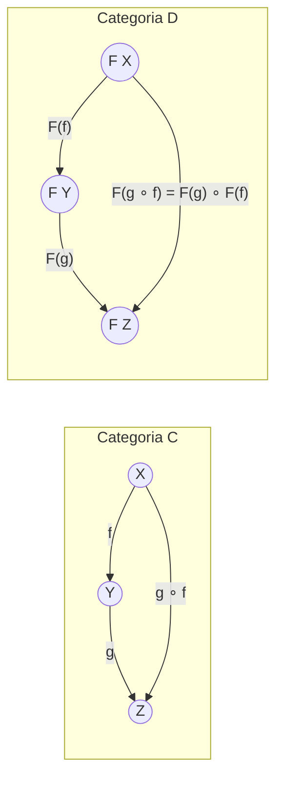
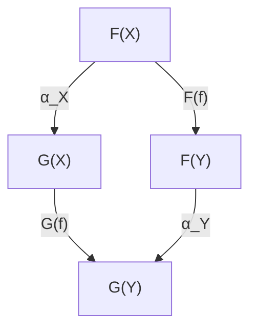

# Manuale Completo di Teoria ed Esempi — LPP 3 CFU
**Insegnamento:** Linguaggi e Paradigmi di Programmazione (Modulo 3 CFU)  
**Docente:** Prof. Luca Roversi — Università degli Studi di Torino  
**Argomenti:** Teoria delle Categorie applicata alla Programmazione Funzionale in Haskell  

> [!NOTE]
> Questo documento raccoglie in modo organico, chiaro e approfondito tutta la teoria trattata nei lucidi del corso (da `LPP0050` a `LPP0700`), corredata da:
> - **Definizioni formali e notazioni categoriali esatte.**
> - **Intuizioni concettuali e spiegazioni sul "perché" matematico e computazionale.**
> - **Esempi concreti in codice Haskell eseguibile e diagrammi commutativi.**
> - **Controesempi tipici d'esame** (come e perché certe strutture falliscono gli assiomi).
> - **Punti di attenzione per l'esame scritto** con Roversi.

---

## Indice Generale della Teoria

1. [Capitolo 1: Fondamenti di Teoria delle Categorie & la Categoria Hask](#capitolo-1-fondamenti-di-teoria-delle-categorie--la-categoria-hask)
   - Cos'è una categoria (oggetti, morfismi, identità, composizione)
   - Gli assiomi fondamentali: Unità e Associatività
   - Diagrammi commutativi ("Pedantic" vs "Essential")
   - Prime categorie: Vuota ($\mathbf{0}$), Terminale ($\mathbf{1}$), Freccia ($\mathbf{0 \to 1}$)
   - La categoria $\mathbf{Hask}$ e corrispondenza concettuale
2. [Capitolo 2: Ordini e Grafi come Categorie](#capitolo-2-ordini-e-grafi-come-categorie)
   - Pre-ordini come categorie (riflessività = identità, transitività = composizione)
   - Ordini parziali (poset) e proprietà di antisimmetria (categorie scheletriche)
   - Ordini totali e proprietà di tricotomia/totalità
   - Unicità delle frecce negli ordini ($|\mathbf{C}(a, b)| \le 1$)
   - Perché un generico grafo orientato NON è una categoria; la Categoria Libera $\mathcal{F}(G)$
3. [Capitolo 3: Monoidi Categoriali](#capitolo-3-monoidi-categoriali)
   - Dal monoide algebrico al monoide categoriale: il cambio di prospettiva
   - Struttura: singolo oggetto $\bullet$, frecce come sezioni parziali $(m \odot)$
   - Esempi completi: Booleani con AND, OR, XOR; Stringhe; Liste
4. [Capitolo 4: La Categoria Set, Monomorfismi ed Epimorfismi](#capitolo-4-la-categoria-set-monomorfismi-ed-epimorfismi)
   - Insiemi e funzioni in $\mathbf{Set}$
   - Monomorfismo (cancellabilità a sinistra) come generalizzazione di funzione iniettiva
   - Epimorfismo (cancellabilità a destra) come generalizzazione di funzione suriettiva
5. [Capitolo 5: Costruzioni Universali: Terminale, Prodotto e Coprodotto](#capitolo-5-costruzioni-universali-terminale-prodotto-e-coprodotto)
   - Il concetto di costruzione universale ("best fitting pattern")
   - Oggetto Terminale: definizione, unicità a meno di isomorfismo, `()` in Haskell, perché `Bool` non è terminale
   - Prodotto Cartesiano: diagramma universale, proiezioni, freccia mediatrice $m$, coppia `(a, b)`
   - Analisi critica dei candidati prodotto e controesempi d'esame
   - Coprodotto Cartesiano: diagramma universale, iniezioni, freccia mediatrice $s$, tipo `Either a b`
   - Analisi critica dei candidati coprodotto e controesempi d'esame
   - Isomorfismi categoriali notevoli (`Either a Void ≅ a`, distributività, somme binarie)
6. [Capitolo 6: Funtori (Functors)](#capitolo-6-funtori-functors)
   - Definizione formale di funtore (mappa tra categorie che preserva connessioni)
   - Esempi matematici: Funtore Identità, Funtore Costante, Funtore Powerset $\mathcal{P}$, Funtore Stella di Kleene $(-)^*$
   - Funtori in Haskell: la typeclass `Functor`, `fmap`, `(<$)`
   - Le due leggi dei funtori: Identità e Composizione
   - Tecniche di dimostrazione: per casi e per induzione strutturale (`Maybe`, `List`, `Either`, alberi `BTree`, `T a`, `U a b`)
   - Tipi controvarianti: perché `Sink s a = Sink (a -> s)` non è un funtore covariante
7. [Capitolo 7: Funtori Applicativi (Applicative Functors)](#capitolo-7-funtori-applicativi-applicative-functors)
   - Perché i funtori semplici non bastano: funzioni a più argomenti incapsulate
   - La typeclass `Applicative`: gli operatori `pure` e `(<*>)` ("tie-fighter")
   - Differenza concettuale e operativa tra Applicative e Monad (indipendenza vs dipendenza sequenziale, validazione errori)
   - Le 4 leggi applicative: Identità, Composizione, Omomorfismo, Interscambio
   - Analisi approfondita della Legge di Composizione Applicativa e tipizzazioni
   - Istanze fondamentali: `Maybe`, `Either`, `List`, `ZipList`, `Reader`, `Const`, `Identity`, `Diagonal`
8. [Capitolo 8: Trasformazioni Naturali (Natural Transformations)](#capitolo-8-trasformazioni-naturali-natural-transformations)
   - Definizione matematica: morfismi tra funtori paralleli
   - Il quadrato di naturalità: $\eta_Y \circ F(f) = G(f) \circ \eta_X$
   - Trasformazioni naturali in Haskell: funzioni polimorfe `forall a. F a -> G a` che commutano con `fmap`
   - Perché la naturalità è fondamentale negli interpreti di linguaggi (stabilità ad ottimizzazioni del compilatore, modularità)
   - Verifiche algebriche passo-passo di naturalità
9. [Capitolo 9: Monadi (Monads), Reader e State](#capitolo-9-monadi-monads-reader-e-state)
   - Definizione di Monade: computazioni sequenziali con passaggio di contesto
   - Operatori `return` e bind `(>>=)`
   - Le tre leggi monadiche: Left identity, Right identity, Associatività del bind
   - Dimostrazioni della legge di associatività del bind
   - La monade `Reader r a`: ambiente globale in sola lettura
   - La monade `State s a`: calcoli con stato mutabile; il pattern computazionale a 3 passi di Roversi per `(>>=)`, `fmap`, `pure` e `(<*>)`
10. [Capitolo 10: Prontuario Strategico per l'Esame Scritto](#capitolo-10-prontuario-strategico-per-lesame-scritto)
    - Come Roversi imposta le domande
    - Errori tipici da evitare
    - Schema rapido di risposta per ciascuna tipologia di esercizio

---


# Capitolo 1: Fondamenti di Teoria delle Categorie & la Categoria Hask

## 1.1 Cos'è una Categoria?
La Teoria delle Categorie è una branca della matematica che studia le **strutture astratte** e le **relazioni** tra di esse, ponendo l'enfasi non sugli elementi interni degli oggetti, ma sulle trasformazioni (**frecce o morfismi**) che li collegano.

### Definizione Formale
Una categoria $\mathbf{C}$ è costituita da:
1. **Una collezione di oggetti**, indicata con $\mathrm{obj}(\mathbf{C})$.
2. **Per ogni coppia di oggetti $X, Y \in \mathrm{obj}(\mathbf{C})$, un insieme di morfismi (o frecce)**, indicato con $\mathbf{C}(X, Y)$ oppure $\mathrm{hom}_\mathbf{C}(X, Y)$. Se $f \in \mathbf{C}(X, Y)$, scriviamo:
   $$f: X \to Y$$
   dove $X$ è la sorgente (*dominio*) e $Y$ è il bersaglio (*codominio*).
3. **Morfismi Identità:** Per ogni oggetto $Y \in \mathrm{obj}(\mathbf{C})$, esiste un morfismo speciale denominato identità:
   $$\mathrm{id}_Y \in \mathbf{C}(Y, Y) \quad (\mathrm{id}_Y: Y \to Y)$$
4. **Operazione di Composizione:** Per ogni terna di oggetti $X, Y, Z$ e per ogni coppia di frecce componibili $f: X \to Y$ e $g: Y \to Z$, è definita una funzione di composizione che associa la freccia:
   $$g \circ f \in \mathbf{C}(X, Z) \quad (g \circ f: X \to Z)$$

### Gli Assiomi di Categoria
Affinché una struttura sia una categoria, la composizione e le identità devono soddisfare due assiomi universali:

1. **Assioma di Unità (Identity Laws):**
   Per ogni freccia $f: X \to Y$:
   $$\mathrm{id}_Y \circ f = f \quad \text{e} \quad f \circ \mathrm{id}_X = f$$
2. **Assioma di Associatività:**
   Per ogni terna di frecce componibili $X \xrightarrow{f} Y \xrightarrow{g} Z \xrightarrow{h} W$:
   $$h \circ (g \circ f) = (h \circ g) \circ f$$

---

## 1.2 Rappresentazione Visiva e Diagrammi Commutativi
Nei lucidi del Prof. Roversi (`LPP0050`), la categoria viene presentata in due forme grafiche:
- **Forma "Pedantic":** Evidenzia esplicitamente gli insiemi di hom-set $\mathbf{C}(X, Y)$, la tabella di composizione $\circ$ e le identità.
- **Forma "Essential":** Mostra i nodi come oggetti e gli archi orientati come frecce.

### Cosa significa che un diagramma "commuta"?
Un diagramma categoriale si dice **commutativo** se tutti i percorsi orientati che partono dallo stesso nodo iniziale e terminano nello stesso nodo finale producono, per composizione, **lo stesso identico morfismo**.

Ad esempio, l'assioma di unità corrisponde alla commutatività del diagramma:

mentre l'associatività corrisponde al diagramma:

in cui il percorso lungo $h \circ (g \circ f)$ coincide con $(h \circ g) \circ f$.

---

## 1.3 Prime Categorie Notevoli
1. **Categoria Vuota $\mathbf{0}$:**
   - $\mathrm{obj}(\mathbf{0}) = \emptyset$.
   - Nessun morfismo. Soddisfa vacuamente tutti gli assiomi.
2. **Categoria Terminale $\mathbf{1}$:**
   - $\mathrm{obj}(\mathbf{1}) = \{\bullet\}$ (un solo oggetto).
   - $\mathbf{1}(\bullet, \bullet) = \{\mathrm{id}_\bullet\}$.
   - Composizione: $\mathrm{id}_\bullet \circ \mathrm{id}_\bullet = \mathrm{id}_\bullet$.
3. **Categoria Freccia $\mathbf{0 \to 1}$:**
   - $\mathrm{obj}(\mathbf{0 \to 1}) = \{0, 1\}$.
   - Tre frecce: $\mathrm{id}_0: 0 \to 0$, $\mathrm{id}_1: 1 \to 1$, e un'unica freccia $f: 0 \to 1$.
   - Le composizioni sono forzate dalle identità: $f \circ \mathrm{id}_0 = f$ e $\mathrm{id}_1 \circ f = f$.

---

## 1.4 La Categoria $\mathbf{Hask}$
In informatica teorica, i linguaggi di programmazione funzionali puri (come Haskell) possono essere modellati come una categoria, tradizionalmente chiamata $\mathbf{Hask}$:

| Concetto Categoriale | Controparte in Haskell | Esempio in Haskell |
|---|---|---|
| **Oggetto** | Un **Tipo** di dato | `Int`, `Bool`, `String`, `[a]`, `Maybe Int` |
| **Morfismo** $f: A \to B$ | Una **Funzione pura** | `length :: String -> Int` |
| **Identità** $\mathrm{id}_A$ | La funzione polimorfa `id` | `id :: a -> a` ; `id x = x` |
| **Composizione** $g \circ f$ | L'operatore punto `(.)` | `(g . f) x = g (f x)` |

### Verifica degli assiomi in $\mathbf{Hask}$:
- **Unità:**
  ```haskell
  (id . f) x == id (f x) == f x      -- id . f == f
  (f . id) x == f (id x) == f x      -- f . id == f
  ```
- **Associatività:**
  ```haskell
  (h . (g . f)) x == h ((g . f) x) == h (g (f x))
  ((h . g) . f) x == (h . g) (f x) == h (g (f x))
  ```

---

# Capitolo 2: Ordini e Grafi come Categorie

Uno dei collegamenti più eleganti tra logica, algebra e teoria delle categorie è la corrispondenza tra **relazioni d'ordine** e categorie sottili (*thin categories*).

## 2.1 Pre-ordini $(X, \le)$
Un pre-ordine è una struttura algebrica formata da un insieme $X$ e da una relazione binaria $\le$ che gode di due sole proprietà:
1. **Riflessività:** $\forall a \in X.\; a \le a$.
2. **Transitività:** $\forall a, b, c \in X.\; a \le b \land b \le c \implies a \le c$.

### Costruzione della Categoria associata
- **Oggetti:** Gli elementi dell'insieme $X$.
- **Frecce:** Tra due oggetti $a$ e $b$ definiamo un morfismo se e solo se $a \le b$:
  $$\mathbf{C}(a, b) = \begin{cases} \{(a, b)\} & \text{se } a \le b \\ \emptyset & \text{se } a \not\le b \end{cases}$$
- **Perché è una categoria?**
  - La **riflessività** garantisce l'esistenza della freccia identità: poiché $a \le a$, esiste sempre $\mathrm{id}_a = (a, a)$.
  - La **transitività** garantisce la composizione: se esistono $(a, b)$ (cioè $a \le b$) e $(b, c)$ (cioè $b \le c$), allora vale $a \le c$, dunque esiste la freccia composta $(b, c) \circ (a, b) = (a, c)$.
  - Gli **assiomi di unità e associatività** sono automaticamente soddisfatti: poiché tra due qualsiasi oggetti $a$ e $b$ esiste *al massimo una freccia*, qualsiasi equazione tra frecce parallele è banalmente vera!

> [!TIP]
> **Caratteristica chiave:** In un pre-ordine possono esistere cicli orientati $a \le b$ e $b \le a$ con $a \ne b$. In tal caso gli oggetti $a$ e $b$ sono **isomorfi** ($a \cong b$), ma non necessariamente uguali.

---

## 2.2 Ordini Parziali (Poset)
Un ordine parziale è un pre-ordine che soddisfa anche l'**antisimmetria**:
$$\forall a, b \in X.\; (a \le b \land b \le a) \implies a = b$$

### Proprietà Categoriale del Poset: Categoria Scheletrica
In un poset, se due oggetti $a$ e $b$ sono isomorfi ($a \cong b$), significa che esistono frecce $a \to b$ ($a \le b$) e $b \to a$ ($b \le a$). Per l'antisimmetria, ne segue che $a = b$.
Una categoria in cui oggetti isomorfi sono identici è detta **scheletrica**.

### Cosa NON può apparire nel diagramma di un Poset?
1. **Cicli di lunghezza $\ge 2$ tra nodi distinti:** non possono coesistere $a \to b$ e $b \to a$ con $a \ne b$.
2. **Frecce parallele distinte:** non possono esistere due frecce diverse $f \ne g: a \to b$.

---

## 2.3 Ordini Totali
Un ordine totale è un poset in cui tutti gli elementi sono confrontabili tra loro (**totalità o tricotomia**):
$$\forall a, b \in X.\; a \le b \;\lor\; b \le a$$

### Proprietà Categoriale dell'Ordine Totale
In una categoria derivata da un ordine totale, per ogni coppia di nodi distinti $a \ne b$, esiste **esattamente una freccia** orientata tra di essi (o da $a$ a $b$, oppure da $b$ a $a$).
- Non possono mancare connessioni (violerebbe la totalità).
- Non possono esserci connessioni in entrambi i versi tra nodi distinti (violerebbe l'antisimmetria).

---

## 2.4 Perché un Grafo Orientato NON è una Categoria?
Un grafo orientato $G = (V, E)$ è semplicemente un insieme di vertici $V$ e archi orientati $E \subseteq V \times V$.
Non ogni grafo è una categoria perché:
1. **Possono mancare le identità:** Un grafo non ha necessariamente un cappio (self-loop) su ogni vertice.
2. **Può mancare la chiusura per composizione:** Se in un grafo abbiamo gli archi $u \to v$ e $v \to w$, non è affatto detto che esista l'arco diretto $u \to w$.

### La Categoria Libera $\mathcal{F}(G)$ generata da un grafo
Per trasformare un grafo $G$ in una categoria senza aggiungere vincoli spuri, si costruisce la **categoria libera** $\mathcal{F}(G)$:
- Gli oggetti sono i vertici di $G$: $\mathrm{obj}(\mathcal{F}(G)) = V$.
- I morfismi tra $u$ e $v$ sono tutti i **cammini orientati** da $u$ a $v$.
- L'identità $\mathrm{id}_v$ è il cammino vuoto su $v$ (di lunghezza 0).
- La composizione è la **concatenazione di cammini**.

---

# Capitolo 3: Monoidi Categoriali

## 3.1 Il Cambio di Prospettiva
In algebra astratta, un **monoide** è una terna $(M, \odot, e)$ dove:
- $M$ è un insieme.
- $\odot: M \times M \to M$ è un'operazione binaria **associativa**: $(x \odot y) \odot z = x \odot (y \odot z)$.
- $e \in M$ è l'**elemento neutro**: $e \odot x = x = x \odot e$.

In Teoria delle Categorie, un monoide è visto non come un insieme di elementi con un'operazione, ma come **una categoria con un unico oggetto**!



### La Traduzione Categoriale (Slide 7-8 di `CT0100`)
Dato il monoide $(M, \odot, e)$, costruiamo la categoria $\mathbf{M}$:
1. **Oggetti:** Unico oggetto astratto $\mathrm{obj}(\mathbf{M}) = \{\bullet\}$.
2. **Morfismi:** Ogni elemento $m \in M$ diventa un endomorfismo $(\bullet \to \bullet)$, rappresentato dalla *sezione parziale* $(m \odot)$:
   $$\hom(\bullet, \bullet) = \{(m \odot) \mid m \in M\}$$
3. **Morfismo Identità:** È la sezione dell'elemento neutro:
   $$\mathrm{id}_\bullet = (e \odot)$$
   Infatti: $(e \odot m) = m = (m \odot e)$.
4. **Composizione di morfismi:**
   $$(n \odot) \circ (m \odot) = ((n \odot m) \odot)$$
   L'associatività della composizione categoriale deriva direttamente dall'associatività dell'operazione algebrica $\odot$.

---

## 3.2 Esempi Fondamentali dei Lucidi

### 1. Booleani con AND: $(B, \land, T)$
- $\mathrm{obj} = \{\bullet\}$
- Morfismi: $\hom(\bullet, \bullet) = \{(T \land), (F \land)\}$
- Identità: $(T \land)$, poiché $T \land x = x$.
- Composizione: $(x \land) \circ (y \land) = ((x \land y)\land)$. In particolare, $(F \land)$ assorbe tutto: $(F \land) \circ (T \land) = (F \land)$.

### 2. Booleani con OR: $(B, \lor, F)$
- $\mathrm{obj} = \{\bullet\}$
- Morfismi: $\hom(\bullet, \bullet) = \{(T \lor), (F \lor)\}$
- Identità: $(F \lor)$, poiché $F \lor x = x$.
- Composizione: $(x \lor) \circ (y \lor) = ((x \lor y)\lor)$.

### 3. Booleani con XOR: $(B, \oplus, F)$
- $\mathrm{obj} = \{\bullet\}$
- Morfismi: $\hom(\bullet, \bullet) = \{(T \oplus), (F \oplus)\}$
- Identità: $(F \oplus)$.
- Notare che $(T \oplus) \circ (T \oplus) = ((T \oplus T)\oplus) = (F \oplus) = \mathrm{id}_\bullet$ (ogni elemento è il proprio inverso, formando anche un gruppo).

### 4. Stringhe con Concatenazione: $(\Sigma^*, \cdot, \epsilon)$
- $\mathrm{obj} = \{\bullet\}$
- Morfismi: $\hom(\bullet, \bullet) = \{(w \cdot) \mid w \in \Sigma^*\}$ (frecce che prefissano la stringa $w$).
- Identità: $(\epsilon \cdot)$ (stringa vuota).
- Composizione: $(u \cdot) \circ (v \cdot) = ((u \cdot v)\cdot)$.

### 5. Liste con Append: $([a], {+\!+}, [\,])$
- $\mathrm{obj} = \{\bullet\}$
- Morfismi: $\hom(\bullet, \bullet) = \{(l {+\!+}) \mid l \text{ è una lista}\}$
- Identità: $([\,] {+\!+})$
- Composizione: $(l_1 {+\!+}) \circ (l_2 {+\!+}) = ((l_1 {+\!+} l_2){+\!+})$.


# Capitolo 4: La Categoria Set, Monomorfismi ed Epimorfismi

## 4.1 La Categoria $\mathbf{Set}$
La categoria $\mathbf{Set}$ è il prototipo fondamentale di categoria concreta:
- **Oggetti:** Gli insiemi matematici ($X, Y, Z, \dots$).
- **Morfismi:** Le funzioni totali tra insiemi ($f: X \to Y$).
- **Identità:** Per ogni insieme $X$, la funzione identica $\mathrm{id}_X(x) = x$.
- **Composizione:** La consueta composizione funzionale $(g \circ f)(x) = g(f(x))$.

### Proprietà di base delle funzioni tra insiemi:
Data una funzione $f: X \to Y$:
- **Dominio:** $X$.
- **Codominio:** $Y$.
- **Immagine:** $\mathrm{Im}(f) = \{y \in Y \mid \exists x \in X.\; y = f(x)\} \subseteq Y$.
- **Iniettiva (one-to-one):**
  $$\forall x_1, x_2 \in X.\; f(x_1) = f(x_2) \implies x_1 = x_2$$
- **Suriettiva (onto):**
  $$\forall y \in Y.\; \exists x \in X.\; y = f(x) \iff \mathrm{Im}(f) = Y$$

---

## 4.2 Monomorfismi (Generalizzazione dell'Iniettività)
In una categoria astratta, non possiamo "guardare dentro" gli oggetti per esaminare i singoli elementi. Dobbiamo formulare il concetto di iniettività unicamente attraverso le relazioni tra frecce.

### Definizione di Monomorfismo
Un morfismo $f: X \to Y$ in una categoria $\mathbf{C}$ è detto **monomorfismo** (o freccia *mono*, o *semplificabile a sinistra*) se per ogni coppia di morfismi paralleli $g, h: Z \to X$:
$$f \circ g = f \circ h \implies g = h$$



### Perché generalizza l'iniettività?
In $\mathbf{Set}$, consideriamo come oggetto di test $Z$ il singoletto $\{\star\}$.
- Una funzione $g: \{\star\} \to X$ sceglie un elemento $x_1 = g(\star) \in X$.
- Una funzione $h: \{\star\} \to X$ sceglie un elemento $x_2 = h(\star) \in X$.
- La composizione $(f \circ g)(\star) = f(x_1)$ e $(f \circ h)(\star) = f(x_2)$.
- L'uguaglianza $f \circ g = f \circ h$ significa che $f(x_1) = f(x_2)$.
- Se $f$ è un monomorfismo, ne segue $g = h$, ovvero $x_1 = x_2$.
Dunque, in $\mathbf{Set}$, **monomorfismo $\iff$ funzione iniettiva**.

---

## 4.3 Epimorfismi (Generalizzazione della Suriettività)
Dualizzando il concetto di monomorfismo invertendo il verso delle composizioni, otteniamo l'epimorfismo.

### Definizione di Epimorfismo
Un morfismo $f: X \to Y$ in una categoria $\mathbf{C}$ è detto **epimorfismo** (o freccia *epi*, o *semplificabile a destra*) se per ogni coppia di morfismi paralleli $g, h: Y \to Z$:
$$g \circ f = h \circ f \implies g = h$$



### Perché generalizza la suriettività?
In $\mathbf{Set}$, supponiamo per assurdo che $f: X \to Y$ non sia suriettiva. Allora esiste almeno un elemento $y_0 \in Y$ non raggiunto da $f$ ($y_0 \notin \mathrm{Im}(f)$).
Scegliamo $Z = \{0, 1\}$ e definiamo due funzioni $g, h: Y \to \{0, 1\}$ tali che:
- $g(y) = 0$ per ogni $y \in Y$.
- $h(y) = 0$ per ogni $y \in \mathrm{Im}(f)$, ma $h(y_0) = 1$.
Poiché su tutta l'immagine di $f$ le due funzioni valgono $0$, avremo $g(f(x)) = h(f(x)) = 0$ per ogni $x \in X$, quindi:
$$g \circ f = h \circ f$$
Tuttavia $g \ne h$ (differiscono su $y_0$). L'unico modo per impedire questa ambiguità è che non esistano elementi scoperti in $Y$.
Dunque, in $\mathbf{Set}$, **epimorfismo $\iff$ funzione suriettiva**.

---

# Capitolo 5: Costruzioni Universali: Terminale, Prodotto e Coprodotto

## 5.1 Il Concetto di Costruzione Universale
Nei lucidi di Roversi (`LPP0150`), una costruzione universale viene paragonata alla ricerca del **"best fitting pattern"** (il pattern che calza meglio di tutti gli altri).
Invece di costruire un oggetto descrivendo la sua rappresentazione interna in memoria, la Teoria delle Categorie caratterizza un oggetto in base a **come interagisce con tutti gli altri oggetti della categoria**, imponendo l'**esistenza e l'unicità** di una freccia mediatrice (*fattorizzazione universale*).

---

## 5.2 Oggetto Terminale (e Iniziale)

### Definizione di Oggetto Terminale
In una categoria $\mathbf{C}$, un oggetto $T \in \mathrm{obj}(\mathbf{C})$ è detto **terminale** (o finale) se per ogni oggetto $X \in \mathrm{obj}(\mathbf{C})$ esiste **uno e un solo** morfismo:
$$!_X: X \to T$$



### Esempi:
1. **In $\mathbf{Set}$:** Qualsiasi insieme con un solo elemento (singoletto $\{\star\}$) è terminale. Infatti da qualunque insieme $X$ c'è una sola funzione verso $\{\star\}$: la funzione costante $x \mapsto \star$.
2. **In Haskell ($\mathbf{Hask}$):** L'oggetto terminale è il tipo unit `()`:
   ```haskell
   unit :: a -> ()
   unit _ = ()
   ```
3. **Controesempio (`Bool` non è terminale):**
   Il tipo `Bool = True | False` ha due elementi. Da qualsiasi tipo abitato $A$ esistono almeno 2 funzioni verso `Bool`:
   ```haskell
   f1 _ = True
   f2 _ = False
   ```
   Mancando l'unicità della freccia, `Bool` **non** è terminale.

### Teorema: Unicità a meno di Isomorfismo
> **Teorema:** Se $T$ e $T'$ sono entrambi oggetti terminali nella stessa categoria $\mathbf{C}$, allora $T \cong T'$ (sono isomorfi).

**Dimostrazione:**
1. Poiché $T'$ è terminale, esiste un'unica freccia $f: T \to T'$.
2. Poiché $T$ è terminale, esiste un'unica freccia $g: T' \to T$.
3. La composizione $g \circ f: T \to T$ è una freccia da $T$ a $T$. Ma $T$ è terminale, quindi deve esistere un'**unica** freccia da $T$ in $T$. Poiché l'identità $\mathrm{id}_T$ è anch'essa una freccia $T \to T$, per unicità deve valere:
   $$g \circ f = \mathrm{id}_T$$
4. Simmetricamente, $f \circ g: T' \to T'$ è una freccia verso $T'$, dunque per unicità:
   $$f \circ g = \mathrm{id}_{T'}$$
5. Essendo $f$ e $g$ inverse, $T \cong T'$. $\blacksquare$

### Il Concetto Duale: Oggetto Iniziale $\bot$
Un oggetto $I$ è **iniziale** se per ogni $X$ esiste un'unica freccia da $I$ verso $X$: $?_X: I \to X$.
- In $\mathbf{Set}$: l'insieme vuoto $\emptyset$.
- In Haskell: il tipo `Void` (dal modulo `Data.Void`), con la funzione `absurd :: Void -> a`.

---

## 5.3 Prodotto Cartesiano Categoriale

### Definizione di Prodotto
Dati due oggetti $A, B \in \mathrm{obj}(\mathbf{C})$, il loro **prodotto** è una tripla $(A \times B, \pi_1, \pi_2)$ dove:
- $A \times B \in \mathrm{obj}(\mathbf{C})$ è un oggetto.
- $\pi_1: A \times B \to A$ e $\pi_2: A \times B \to B$ sono due morfismi detti **proiezioni canoniche**.
tale che soddisfa la seguente **proprietà universale**:
Per ogni altro oggetto $C \in \mathrm{obj}(\mathbf{C})$ dotato di due frecce $f: C \to A$ e $g: C \to B$, **esiste un'unica freccia mediatrice** $m: C \to A \times B$ tale che il seguente diagramma commuta:



Cioè:
$$\pi_1 \circ m = f \quad \text{e} \quad \pi_2 \circ m = g$$

### Il Prodotto in Haskell
In Haskell il prodotto è la tupla binaria `(a, b)` con le proiezioni `fst` e `snd`:
```haskell
fst :: (a, b) -> a
snd :: (a, b) -> b
```
Data una qualsiasi altra struttura $C$ con $f :: c \to a$ e $g :: c \to b$, l'unica mediatrice è:
```haskell
m :: c -> (a, b)
m x = (f x, g x)
```

---

## 5.4 Perché Altre Proposte Falliscono come Prodotto? (Domande d'Esame)

### Caso 1: Mancanza di Informazione (Fallisce l'esistenza di $m$)
Candidato: $(a, \lambda x \to x, \lambda x \to y_0::b)$
- Proiezione su $a$: identità $\lambda x \to x$.
- Proiezione su $b$: costante $\lambda x \to y_0$.
*Perché fallisce?* Se testiamo con la vera coppia $(a, b)$ con $f = \mathrm{fst}$ e $g = \mathrm{snd}$, la seconda equazione imporrebbe:
$$p_2(m(x, z)) = y_0 = z \quad \forall z \in b$$
Se $b$ ha più di un elemento, una funzione costante non può uguagliare un arbitrario $z$. Non esiste alcuna mediatrice $m$.

### Caso 2: Informazione Ridondante (Fallisce l'unicità di $m$)
Candidato: $((a, a, b), \lambda(x, \_, \_) \to x, \lambda(\_, \_, z) \to z)$ oppure $((Bool, Int, Bool), \dots)$
*Perché fallisce?* La coordinata centrale (o non considerata) è completamente libera:
- $m_1(x, z) = (x, x, z)$
- $m_2(x, z) = (x, k, z)$ per qualsiasi $k \in a$
Entrambe soddisfano $p_1 \circ m = f$ e $p_2 \circ m = g$. **Mancando l'unicità della mediatrice**, la costruzione non è universale.

---

## 5.5 Coprodotto Categoriale (Somma Disgiunta)

### Definizione di Coprodotto
Dati due oggetti $A, B \in \mathrm{obj}(\mathbf{C})$, il loro **coprodotto** è una tripla $(A + B, \iota_1, \iota_2)$ dove:
- $\iota_1: A \to A + B$ e $\iota_2: B \to A + B$ sono dette **iniezioni canoniche**.
tale che per ogni altro oggetto $C$ dotato di due frecce $f: A \to C$ e $g: B \to C$, **esiste un'unica freccia mediatrice** $s: A + B \to C$ tale che:
$$s \circ \iota_1 = f \quad \text{e} \quad s \circ \iota_2 = g$$



### Il Coprodotto in Haskell: `Either a b`
In Haskell il coprodotto è `Either a b`:
```haskell
data Either a b = Left a | Right b
```
Le iniezioni sono i costruttori:
```haskell
Left  :: a -> Either a b  -- ι1
Right :: b -> Either a b  -- ι2
```
La freccia mediatrice è la funzione predefinita `either`:
```haskell
either :: (a -> c) -> (b -> c) -> Either a b -> c
either f _ (Left x)  = f x
either _ g (Right y) = g y
```

---

## 5.6 Perché Altre Proposte Falliscono come Coprodotto?

### Caso 1: Iniezioni Sovrapposte (Fallisce l'esistenza di $s$)
Candidato: $(Int, \lambda x \to x, \lambda y \to \text{if } y \text{ then } 0 \text{ else } 1)$
*Perché fallisce?* Il valore $0 \in \mathrm{Int}$ e il booleano $\mathrm{True} \in \mathrm{Bool}$ vengono entrambi mappati nell'intero $0$.
Se scegliamo una funzione test con $f(0) \ne g(\mathrm{True})$, la mediatrice $s$ dovrebbe valere contemporaneamente $s(0) = f(0)$ e $s(0) = g(\mathrm{True})$, il che è impossibile.

### Caso 2: Costruttori Extra (Fallisce l'unicità di $s$)
Candidato: $(Either\ (Either\ Bool\ Int)\ Int, \dots)$
*Perché fallisce?* Il ramo esterno `Right Int` non viene mai raggiunto dalle iniezioni. L'azione di $s$ su `Right w` può essere scelta arbitrariamente, distruggendo l'unicità.

---

## 5.7 Isomorfismi Notevoli tra Tipi Algebrici
1. **Elemento neutro del coprodotto:**
   $$\mathrm{Either}\ a\ \mathrm{Void} \cong a$$
   *Intuito:* $a + 0 = a$.
2. **Distributività del prodotto sul coprodotto:**
   $$(a, \mathrm{Either}\ b\ c) \cong \mathrm{Either}\ (a, b)\ (a, c)$$
   *Intuito:* $a \times (b + c) = a \times b + a \times c$.
3. **Somma di tipi identici:**
   $$\mathrm{Either}\ a\ a \cong (\mathrm{Either}\ ()\ (),\; a) \cong (\mathrm{Bool}, a)$$
   *Intuito:* $a + a = 2 \times a$.


# Capitolo 6: Funtori (Functors)

## 6.1 Definizione Matematica di Funtore
Se le categorie sono mondi astratti di oggetti e frecce, un **funtore** è una mappa tra categorie che preserva integralmente la struttura categoriale.

Dati due categorie $\mathbf{C}$ e $\mathbf{D}$, un funtore covariante $F: \mathbf{C} \to \mathbf{D}$ assegna:
1. **Ad ogni oggetto** $X \in \mathrm{obj}(\mathbf{C})$, un oggetto $F(X) \in \mathrm{obj}(\mathbf{D})$.
2. **Ad ogni morfismo** $f: X \to Y$ in $\mathbf{C}$, un morfismo $F(f): F(X) \to F(Y)$ in $\mathbf{D}$.

soddisfacendo due condizioni di preservazione:
- **Preservazione dell'Identità:**
  $$F(\mathrm{id}_X) = \mathrm{id}_{F(X)} \quad \forall X \in \mathrm{obj}(\mathbf{C})$$
- **Preservazione della Composizione:**
  $$F(g \circ f) = F(g) \circ F(f) \quad \forall f \in \mathbf{C}(X, Y),\; g \in \mathbf{C}(Y, Z)$$



---

## 6.2 Esempi Matematici Notevoli (Slide di `CT0300`)

### 1. Funtore Identità $\mathbf{1}_\mathbf{C}: \mathbf{C} \to \mathbf{C}$
Mappa ogni oggetto su se stesso ($\mathbf{1}_\mathbf{C}(X) = X$) e ogni freccia su se stessa ($\mathbf{1}_\mathbf{C}(f) = f$).

### 2. Funtore Costante $\Delta_K: \mathbf{C} \to \mathbf{D}$
Fissato un oggetto $K \in \mathrm{obj}(\mathbf{D})$, mappa ogni oggetto $X \in \mathrm{obj}(\mathbf{C})$ in $K$, e ogni freccia $f$ nell'identità $\mathrm{id}_K$. In Haskell corrisponde a `Const k a`.

### 3. Funtore Powerset $\mathcal{P}: \mathbf{Set} \to \mathbf{Set}$
- Sugli oggetti: $\mathcal{P}(X) = \{s \mid s \subseteq X\}$ (insieme delle parti).
- Sulle frecce: data $f: X \to Y$, la funzione $\mathcal{P}(f): \mathcal{P}(X) \to \mathcal{P}(Y)$ è l'immagine diretta:
  $$\mathcal{P}(f)(s) = \{f(x) \mid x \in s\}$$

### 4. Funtore Stella di Kleene $(-)^*: \mathbf{Alphabet} \to \mathbf{Monoid}$
- Sugli alfabeti: mappa un insieme di simboli $\Sigma$ nel monoide libero delle stringhe $\Sigma^*$.
- Sulle funzioni: data $f: \Sigma \to \Gamma^*$, la estende all'omomorfismo di monoidi $f^*: \Sigma^* \to \Gamma^*$ definito da:
  $$f^*(\epsilon) = \epsilon, \quad f^*(w \cdot \sigma) = f^*(w) \cdot f(\sigma)$$

---

## 6.3 Funtori in Haskell
In Haskell, un funtore è rappresentato da un costruttore di tipo con kind `* -> *` (cioè un tipo generico con un parametro, come `Maybe`, `[]`, `Tree`) che implementa la typeclass `Functor`:

```haskell
class Functor f where
  fmap :: (a -> b) -> f a -> f b
  
  -- Operatore di rimpiazzo (opzionale con default)
  (<$) :: a -> f b -> f a
  (<$) = fmap . const
```

L'operatore infisso `(<$>)` è un sinonimo di `fmap`:
```haskell
(<$>) :: Functor f => (a -> b) -> f a -> f b
(<$>) = fmap
```

### Le Due Leggi dei Funtori
Ogni istanza lecita di `Functor` deve soddisfare:
1. **Legge di Identità:**
   $$\text{fmap id} = \text{id}$$
   *(Applicare `fmap id` ad una struttura dati restituisce la struttura identica senza mutarla).*
2. **Legge di Composizione:**
   $$\text{fmap } (g \circ f) = \text{fmap } g \circ \text{fmap } f$$
   *(Mappare una composizione equivale a mappare prima la funzione interna e poi quella esterna).*

---

## 6.4 Metodologia di Dimostrazione delle Leggi dei Funtori

### A. Tipi Non Ricorsivi (Dimostrazione per Casi)
Esempio con `Maybe a`:
```haskell
instance Functor Maybe where
  fmap _ Nothing  = Nothing
  fmap f (Just x) = Just (f x)
```
- **Verifica Identità:**
  - `fmap id Nothing = Nothing = id Nothing`
  - `fmap id (Just x) = Just (id x) = Just x = id (Just x)`
- **Verifica Composizione:**
  - `fmap (g . f) Nothing = Nothing = fmap g (fmap f Nothing)`
  - `fmap (g . f) (Just x) = Just ((g . f) x) = Just (g (f x)) = fmap g (Just (f x)) = fmap g (fmap f (Just x))`

### B. Tipi Ricorsivi (Dimostrazione per Induzione Strutturale)
Esempio con alberi binari con valori sulle foglie:
```haskell
data BTree n l where
  Leaf :: l -> BTree n l
  Node :: BTree n l -> BTree n l -> BTree n l
```
Definizione di `fmap`:
```haskell
instance Functor (BTree n) where
  fmap f (Leaf x)     = Leaf (f x)
  fmap f (Node t1 t2) = Node (fmap f t1) (fmap f t2)
```
- **Caso Base (`Leaf x`):**
  $$\text{fmap id (Leaf } x) = \text{Leaf (id } x) = \text{Leaf } x = \text{id (Leaf } x)$$
- **Passo Induttivo (`Node t1 t2`):**
  *Ipotesi Induttiva (I.H.):* assumiamo che $\text{fmap id } t_1 = t_1$ e $\text{fmap id } t_2 = t_2$.
  $$\text{fmap id (Node } t_1\; t_2) = \text{Node } (\text{fmap id } t_1)\; (\text{fmap id } t_2)$$
  $$\overset{\text{I.H.}}{=} \text{Node } t_1\; t_2 = \text{id (Node } t_1\; t_2) \quad \blacksquare$$

---

## 6.5 Controesempio: Funtori Controvarianti (Slide 14 di `CT0300`)
Consideriamo il tipo:
```haskell
newtype Sink s a = Sink { runSink :: a -> s }
```
Possiamo definire un'istanza `Functor (Sink s)`?
Dovremmo scrivere una funzione:
$$\text{fmap} :: (a \to b) \to \text{Sink } s\ a \to \text{Sink } s\ b$$
Ma dentro `Sink s b` abbiamo bisogno di una funzione `b -> s`. Con $f: a \to b$ e $g: a \to s$, **non possiamo comporle** per ottenere $b \to s$ (andrebbero nella stessa direzione!).
Infatti il tipo `a` appare in **posizione negativa** (come argomento della funzione). `Sink` non è un funtore covariante, bensì un **funtore controvariante**:
```haskell
class Contravariant f where
  contramap :: (b -> a) -> f a -> f b
```

---

# Capitolo 7: Funtori Applicativi (Applicative Functors)

## 7.1 Il Limite dei Funtori Semplici
I funtori semplici (`Functor`) consentono di mappare solo **funzioni unarie** `(a -> b)` su valori incapsulati:
$$\text{fmap} :: (a \to b) \to f\, a \to f\, b$$
Cosa accade se abbiamo una funzione a due argomenti?
$$\text{add} :: \text{Int} \to \text{Int} \to \text{Int}$$
Se applichiamo `fmap add` a un valore incapsulato $x :: f\, \text{Int}$, otteniamo:
$$\text{fmap add } x :: f\, (\text{Int} \to \text{Int})$$
Ci ritroviamo con una **funzione incapsulata nel contesto** $f$. Con il solo `fmap`, non abbiamo alcun modo di applicare questa funzione a un secondo valore $y :: f\, \text{Int}$, poiché `fmap` richiede che la funzione sia "pura" all'esterno del contesto!

---

## 7.2 La Soluzione: Typeclass `Applicative`
La typeclass `Applicative` arricchisce i funtori introducendo due operazioni:

```haskell
class Functor f => Applicative f where
  pure  :: a -> f a
  (<*>) :: f (a -> b) -> f a -> f b
```

- `pure`: Inietta un valore puro all'interno del contesto minimo senza effetti collaterali.
- `(<*>)` (soprannominato *"tie-fighter"* o *ap*): Prende una funzione incapsulata e la applica a un valore incapsulato, combinando gli effetti computazionali.

Grazie a `pure` e `(<*>)`, possiamo applicare funzioni con un numero arbitrario di parametri:
```haskell
pure add <*> Just 3 <*> Just 4   -- Produce Just 7
```
oppure, combinando con `fmap` (ossia `<$>`):
```haskell
add <$> Just 3 <*> Just 4        -- Sintassi idiomatica
```

---

## 7.3 Applicative vs Monad: Perché l'Applicativo è Cruciale?

Spesso gli studenti chiedono: *se le Monadi sono più potenti, perché studiare gli Applicativi?*
La risposta sta proprio nel fatto che **avere meno potere espressivo garantisce più garanzie strutturali**:

| Proprietà | `Applicative` | `Monad` |
|---|---|---|
| **Operatore chiave** | `(<*>) :: f (a -> b) -> f a -> f b` | `(>>=) :: m a -> (a -> m b) -> m b` |
| **Dipendenza dei dati** | Gli argomenti sono **indipendenti** | Il secondo calcolo **dipende dal valore** del primo |
| **Ispezione statica** | La struttura del calcolo è nota a priori | La struttura del calcolo varia a runtime |
| **Esecuzione** | Possibile **in parallelo** / concorrenza | Strettamente **sequenziale** |
| **Gestione Errori** | Può **accumulare** tutti gli errori (es. validazione form) | Si ferma al primo errore (**short-circuiting**) |

> [!IMPORTANT]
> **Esempio pratico d'esame:** Nella validazione di una form utente (es. username, email, password), se usassimo una Monade l'utente riceverebbe solo il primo errore. Usando un Applicativo, tutti i campi vengono controllati in modo indipendente e tutti gli errori rilevati vengono accumulati!

---

## 7.4 Le 4 Leggi dei Funtori Applicativi

1. **Identità (Identity):**
   $$\text{pure id} \mathbin{\langle*\rangle} v = v$$
2. **Omomorfismo (Homomorphism):**
   $$\text{pure } f \mathbin{\langle*\rangle} \text{pure } x = \text{pure } (f\, x)$$
   *(Applicare una funzione pura a un valore puro corrisponde ad applicare la funzione e poi racchiudere il risultato con `pure`).*
3. **Interscambio (Interchange):**
   $$u \mathbin{\langle*\rangle} \text{pure } y = \text{pure } (\lambda f \to f\, y) \mathbin{\langle*\rangle} u$$
4. **Composizione (Composition):**
   $$\text{pure } (.) \mathbin{\langle*\rangle} u \mathbin{\langle*\rangle} v \mathbin{\langle*\rangle} w = u \mathbin{\langle*\rangle} (v \mathbin{\langle*\rangle} w)$$

---

## 7.5 Analisi Approfondita della Legge di Composizione Applicativa

Nei PDF d'esame (Parte 3), Roversi chiede costantemente di:
> *"Recall the corresponding applicative composition law, explicitly writing the types of its components, and prove it."*

### Tipizzazione Dettagliata dei Componenti
$$\text{pure } (.) \mathbin{\langle*\rangle} u \mathbin{\langle*\rangle} v \mathbin{\langle*\rangle} w = u \mathbin{\langle*\rangle} (v \mathbin{\langle*\rangle} w)$$

- $(.) :: (b \to c) \to (a \to b) \to a \to c$ (la composizione di funzioni standard).
- $\text{pure } (.) :: f\, ((b \to c) \to (a \to b) \to a \to c)$.
- $u :: f\, (b \to c)$ (una funzione incapsulata da $b$ a $c$).
- $v :: f\, (a \to b)$ (una funzione incapsulata da $a$ a $b$).
- $w :: f\, a$ (un valore incapsulato di tipo $a$).

### Valutazione per Passi di LHS:
1. $\text{pure } (.) \mathbin{\langle*\rangle} u :: f\, ((a \to b) \to a \to c)$
2. $(\text{pure } (.) \mathbin{\langle*\rangle} u) \mathbin{\langle*\rangle} v :: f\, (a \to c)$
3. $((\text{pure } (.) \mathbin{\langle*\rangle} u) \mathbin{\langle*\rangle} v) \mathbin{\langle*\rangle} w :: f\, c$

### Valutazione per Passi di RHS:
1. $v \mathbin{\langle*\rangle} w :: f\, b$
2. $u \mathbin{\langle*\rangle} (v \mathbin{\langle*\rangle} w) :: f\, c$

Entrambi i membri producono un termine di tipo $f\, c$. La legge afferma che combinare prima le due funzioni $u$ e $v$ tramite composizione e poi applicarle a $w$ è identico ad applicare prima $v$ a $w$ e poi $u$ al risultato.

---

## 7.6 Panoramica delle Istanze Applicative Notevoli

| Tipo | Definizione di `pure` | Definizione di `(<*>)` |
|---|---|---|
| `Maybe` | `pure = Just` | `Nothing <*> _ = Nothing`, `_ <*> Nothing = Nothing`, `Just f <*> Just x = Just (f x)` |
| `Either e` | `pure = Right` | `Left err <*> _ = Left err`, `Right f <*> Right x = Right (f x)` |
| `List` | `pure x = [x]` | Prodotto cartesiano: applica ogni funzione a ogni elemento |
| `ZipList` | `pure x = repeat x` | Applica le funzioni punto a punto: `zipWith ($)` |
| `Reader r` | `pure x = \_ -> x` | `rf <*> rx = \r -> (rf r) (rx r)` |
| `Const c` | `pure _ = Const mempty` | `Const c1 <*> Const c2 = Const (c1 <> c2)` *(richiede $c$ Monoide!)* |
| `Identity` | `pure = Identity` | `Identity f <*> Identity x = Identity (f x)` |
| `Diagonal` | `pure x = Diagonal (x, x)` | `Diagonal (f1, f2) <*> Diagonal (x1, x2) = Diagonal (f1 x1, f2 x2)` |


# Capitolo 8: Trasformazioni Naturali (Natural Transformations)

## 8.1 Definizione Matematica
Nella gerarchia della Teoria delle Categorie:
- Le **categorie** contengono *oggetti* e *morfismi*.
- I **funtori** sono *morfismi tra categorie*.
- Le **trasformazioni naturali** sono **morfismi tra funtori paralleli**!

Siano $\mathbf{C}$ e $\mathbf{D}$ due categorie, e siano $F, G: \mathbf{C} \to \mathbf{D}$ due funtori aventi lo stesso dominio e codominio.
Una **trasformazione naturale** $\alpha: F \Rightarrow G$ è una famiglia di morfismi in $\mathbf{D}$:
$$\{\alpha_X: F(X) \to G(X)\}_{X \in \mathrm{obj}(\mathbf{C})}$$
indicizzata dagli oggetti di $\mathbf{C}$, tale che per ogni morfismo $f: X \to Y$ in $\mathbf{C}$, commuta il seguente quadrato di naturalità:



In formule:
$$\alpha_Y \circ F(f) = G(f) \circ \alpha_X$$

---

## 8.2 Trasformazioni Naturali in Haskell
In Haskell, una trasformazione naturale tra due funtori `F` e `G` è una **funzione polimorfica** che agisce sul parametro di tipo in modo parametricamente universale:
```haskell
alpha :: forall a. f a -> g a
```
La condizione di naturalità in $\mathbf{Hask}$ afferma che:
$$\alpha \circ \text{fmap}_F(f) = \text{fmap}_G(f) \circ \alpha$$
ovvero su un singolo elemento $x :: F\, a$:
$$\alpha(\text{fmap}_F\, f\, x) = \text{fmap}_G\, f\, (\alpha\, x)$$

> [!NOTE]
> **Il Teorema "Free Theorems":** In Haskell puro, per il teorema di parametricità di Reynolds/Wadler, *qualsiasi funzione polimorfica* con tipo `forall a. F a -> G a` che non ispeziona il tipo concreto `a` è **automaticamente una trasformazione naturale**! Nelle domande d'esame, Roversi chiede comunque di verificarlo algebricamente passo per passo.

---

## 8.3 Perché la Naturalità è Fondamentale per i Programmatori?
Nei lucidi `LPP0450` ("Interpreters as Natural Transformations"), Roversi spiega le motivazioni profonde per cui gli interpreti di espressioni dovrebbero essere trasformazioni naturali:

1. **Stabilità rispetto alle Ottimizzazioni del Compilatore:**
   Se un interprete `eval :: Term a -> Result a` è una trasformazione naturale, la semantica del programma è invariante rispetto alle trasformazioni e ottimizzazioni del codice, come:
   - $\alpha$-rinomina delle variabili.
   - **Constant folding** (valutazione a tempo di compilazione di costanti).
   - **Dead-code elimination** (eliminazione di codice morto).
   - Cambiamento della rappresentazione interna a runtime.
2. **Modularità ed Estendibilità "Free":**
   Essere una trasformazione naturale garantisce che l'interprete possa essere esteso passo-passo (aggiungendo nuovi costruttori di espressioni come negazione, esponenziazione, o effetti come logging ed eccezioni) senza dover riscrivere la logica esistente.

---

## 8.4 Esempi ed Esercizi Tipici d'Esame

### Esempio: `maybeToList`
```haskell
maybeToList :: Maybe a -> [a]
maybeToList Nothing  = []
maybeToList (Just x) = [x]
```
Verifica della naturalità su `Just x`:
- **LHS:**
  $$\text{maybeToList}(\text{fmap}_{Maybe}\, f\, (\text{Just } x)) = \text{maybeToList}(\text{Just } (f(x))) = [f(x)]$$
- **RHS:**
  $$\text{fmap}_{[]}\, f\, (\text{maybeToList}(\text{Just } x)) = \text{fmap}_{[]}\, f\, [x] = \text{map } f\, [x] = [f(x)]$$
Poiché $\text{LHS} = \text{RHS}$, la legge è verificata.

### Esempio: `listToMaybe`
```haskell
listToMaybe :: [a] -> Maybe a
listToMaybe []    = Nothing
listToMaybe (x:_) = Just x
```
Verifica su `h:t`:
- **LHS:** $\text{listToMaybe}(\text{fmap } f\, (h:t)) = \text{listToMaybe}(f(h) : \text{map } f\, t) = \text{Just } (f(h))$.
- **RHS:** $\text{fmap } f\, (\text{listToMaybe}(h:t)) = \text{fmap } f\, (\text{Just } h) = \text{Just } (f(h))$.
$\text{LHS} = \text{RHS}$.

---

# Capitolo 9: Monadi (Monads), Reader e State

## 9.1 Cos'è una Monade?
Una monade è un'astrazione che consente di **concatenare computazioni sequenziali in cui i passi successivi dipendono dai valori prodotti dai passi precedenti**, gestendo in modo trasparente gli effetti computazionali (es. fallimento con `Maybe`/`Either`, non-determinismo con liste, stato mutabile con `State`, configurazioni con `Reader`).

### Definizione della Typeclass `Monad`
```haskell
class Applicative m => Monad m where
  -- Bind: concatena una computazione con una funzione che produce una nuova computazione
  (>>=) :: m a -> (a -> m b) -> m b

  -- Inietta un valore puro (equivalente a pure)
  return :: a -> m a
  return = pure
```

---

## 9.2 Le 3 Leggi Monadiche
Affinché un'istanza di `Monad` sia corretta, deve soddisfare tre leggi algebriche:

1. **Identità a Sinistra (Left Identity):**
   $$\text{return } a \mathbin{>\!\!>=} f \;\equiv\; f\, a$$
   *(Iniettare un valore con `return` e passarlo con `>>=` a una funzione $f$ equivale semplicemente a calcolare $f(a)$).*
2. **Identità a Destra (Right Identity):**
   $$m \mathbin{>\!\!>=} \text{return} \;\equiv\; m$$
   *(Eseguire un calcolo $m$ e passare il risultato a `return` non altera il calcolo originale).*
3. **Associatività (Associativity of Bind):**
   $$(m \mathbin{>\!\!>=} f) \mathbin{>\!\!>=} g \;\equiv\; m \mathbin{>\!\!>=} (\lambda x \to f\, x \mathbin{>\!\!>=} g)$$
   *(L'ordine di raggruppamento delle operazioni di sequenzializzazione non influenza il risultato finale).*

---

## 9.3 La Monade `Reader r a`
La monade `Reader` modella computazioni che dipendono da un **ambiente di configurazione condiviso in sola lettura** di tipo `r`:
```haskell
newtype Reader r a = Reader { runReader :: r -> a }
```

### Implementazione del Bind `(>>=)`:
```haskell
instance Monad (Reader r) where
  (>>=) :: Reader r a -> (a -> Reader r b) -> Reader r b
  Reader f >>= g = Reader $ \r ->
    let a = f r           -- 1. Esegue la prima computazione passando l'ambiente r
        Reader h = g a    -- 2. Applica la continuazione g al risultato a
    in h r                -- 3. Esegue la seconda computazione con lo STESSO ambiente r
```

### Giustificazione Essenziale:
La monade `Reader` distribuisce lo stesso ambiente $r$ a tutte le computazioni sequenziali, garantendo che le informazioni globali siano leggibili ovunque senza dover passare esplicitamente il parametro a ogni funzione.

---

## 9.4 La Monade `State s a`
La monade `State` modella computazioni dotate di uno **stato mutabile** di tipo `s`.
In un linguaggio funzionale puro in cui le variabili sono immutabili, una computazione con stato viene modellata come una **funzione di transizione di stato**:
```haskell
newtype State s a = State { runState :: s -> (a, s) }
```
Riceve uno stato iniziale $s$ e restituisce una coppia `(valore_prodotto, nuovo_stato)`.

### Il Flusso Computazionale a 3 Passi di Roversi per `(>>=)`:
Nei lucidi `LPP0700` (slide 4), Roversi formalizza il bind esattamente con questo schema:

```haskell
instance Monad (State s) where
  (>>=) :: State s a -> (a -> State s b) -> State s b
  f >>= g = State $ \s ->
    -- Step 1: Esegui la prima computazione f con lo stato iniziale s
    let (v, s') = runState f s
    -- Step 2: Applica la funzione g al valore v, producendo una nuova computazione (g v)
    -- Step 3: Esegui questa nuova computazione con lo stato aggiornato s'
    in runState (g v) s'
```

### Schema Grafico del Flusso di Stato (Lucidi Roversi):
```
Stato iniziale s ──> [ runState f ] ──> valore intermedio v  ──> [ apply g ] ──> computazione (g v)
                           │                                                            │
                           └──> stato aggiornato s' ────────────────────────────────────┘
                                                                                        │
                                                                                        v
                                                            Risultato finale: (b, s'')
```

### Implementazioni di `fmap`, `pure` e `(<*>)` per `State`:
```haskell
instance Functor (State s) where
  -- Modifica solo il valore v, lasciando inalterata la transizione di stato
  fmap h (State f) = State $ \s ->
    let (v, s') = f s
    in (h v, s')

instance Applicative (State s) where
  -- pure non modifica lo stato
  pure x = State $ \s -> (x, s)

  -- (<*>) incanala lo stato attraverso le due computazioni indipendenti
  State sf <*> State sx = State $ \s ->
    let (f, s')  = sf s    -- 1. Esegue sf sullo stato s producendo la funzione f e stato s'
        (x, s'') = sx s'   -- 2. Esegue sx sullo stato s' producendo l'argomento x e stato s''
    in (f x, s'')          -- 3. Applica f ad x con lo stato finale s''
```

---

# Capitolo 10: Prontuario Strategico per l'Esame Scritto

## 10.1 Come il Prof. Roversi Imposta gli Esercizi
Il Prof. Roversi segue uno schema di formulazione estremamente coerente e prevedibile:
1. **Verifiche di Categorie su Ordini:**
   - Collega sempre **riflessività** $\to$ freccia identità.
   - Collega sempre **transitività** $\to$ composizione di frecce.
   - Sottolinea che l'unicità delle frecce ($|\mathbf{C}(a, b)| \le 1$) rende gli assiomi banali.
2. **Candidati Prodotto e Coprodotto:**
   - La domanda è sempre: *Questa tripla è un prodotto/coprodotto? Se sì perché, se no quale condizione è violata?*
   - Nel $90\%$ dei casi la risposta è **NO**, e la motivazione è:
     - **Mancanza di unicità:** la presenza di componenti non considerate permette di scegliere valori arbitrari per la mediatrice.
     - **Mancanza di esistenza:** coordinate costanti o sovrapposizioni non permettono di fattorizzare generiche funzioni test.
3. **Prove di Funtorialità (`fmap`):**
   - Richiede di definire `fmap` e poi dimostrare identità e composizione.
   - Se il tipo è ricorsivo (`List`, `Tree`), usa esplicitamente la dicitura *"per induzione strutturale con Ipotesi Induttiva (I.H.)"*.
4. **Legge di Composizione Applicativa:**
   - Richiede di scrivere prima i **tipi espliciti** di $(.), \text{pure } (.), u, v, w$.
   - Poi calcola separatamente $\text{LHS}$ e $\text{RHS}$ e mostra che coincidono termine a termine.
5. **Naturalità e Monadi:**
   - Verifica di naturalità: calcola i due rami $\alpha(\text{fmap } f\, x)$ e $\text{fmap } f\, (\alpha\, x)$.
   - Per `State` e `Reader`: ricorda i 3 step di sequenzializzazione dello stato!

---

## 10.2 Checklist di Verifica Prima della Consegna
- [ ] Ho specificato il dominio e codominio di ogni morfismo?
- [ ] Nelle dimostrazioni per induzione, ho dichiarato chiaramente l'**Ipotesi Induttiva**?
- [ ] Quando un candidato prodotto/coprodotto fallisce, ho specificato se fallisce l'**esistenza** o l'**unicità** della freccia mediatrice?
- [ ] Nella legge di composizione applicativa ho esplicitato la tipizzazione dei termini coinvolti?
- [ ] Nei diagrammi ho indicato il verso corretto delle frecce?
