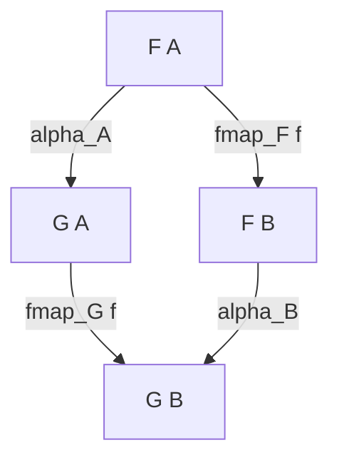

# Guida Strategica & Formulario — LPP 3 CFU (Prof. Luca Roversi)

> [!IMPORTANT]
> **Niente panico!** Anche se i 4 PDF contengono un totale di **83 esercizi**, in realtà gli esercizi si basano tutti su **6 precisi schemi (archetipi)** che si ripetono cambiando soltanto il tipo di dato (es. `Maybe`, `Either`, `List`, `BTree`, `State`, `Reader`).
> Una volta compresi questi 6 schemi, sai risolvere qualsiasi esercizio dell'esame al 100%.

---

## 🗺️ Mappa dei 6 Schemi dell'Esame

| Archetipo | Argomento                        | File PDF | Tipo di domanda d'esame                                                                                 |
| --------- | -------------------------------- | -------- | ------------------------------------------------------------------------------------------------------- |
| **1**     | **Ordini & Monoidi Categoriali** | Parte 1  | Dimostrare che un pre-ordine/poset/monoide è categoria, scrivere diagrammi commutativi.                 |
| **2**     | **Costruzioni Universali**       | Parte 1  | Terminale, Prodotto, Coprodotto, unicità a meno di iso, determinare se una tupla è prodotto/coprodotto. |
| **3**     | **Funtori & Leggi dei Funtori**  | Parte 2  | Definire `fmap`, dimostrare legge identità e composizione, diagrammi in $\mathbf{Set}$.                 |
| **4**     | **Funtori Applicativi**          | Parte 3  | Motivazione d'uso, definire `pure` e `(<*>)`, dimostrare la legge di composizione applicativa.          |
| **5**     | **Trasformazioni Naturali**      | Parte 4  | Definizione, verificare il quadrato di naturalità $\eta_B \circ F(f) = G(f) \circ \eta_A$.              |
| **6**     | **Monadi & State/Reader**        | Parte 4  | Definire `(>>=)`, dimostrare associatività del bind, spiegazione di `State` e `Reader`.                 |

---

## 📐 I 6 Template di Risoluzione (Da imparare a memoria)

### Archetipo 1: Dimostrare che un Pre-ordine $(X, \le)$ è una Categoria
- **Oggetti:** Gli elementi dell'insieme $X$: $\mathrm{obj}(\mathbf{C}) = X$.
- **Morfismi (frecce):** Tra due oggetti $a, b \in X$, esiste un morfismo $a \to b$ se e solo se $a \le b$.
  $$\mathbf{C}(a, b) = \begin{cases} \{(a, b)\} & \text{se } a \le b \\ \emptyset & \text{altrimenti} \end{cases}$$
- **Identità:** Per ogni $a \in X$, la proprietà **riflessiva** garantisce che $a \le a$, quindi esiste sempre la freccia identità $\mathrm{id}_a = (a, a)$.
- **Composizione:** Siano $f: a \to b$ e $g: b \to c$. Per definizione ciò significa $a \le b$ e $b \le c$. Per la proprietà **transitiva**, $a \le c$, quindi esiste la freccia $g \circ f = (a, c): a \to c$.
- **Assiomi di categoria (Identità e Associatività):** Valgono banalmente perché tra due qualsiasi oggetti esiste *al massimo una freccia*. Quindi due composizioni con stessa sorgente e destinazione devono coincidere necessariamente!

#### Monoidi come Categorie con 1 solo oggetto:
Dato un monoide algebrico $(M, \odot, e)$:
- **Unico oggetto:** $\mathrm{obj}(\mathbf{M}) = \{\bullet\}$.
- **Frecce:** Ogni elemento $m \in M$ diventa un endomorfismo $(\bullet \to \bullet)$ rappresentato dalla sezione $(m \odot)$:
  $$\hom(\bullet, \bullet) = \{(m \odot) \mid m \in M\}$$
- **Composizione:** $(n \odot) \circ (m \odot) = ((n \odot m)\odot)$ (associativa grazie a $\odot$).
- **Identità:** $(e \odot)$ è l'identità poiché $(e \odot m) = m = (m \odot e)$.

---

### Archetipo 2: Costruzioni Universali (Terminale, Prodotto, Coprodotto)

#### 1. Oggetto Terminale $T$
- $\forall X \in \mathrm{obj}(\mathbf{C})$, esiste un'**unica** freccia $!_X: X \to T$.
- In $\mathbf{Set}$ e in Haskell è il singleton `()` (unit): `unit :: a -> () ; unit _ = ()`.
- Unicità a meno di isomorfismo: se $T, T'$ sono entrambi terminali, esistono unici $f: T \to T'$ e $g: T' \to T$. La composizione $g \circ f: T \to T$ deve coincidere con l'unica freccia $\mathrm{id}_T$. Idem $f \circ g = \mathrm{id}_{T'}$. Quindi $T \cong T'$.

#### 2. Prodotto Categoriale $(A \times B, \pi_1, \pi_2)$
- Per ogni candidato $(C, p_1, p_2)$ con $p_1: C \to A$ e $p_2: C \to B$, esiste un'**unica freccia mediatrice** $m: C \to A \times B$ tale che:
  $$\pi_1 \circ m = p_1 \quad \text{e} \quad \pi_2 \circ m = p_2$$
- In Haskell: $A \times B$ è la coppia `(a, b)` con `fst` e `snd`. Per qualsiasi altro candidato $C$, $m = \lambda c \to (p_1(c), p_2(c))$.
- **Come riconoscere se una tripla NON è un prodotto:**
  1. **Perdita di informazione:** Se una componente ignora uno dei tipi (es. `(a, \x -> x, \x -> y::b)`), non è possibile ricostruire arbitrari $p_2$.
  2. **Violazione dell'unicità:** Se ci sono dati superflui (es. `((a, a, b), \(x,_,_) -> x, \(_,_,z) -> z)` oppure `((Bool, Int, Bool), ...)`), esistono infinite frecce mediatrici $m$ che scelgono valori diversi per la componente non usata.

#### 3. Coprodotto Categoriale $(A + B, \iota_1, \iota_2)$
- Per ogni candidato $(C, q_1, q_2)$ con $q_1: A \to C$ e $q_2: B \to C$, esiste un'**unica freccia mediatrice** $s: A + B \to C$ tale che:
  $$s \circ \iota_1 = q_1 \quad \text{e} \quad s \circ \iota_2 = q_2$$
- In Haskell: $A + B$ è `Either a b` con le iniezioni `Left` e `Right`. La mediatrice è `either q1 q2`:
  $$s(\mathrm{Left}(x)) = q_1(x), \quad s(\mathrm{Right}(y)) = q_2(y)$$
- **Perché altri candidati falliscono:**
  - Se le iniezioni non sono disgiunte (es. iniettare `Int` e `Bool` entrambi in `Int` sovrapponendo $0$ con `True`), l'informazione sulla provenienza viene persa e non si può definire $s$.
  - Se il tipo candidato ha costruttori in più non coperti dalle iniezioni (es. `Either (Either Bool Int) Int`), l'azione di $s$ su quei costruttori extra può essere scelta arbitrariamente, distruggendo l'unicità di $s$.

---

### Archetipo 3: Funtori e relative Leggi
Data una typeclass `Functor f`:
```haskell
class Functor f where
  fmap :: (a -> b) -> f a -> f b
```

#### Le 2 Leggi da dimostrare:
1. **Identità:** `fmap id = id` (ovvero per ogni $x$, `fmap id x = x`).
2. **Composizione:** `fmap (g . f) = fmap g . fmap f` (ovvero per ogni $x$, `fmap (g . f) x = fmap g (fmap f x)`).

#### Schema di dimostrazione (per casi sui costruttori):
Per ogni costruttore del tipo di dato:
1. Scrivi il membro sinistro (LHS).
2. Applica la definizione di `fmap`.
3. Sostituisci `id x = x` oppure $(g \circ f)(x) = g(f(x))$.
4. Riconosci che il risultato coincide con il membro destro (RHS).
*(Se il tipo è ricorsivo, come `List` o `BTree`, usa l'ipotesi induttiva sui sotto-alberi/coda).*

---

### Archetipo 4: Funtori Applicativi & Legge di Composizione
Data la typeclass `Applicative f`:
```haskell
class Functor f => Applicative f where
  pure  :: a -> f a
  (<*>) :: f (a -> b) -> f a -> f b
```

#### Legge di Composizione Applicativa:
$$\text{pure }(.) \mathbin{\langle*\rangle} u \mathbin{\langle*\rangle} v \mathbin{\langle*\rangle} w = u \mathbin{\langle*\rangle} (v \mathbin{\langle*\rangle} w)$$

#### Tipi delle componenti:
- $(.) :: (b \to c) \to (a \to b) \to a \to c$
- $\text{pure }(.) :: f ((b \to c) \to (a \to b) \to a \to c)$
- $u :: f (b \to c)$
- $v :: f (a \to b)$
- $w :: f a$
- Risultato di entrambi i lati: $f c$.

#### Schema di dimostrazione:
Si valutano i due lati separatamente:
- **LHS:**
  $$\text{pure }(.) \mathbin{\langle*\rangle} u \implies \dots$$
  $$(\text{pure }(.) \mathbin{\langle*\rangle} u) \mathbin{\langle*\rangle} v \implies \dots$$
  $$((\text{pure }(.) \mathbin{\langle*\rangle} u) \mathbin{\langle*\rangle} v) \mathbin{\langle*\rangle} w \implies \dots$$
- **RHS:**
  $$v \mathbin{\langle*\rangle} w \implies \dots$$
  $$u \mathbin{\langle*\rangle} (v \mathbin{\langle*\rangle} w) \implies \dots$$
I due risultati coincidono!

---

### Archetipo 5: Trasformazioni Naturali e Condizione di Naturalità
Dati due funtori $F, G: \mathbf{C} \to \mathbf{D}$, una trasformazione naturale $\alpha: F \Rightarrow G$ è una famiglia di morfismi $\alpha_X: F(X) \to G(X)$ tale che per ogni freccia $f: A \to B$ commuta il diagramma:



In Haskell, la condizione è:
$$\alpha \circ \mathrm{fmap}_F(f) = \mathrm{fmap}_G(f) \circ \alpha$$
ovvero su un elemento $x :: F(a)$:
$$\alpha(\mathrm{fmap}_F\, f\, x) = \mathrm{fmap}_G\, f\, (\alpha\, x)$$

#### Schema di dimostrazione per l'esame:
Per un dato elemento (es. `Just x`, `x:xs`, `Right x`):
1. **Calcola LHS:** $\alpha(\mathrm{fmap}_F\, f\, x)$.
2. **Calcola RHS:** $\mathrm{fmap}_G\, f\, (\alpha\, x)$.
3. Mostra l'uguaglianza termine a termine.

---

### Archetipo 6: Monadi e Associatività del Bind
```haskell
class Applicative m => Monad m where
  (>>=) :: m a -> (a -> m b) -> m b
```

#### Legge di Associatività del Bind:
$$(m \mathbin{>\!\!>=} f) \mathbin{>\!\!>=} g = m \mathbin{>\!\!>=} (\lambda x \to f\, x \mathbin{>\!\!>=} g)$$
dove:
- $m :: m a$
- $f :: a \to m b$
- $g :: b \to m c$

#### Schema di dimostrazione:
Analizza i casi su $m$:
- Se $m$ è un costruttore "vuoto/errore" (es. `Nothing`, `Left err`, `Nil`): entrambi i lati collassano immediatamente al medesimo errore/costruttore.
- Se $m$ contiene un valore (es. `Just x`, `Right x`, `Cons x xs`): valuta LHS e RHS espandendo la definizione di `(>>=)` e mostra che giungono alla medesima espressione.
