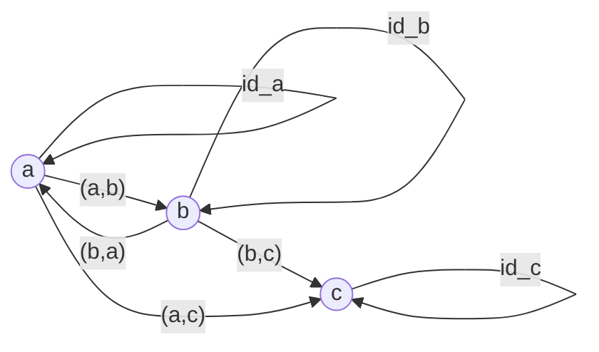
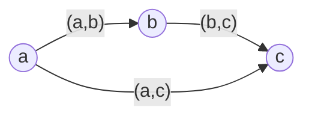
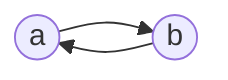
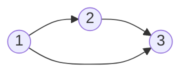
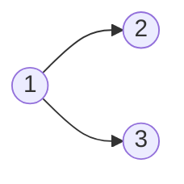
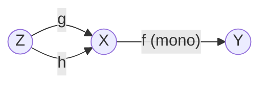
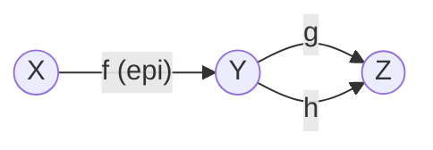
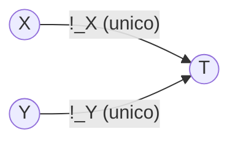
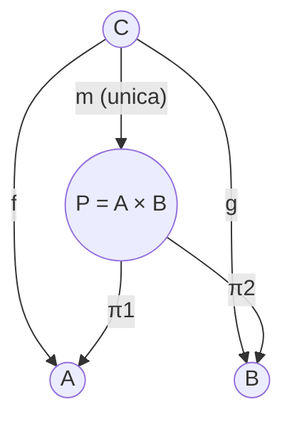
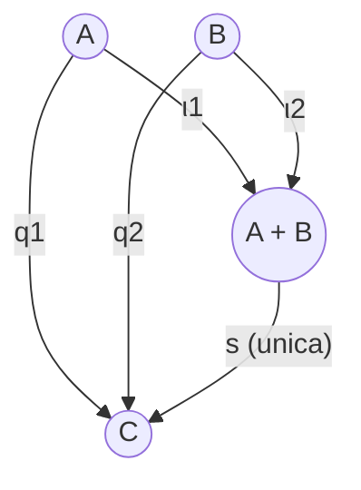

# Risoluzione Esercizi Esame — Parte 1
**Corso:** Linguaggi e Paradigmi di Programmazione (3 CFU)  
**Docente:** Prof. Luca Roversi  
**Argomenti:** Categorie elementari, Pre-ordini, Poset, Ordini totali, Monoidi categoriali, Categoria $\mathbf{Set}$, Monomorfismi, Epimorfismi, Oggetto terminale, Prodotto cartesiano, Coprodotto.

---

## CT0050: Prime Categorie e Ordini

### Esercizio 1
> **Testo:** Prove that any pre-order is a category.  
> **Hint:** Recall def. of pre-order; show that reflexivity implies the existence of identity using transitivity; show that transitivity is arrow composition.

**Soluzione:**
1. **Definizione di Pre-ordine:** Un pre-ordine è una coppia $(X, \le)$ dove $X$ è un insieme e $\le \subseteq X \times X$ è una relazione binaria:
   - **Riflessiva:** $\forall a \in X.\; a \le a$
   - **Transitiva:** $\forall a, b, c \in X.\; (a \le b \land b \le c) \implies a \le c$
2. **Costruzione della Categoria $\mathbf{C}$:**
   - **Oggetti:** $\mathrm{obj}(\mathbf{C}) = X$.
   - **Morfismi (frecce):** Per ogni coppia di oggetti $a, b \in X$, l'insieme dei morfismi $\mathbf{C}(a, b)$ contiene un unico elemento se $a \le b$, ed è vuoto altrimenti:
     $$\mathbf{C}(a, b) = \begin{cases} \{(a, b)\} & \text{se } a \le b \\ \emptyset & \text{altrimenti} \end{cases}$$
3. **Morfismo Identità:**
   Per la proprietà riflessiva del pre-ordine, per ogni $a \in X$ vale $a \le a$. Dunque esiste sempre il morfismo $\mathrm{id}_a = (a, a) \in \mathbf{C}(a, a)$.
4. **Composizione di Morfismi:**
   Siano $f = (a, b) \in \mathbf{C}(a, b)$ e $g = (b, c) \in \mathbf{C}(b, c)$. Ciò implica che $a \le b$ e $b \le c$. Per la transitività della relazione $\le$, ne segue che $a \le c$. Definiamo quindi la composizione:
   $$g \circ f = (a, c) \in \mathbf{C}(a, c)$$
5. **Assiomi di Categoria:**
   - **Unità (Identity laws):** Per ogni freccia $f = (a, b) \in \mathbf{C}(a, b)$:
     $$\mathrm{id}_b \circ f = (b, b) \circ (a, b) = (a, b) = f$$
     $$f \circ \mathrm{id}_a = (a, b) \circ (a, a) = (a, b) = f$$
   - **Associatività:** Date tre frecce componibili $f = (a, b)$, $g = (b, c)$, $h = (c, d)$:
     $$(h \circ g) \circ f = (a, d) = h \circ (g \circ f)$$
   *Nota fondamentale:* Poiché tra due qualsiasi oggetti c'è al massimo un morfismo ($|\mathbf{C}(x, y)| \le 1$), qualsiasi diagramma parallelo commuta banalmente, e gli assiomi di categoria sono automaticamente soddisfatti. $\blacksquare$

---

### Esercizio 2
> **Testo:** Write an example of pre-order and the corresponding commuting diagram to show that the pre-order is a category.

**Soluzione:**
Sia $X = \{a, b, c\}$. Definiamo la relazione di pre-ordine $\le$ come:
$$\le \;=\; \{(a, a), (b, b), (c, c), (a, b), (b, c), (a, c), (b, a)\}$$
*(Nota: questo è un pre-ordine ma non un ordine parziale, perché $a \le b$ e $b \le a$ ma $a \ne b$, cioè $a$ e $b$ sono isomorfi).*

**Diagramma commutativo:**

- La composizione $(b, c) \circ (a, b) = (a, c)$ commuta.
- La composizione $(b, a) \circ (a, b) = (a, a) = \mathrm{id}_a$ commuta.
- La composizione $(a, b) \circ (b, a) = (b, b) = \mathrm{id}_b$ commuta.

---

### Esercizio 3
> **Testo:** Prove that any partial-order is a category.

**Soluzione:**
Un ordine parziale (poset) è una coppia $(X, \le)$ tale che $\le$ è:
1. Riflessiva: $\forall a.\; a \le a$
2. Transitiva: $\forall a, b, c.\; a \le b \land b \le c \implies a \le c$
3. Antisimmetrica: $\forall a, b.\; a \le b \land b \le a \implies a = b$

Poiché un ordine parziale soddisfa riflessività e transitività, esso è in particolare un **pre-ordine**.
Per la dimostrazione svolta nell'**Esercizio 1**, ogni pre-ordine definisce una categoria dove:
- Gli oggetti sono gli elementi di $X$.
- I morfismi sono le coppie $(a, b)$ con $a \le b$.
- Le identità sono garantite dalla riflessività.
- La composizione è garantita dalla transitività.
- Associatività e unità valgono banalmente perché $|\mathbf{C}(a, b)| \le 1$.
Dunque ogni ordine parziale è una categoria. (L'antisimmetria aggiunge l'ulteriore proprietà che se $a \cong b$, allora $a = b$, ovvero la categoria è *scheletrica*). $\blacksquare$

---

### Esercizio 4
> **Testo:** Write an example of partial-order and the corresponding commuting diagram to show that the pre-order is a category. Highlight a possible graph that cannot be a sub-graph of the commuting diagram corresponding to the given example.

**Soluzione:**
1. **Esempio:** Sia $X = \{a, b, c\}$ con la relazione:
   $$\le \;=\; \{(a, a), (b, b), (c, c), (a, b), (b, c), (a, c)\}$$
2. **Diagramma commutativo:**


*(I cappi di identità su ciascun nodo sono impliciti).*

3. **Grafo che NON può essere un sottografo:**
   Un grafo contenente un ciclo tra nodi distinti, ad esempio:


   **Motivazione:** In un ordine parziale vale l'antisimmetria ($a \le b \land b \le a \implies a = b$). La presenza contemporanea di una freccia $a \to b$ e di una freccia $b \to a$ con $a \ne b$ violerebbe l'antisimmetria. Inoltre, non possono esistere due frecce parallele distinte tra gli stessi due nodi ($|\mathbf{C}(x, y)| \le 1$).

---

### Esercizio 5
> **Testo:** Prove that any total-order is a category.

**Soluzione:**
Un ordine totale è un ordine parziale $(X, \le)$ che soddisfa la proprietà di **totalità (o tricotomia/connessione)**:
$$\forall a, b \in X.\; a \le b \;\lor\; b \le a$$
Poiché un ordine totale è a tutti gli effetti un ordine parziale (e quindi un pre-ordine), la costruzione della categoria è identica a quella degli Esercizi 1 e 3:
- $\mathrm{obj}(\mathbf{C}) = X$.
- $\mathbf{C}(a, b) = \{(a, b)\}$ se $a \le b$, altrimenti $\emptyset$.
- Riflessività $\implies$ esistenza di $\mathrm{id}_a = (a, a)$.
- Transitività $\implies$ composizione $(b, c) \circ (a, b) = (a, c)$.
- Gli assiomi di categoria valgono banalmente poiché $|\mathbf{C}(a, b)| \le 1$. $\blacksquare$

---

### Esercizio 6
> **Testo:** Write an example of total-order and the corresponding commuting diagram to show that the pre-order is a category. Highlight a possible graph that cannot be a sub-graph of the commuting diagram corresponding to the given example.

**Soluzione:**
1. **Esempio:** L'insieme $X = \{1, 2, 3\}$ con il consueto ordine $\le$:
   $$\le \;=\; \{(1,1), (2,2), (3,3), (1,2), (2,3), (1,3)\}$$
2. **Diagramma commutativo:**



3. **Grafo che NON può essere un sottografo:**
   Un grafo in cui due nodi non sono confrontabili in alcuna direzione, ad esempio:


   *(senza alcuna freccia tra 2 e 3).*  
   **Motivazione:** In un ordine totale ogni coppia di elementi deve essere confrontabile ($\forall x, y.\; x \le y \lor y \le x$). L'assenza di frecce tra $2$ e $3$ (in entrambe le direzioni) violerebbe l'assioma di totalità (come mostrato nei lucidi Roversi, slide 14 di `CT0050`).

---

### Esercizio 7
> **Testo:** Prove that at most one arrow exists between two objects of the commuting diagram corresponding to a pre-order.

**Soluzione:**
In una categoria derivata da un pre-ordine $(X, \le)$, l'insieme dei morfismi tra due oggetti $a$ e $b$ è definito come:
$$\mathbf{C}(a, b) = \begin{cases} \{(a, b)\} & \text{se } (a, b) \in\; \le \\ \emptyset & \text{se } (a, b) \notin\; \le \end{cases}$$
Poiché $\le$ è un sottoinsieme del prodotto cartesiano $X \times X$ (cioè un insieme matematico di coppie), per ogni coppia ordinata $(a, b)$ vale una e una sola delle due alternative:
- $(a, b) \in\; \le \implies |\mathbf{C}(a, b)| = 1$
- $(a, b) \notin\; \le \implies |\mathbf{C}(a, b)| = 0$
In entrambi i casi, $|\mathbf{C}(a, b)| \le 1$. Pertanto, esiste **al massimo una freccia** tra due oggetti qualsiasi in una data direzione. Avere due frecce parallele distinte $f, g: a \to b$ significherebbe che $\{(a, b), (a, b)\}$ ha cardinalità 2, assurdo per definizione di insieme. $\blacksquare$

---

### Esercizio 8
> **Testo:** Prove that at most one arrow exists between two objects of the commuting diagram corresponding to a partial-order.

**Soluzione:**
Ogni ordine parziale è per definizione un pre-ordine. La definizione dell'insieme dei morfismi $\mathbf{C}(a, b)$ si basa unicamente sull'appartenenza della coppia $(a, b)$ alla relazione d'ordine $\le \subseteq X \times X$.
Dunque $|\mathbf{C}(a, b)| \in \{0, 1\}$, esattamente come dimostrato nell'Esercizio 7. $\blacksquare$

---

### Esercizio 9
> **Testo:** Prove that exactly one arrow exists between two objects of the commuting diagram corresponding to a total-order.

**Soluzione:**
Siano $a, b \in X$ due oggetti distinti ($a \ne b$) in un ordine totale $(X, \le)$.
1. Per la proprietà di **totalità**, vale $a \le b \lor b \le a$. Ne segue che tra i due oggetti esiste *almeno* una freccia (o da $a$ a $b$, o da $b$ a $a$).
2. Per la proprietà di **antisimmetria**, se valessero contemporaneamente $a \le b$ e $b \le a$, ne seguirebbe $a = b$, contraddicendo l'ipotesi che $a \ne b$. Dunque non possono esistere frecce in entrambe le direzioni tra nodi distinti.
3. Inoltre, per l'Esercizio 7, non possono esistere frecce parallele nella stessa direzione.
Pertanto, per ogni coppia non ordinata di elementi distinti $\{a, b\}$, esiste **esattamente una freccia** che li collega (orientata da $a$ a $b$ se $a \le b$, oppure da $b$ a $a$ se $b \le a$). $\blacksquare$

---

### Esercizio 10
> **Testo:** Justify why we cannot say that every oriented graph is a category.

**Soluzione:**
Un grafo orientato $G = (V, E)$ consiste unicamente di un insieme di vertici $V$ e di archi orientati $E \subseteq V \times V$. Non ogni grafo è una categoria per due motivi fondamentali:
1. **Assenza dei morfismi identità:** In una categoria, per ogni vertice $v \in V$ deve esistere un morfismo identità $\mathrm{id}_v: v \to v$. Un generico grafo orientato può non avere cappi (self-loops) su ciascun vertice.
2. **Assenza della chiusura per composizione:** In una categoria, se esistono frecce $f: u \to v$ e $g: v \to w$, *deve necessariamente esistere* la freccia composta $g \circ f: u \to w$. In un generico grafo orientato possono esistere cammini di lunghezza $\ge 2$ senza che vi sia un arco diretto dal nodo di partenza a quello di arrivo.
*(Per trasformare un grafo in una categoria occorre considerare la sua categoria libera $\mathcal{F}(G)$, aggiungendo le identità e tutti gli archi di composizione).*

---

## CT0100: Monoidi Categoriali

> **Principio Generale (Roversi):** Un monoide algebrico $(M, \odot, e)$ corrisponde a una categoria $\mathbf{M}$ avente:
> - Un unico oggetto: $\mathrm{obj}(\mathbf{M}) = \{\bullet\}$
> - Come frecce, le "sezioni" (applicazioni parziali dell'operazione): $\hom(\bullet, \bullet) = \{(m \odot) \mid m \in M\}$
> - Come freccia identità: la sezione dell'elemento neutro $(e \odot)$
> - Composizione: $(n \odot) \circ (m \odot) = ((n \odot m) \odot)$

### Esercizio 11
> **Testo:** Let $B = \{T, F\}$. Write the Categorical monoid of the monoid $(B, \land, T)$.

**Soluzione:**
- **Oggetti:** $\mathrm{obj}(\mathbf{B}_\land) = \{\bullet\}$
- **Morfismi:** $\hom(\bullet, \bullet) = \{(T \land), (F \land)\}$ dove:
  - $(T \land): \bullet \to \bullet$ è l'identità: $\mathrm{id}_\bullet = (T \land)$
  - $(F \land): \bullet \to \bullet$
- **Composizione:** $(x \land) \circ (y \land) = ((x \land y)\land)$
  - $(T \land) \circ (T \land) = (T \land)$
  - $(T \land) \circ (F \land) = (F \land) \circ (T \land) = (F \land)$
  - $(F \land) \circ (F \land) = (F \land)$

---

### Esercizio 12
> **Testo:** Let $B = \{T, F\}$. Write the Categorical monoid of the monoid $(B, \lor, F)$.

**Soluzione:**
- **Oggetti:** $\mathrm{obj}(\mathbf{B}_\lor) = \{\bullet\}$
- **Morfismi:** $\hom(\bullet, \bullet) = \{(T \lor), (F \lor)\}$
- **Identità:** $\mathrm{id}_\bullet = (F \lor)$ (poiché $F$ è l'elemento neutro di $\lor$)
- **Composizione:** $(x \lor) \circ (y \lor) = ((x \lor y)\lor)$

---

### Esercizio 13
> **Testo:** Let $B = \{T, F\}$. Write the Categorical monoid of the monoid $(B, \oplus, F)$ ("exclusive or").

**Soluzione:**
- **Oggetti:** $\mathrm{obj}(\mathbf{B}_\oplus) = \{\bullet\}$
- **Morfismi:** $\hom(\bullet, \bullet) = \{(T \oplus), (F \oplus)\}$
- **Identità:** $\mathrm{id}_\bullet = (F \oplus)$ (poiché $x \oplus F = x$)
- **Composizione:** $(x \oplus) \circ (y \oplus) = ((x \oplus y)\oplus)$
  - In particolare: $(T \oplus) \circ (T \oplus) = ((T \oplus T)\oplus) = (F \oplus) = \mathrm{id}_\bullet$.

---

### Esercizio 14
> **Testo:** Write the Categorical monoid of the monoid $(\Sigma^*, \cdot, \epsilon)$ (strings).

**Soluzione:**
- **Oggetti:** $\mathrm{obj}(\mathbf{\Sigma^*}) = \{\bullet\}$
- **Morfismi:** $\hom(\bullet, \bullet) = \{(w \cdot) \mid w \in \Sigma^*\}$ dove $(w \cdot)$ indica la concatenazione prefissa della stringa $w$.
- **Identità:** $\mathrm{id}_\bullet = (\epsilon \cdot)$ (stringa vuota).
- **Composizione:** $(u \cdot) \circ (v \cdot) = ((u \cdot v)\cdot)$.

---

### Esercizio 15
> **Testo:** Write the Categorical monoid of the monoid $(\{[a_1, \dots, a_n] \mid n \in \mathbb{N}\}, {+\!\!+}, [\,])$ (lists).

**Soluzione:**
- **Oggetti:** $\mathrm{obj}(\mathbf{List}) = \{\bullet\}$
- **Morfismi:** $\hom(\bullet, \bullet) = \{(l {+\!\!+}) \mid l \in List\}$
- **Identità:** $\mathrm{id}_\bullet = ([\,] {+\!\!+})$ (la lista vuota).
- **Composizione:** $(l_1 {+\!\!+}) \circ (l_2 {+\!\!+}) = ((l_1 {+\!\!+} l_2){+\!\!+})$.

---

## CT0150: Categoria $\mathbf{Set}$, Monomorfismi, Epimorfismi, Oggetto Terminale e Prodotto

### Esercizio 16
> **Testo:** Recall the definition of monomorphism and how it is obtained as a generalization of the notion: "injective function" between two sets.

**Soluzione:**
1. **Definizione di Monomorfismo:** In una categoria $\mathbf{C}$, un morfismo $f: X \to Y$ è detto **monomorfismo** (o freccia mono, o semplificabile a sinistra) se per ogni coppia di morfismi paralleli $g, h: Z \to X$:
   $$f \circ g = f \circ h \implies g = h$$



2. **Generalizzazione da funzione iniettiva:**
   In $\mathbf{Set}$, una funzione $f: X \to Y$ è iniettiva se $\forall x, x' \in X,\; f(x) = f(x') \implies x = x'$.
   Se consideriamo $Z = \{\bullet\}$ (un singoletto), due funzioni $g, h: \{\bullet\} \to X$ corrispondono alla scelta di due elementi $g(\bullet) = x$ e $h(\bullet) = x'$ in $X$.
   L'uguaglianza $f \circ g = f \circ h$ significa $f(g(\bullet)) = f(h(\bullet))$, ossia $f(x) = f(x')$.
   L'implicazione $g = h$ impone che $g(\bullet) = h(\bullet)$, ossia $x = x'$.
   Il monomorfismo generalizza questo concetto a qualunque oggetto di test $Z$ senza dover fare riferimento agli "elementi interni" degli oggetti, operando solo tramite frecce esterne.

---

### Esercizio 17
> **Testo:** Recall the definition of epimorphism and how it is obtained as a generalization of the notion: "surjective function" between two sets.

**Soluzione:**
1. **Definizione di Epimorfismo:** In una categoria $\mathbf{C}$, un morfismo $f: X \to Y$ è detto **epimorfismo** (o freccia epi, o semplificabile a destra) se per ogni coppia di morfismi paralleli $g, h: Y \to Z$:
   $$g \circ f = h \circ f \implies g = h$$



2. **Generalizzazione da funzione suriettiva:**
   In $\mathbf{Set}$, $f: X \to Y$ è suriettiva se l'immagine di $f$ copre tutto il codominio: $\mathrm{Im}(f) = Y$.
   Se $f$ non fosse suriettiva, esisterebbe almeno un elemento $y_0 \in Y \setminus \mathrm{Im}(f)$. Potremmo allora costruire due funzioni $g, h: Y \to \{0, 1\}$ che concordano su tutti gli elementi di $\mathrm{Im}(f)$ ma differiscono su $y_0$ (es. $g(y_0) = 0$ e $h(y_0) = 1$). In tal caso avremmo $g \circ f = h \circ f$ ma $g \ne h$.
   Imporre la cancellabilità a destra ($g \circ f = h \circ f \implies g = h$) garantisce che non ci siano elementi non coperti in $Y$.

---

### Esercizio 18
> **Testo:** Recall the definition of "Terminal object in a generic category" and how it is obtained as a generalization of the notion: "singleton set".

**Soluzione:**
1. **Definizione:** In una categoria $\mathbf{C}$, un oggetto $T \in \mathrm{obj}(\mathbf{C})$ è detto **terminale** se per ogni oggetto $X \in \mathrm{obj}(\mathbf{C})$ esiste **uno e un solo** morfismo $!_X: X \to T$.



2. **Generalizzazione dal singoletto:**
   Nella categoria $\mathbf{Set}$, consideriamo un insieme singoletto $\{\star\}$. Per qualsiasi insieme $X$, quante funzioni esistono da $X$ a $\{\star\}$?
   Esiste una sola funzione: quella costante che mappa ogni elemento $x \in X$ nell'unico elemento $\star$: $f(x) = \star$.
   In Haskell, l'oggetto terminale è il tipo unit `()` con l'unica funzione:
   ```haskell
   unit :: a -> ()
   unit _ = ()
   ```
   La proprietà universale cattura la natura del singoletto tramite l'esistenza e unicità di una freccia entrante da ogni altro oggetto.

---

### Esercizio 19
> **Testo:** Prove that the terminal object of a category $\mathbf{C}$ is unique up to isomorphism.

**Soluzione:**
Siano $T$ e $T'$ due oggetti terminali nella stessa categoria $\mathbf{C}$.
1. Poiché $T'$ è terminale, esiste un'unica freccia $f: T \to T'$.
2. Poiché $T$ è terminale, esiste un'unica freccia $g: T' \to T$.
3. Consideriamo la composizione $g \circ f: T \to T$.
   Poiché $T$ è terminale, deve esistere un'**unica** freccia da $T$ a $T$.
   Ma sappiamo che l'identità $\mathrm{id}_T: T \to T$ è una freccia da $T$ a $T$.
   Per l'unicità della freccia verso l'oggetto terminale $T$, deve valere:
   $$g \circ f = \mathrm{id}_T$$
4. Analogamente, consideriamo la composizione $f \circ g: T' \to T'$.
   Per l'unicità della freccia da $T'$ verso il terminale $T'$, deve valere:
   $$f \circ g = \mathrm{id}_{T'}$$
5. Poiché $g \circ f = \mathrm{id}_T$ e $f \circ g = \mathrm{id}_{T'}$, $f$ e $g$ sono isomorfismi inversi l'uno dell'altro. Dunque $T \cong T'$. $\blacksquare$

---

### Esercizio 20
> **Testo:** Let $\{a, b, c\}$ be a set with three elements. Is it terminal in the category $\mathbf{Set}$? Justify by means of an example.

**Soluzione:**
**No, non è terminale.**
*Giustificazione con controesempio:*
Sia $X = \{1\}$ un insieme con un solo elemento.
Il numero di funzioni da $X$ a $\{a, b, c\}$ è pari alla cardinalità $|\{a, b, c\}|^{|X|} = 3^1 = 3$.
Tali funzioni sono:
- $f_1(1) = a$
- $f_2(1) = b$
- $f_3(1) = c$
Poiché esistono 3 funzioni distinte da $\{1\}$ a $\{a, b, c\}$, la freccia non è unica (dev'esserne esattamente una). Dunque $\{a, b, c\}$ non è terminale.

---

### Esercizio 21
> **Testo:** Recall the definition of "Product between $a$ and $b$" as given in Category Theory. Then, justify why $(a, \backslash x \to x, \backslash x \to y::b)$ cannot be taken as Product between $a$ and $b$.

**Soluzione:**
1. **Definizione di Prodotto:** In una categoria $\mathbf{C}$, il prodotto di due oggetti $A$ e $B$ è una tripla $(P, \pi_1, \pi_2)$ con $\pi_1: P \to A$ e $\pi_2: P \to B$, tale che per ogni altro oggetto $C$ dotato di due frecce $f: C \to A$ e $g: C \to B$, esiste un'**unica freccia mediatrice** $m: C \to P$ tale che:
   $$\pi_1 \circ m = f \quad \text{e} \quad \pi_2 \circ m = g$$



2. **Perché $(a, \backslash x \to x, \backslash x \to y::b)$ NON è un prodotto:**
   Qui il candidato è $P = a$, con proiezioni $p_1 = \lambda x \to x$ e $p_2 = \lambda x \to y$ (funzione costante che restituisce un elemento prefissato $y \in b$).
   Prendiamo come candidato test la vera coppia $C = (a, b)$ con le proiezioni standard $f = \mathrm{fst}$ e $g = \mathrm{snd}$.
   Dovrebbe esistere una funzione $m: (a, b) \to a$ tale che:
   - $p_1(m(x, z)) = x \implies m(x, z) = x$
   - $p_2(m(x, z)) = z$
   Tuttavia, $p_2(m(x, z)) = p_2(x) = y$. Quindi dovrebbe valere $y = z$ per ogni possibile elemento $z \in b$.
   Se il tipo $b$ ha almeno due elementi distinti $z_1 \ne z_2$, la funzione costante restituisce sempre $y$ e non può uguagliare un arbitrario $z \in b$.
   La freccia mediatrice non può esistere (fallisce l'esistenza della fattorizzazione).

---

### Esercizio 22
> **Testo:** Recall the definition of "Product between $a$ and $b$". Then, justify why $((a,a,b), \(x,\_,\_) \to x, \(\_,\_,z) \to z)$ cannot be taken as Product between $a$ and $b$.

**Soluzione:**
Il candidato proposto è $P = (a, a, b)$ con proiezioni $p_1(x, \_, \_) = x$ e $p_2(\_, \_, z) = z$.
Prendiamo come oggetto di test la coppia $C = (a, b)$ con $f = \mathrm{fst}$ e $g = \mathrm{snd}$.
Affinché sia un prodotto, deve esistere un'**unica** freccia mediatrice $m: (a, b) \to (a, a, b)$ tale che:
$$p_1 \circ m = \mathrm{fst} \quad \text{e} \quad p_2 \circ m = \mathrm{snd}$$
La funzione $m$ riceve $(x, z)$ e deve produrre una terna $(t_1, t_2, t_3)$ tale che $t_1 = x$ e $t_3 = z$.
Tuttavia, la seconda coordinata $t_2 \in a$ non è vincolata da alcuna proiezione! Possiamo definire:
- $m_1(x, z) = (x, x, z)$
- $m_2(x, z) = (x, n, z)$ per un qualsiasi elemento prefissato $n \in a$.
Entrambe le funzioni soddisfano:
$p_1(m_1(x, z)) = x = \mathrm{fst}(x, z)$ e $p_2(m_1(x, z)) = z = \mathrm{snd}(x, z)$,
$p_1(m_2(x, z)) = x = \mathrm{fst}(x, z)$ e $p_2(m_2(x, z)) = z = \mathrm{snd}(x, z)$.
Poiché $m_1 \ne m_2$, **la freccia mediatrice non è unica**. Dunque $((a, a, b), p_1, p_2)$ viola l'unicità della proprietà universale.

---

### Esercizio 23
> **Testo:** Let us assume that both $P$ and $Q$ are the Product of $a$ and $b$ in a Category. Prove that $P$ and $Q$ are isomorphic.

**Soluzione:**
Siano $(P, \pi_1^P, \pi_2^P)$ e $(Q, \pi_1^Q, \pi_2^Q)$ due prodotti per gli oggetti $a$ e $b$.
1. Poiché $P$ è un prodotto e $Q$ è dotato delle proiezioni $\pi_1^Q: Q \to a$ e $\pi_2^Q: Q \to b$, per la proprietà universale di $P$ esiste un'unica freccia mediatrice $m: Q \to P$ tale che:
   $$\pi_1^P \circ m = \pi_1^Q \quad \text{e} \quad \pi_2^P \circ m = \pi_2^Q$$
2. Simmetricamente, poiché $Q$ è un prodotto e $P$ ha le frecce $\pi_1^P: P \to a$ e $\pi_2^P: P \to b$, per la proprietà universale di $Q$ esiste un'unica freccia mediatrice $k: P \to Q$ tale che:
   $$\pi_1^Q \circ k = \pi_1^P \quad \text{e} \quad \pi_2^Q \circ k = \pi_2^P$$
3. Consideriamo ora la freccia composta $m \circ k: P \to P$.
   Verifichiamo la composizione con le proiezioni di $P$:
   $$\pi_1^P \circ (m \circ k) = (\pi_1^P \circ m) \circ k = \pi_1^Q \circ k = \pi_1^P$$
   $$\pi_2^P \circ (m \circ k) = (\pi_2^P \circ m) \circ k = \pi_2^Q \circ k = \pi_2^P$$
   Notiamo che anche l'identità $\mathrm{id}_P: P \to P$ soddisfa banalmente $\pi_1^P \circ \mathrm{id}_P = \pi_1^P$ e $\pi_2^P \circ \mathrm{id}_P = \pi_2^P$.
   Ma per la proprietà universale di $P$, la freccia da $P$ in $P$ che fattorizza $\pi_1^P$ e $\pi_2^P$ è **unica**.
   Quindi deve valere:
   $$m \circ k = \mathrm{id}_P$$
4. In modo del tutto analogo, considerando $k \circ m: Q \to Q$, per l'unicità della mediatrice su $Q$ si conclude:
   $$k \circ m = \mathrm{id}_Q$$
5. Avendo trovato $m: Q \to P$ e $k: P \to Q$ tali che $m \circ k = \mathrm{id}_P$ e $k \circ m = \mathrm{id}_Q$, $P$ e $Q$ sono isomorfi: $P \cong Q$. $\blacksquare$

---

### Esercizi 24 & 25
> **Esercizio 24:** Is the following triple:
> `((Bool, Int, Bool), \(x,y,z) -> z, \(x,y,z) -> y)`
> a product between the Haskell types `Bool` and `Int`?

**Risposta:** **NO.**
*Motivazione:* La prima coordinata $x \in \mathrm{Bool}$ non è utilizzata da nessuna delle due proiezioni. Di conseguenza, data una coppia test $(\mathrm{Bool}, \mathrm{Int})$ con proiezioni identità, la freccia mediatrice $m(b, i)$ potrebbe essere scelta come $(b_0, i, b)$ per qualsiasi valore arbitrario $b_0 \in \{\mathrm{True}, \mathrm{False}\}$. Essendoci almeno due scelte distinte per $m$, viene violata l'**unicità della freccia mediatrice**.

---

> **Esercizio 25:** Is the following triple:
> `((Bool, Int, Bool), \(x,y,z) -> x, \(x,y,z) -> y)`
> a product between the Haskell types `Bool` and `Int`?

**Risposta:** **NO.**
*Motivazione:* Identica al caso precedente: la terza coordinata $z \in \mathrm{Bool}$ viene scartata da entrambe le proiezioni. La mediatrice $m(b, i) = (b, i, z_0)$ ammette scelte arbitrarie per $z_0$, violando l'unicità di $m$.

---

### Esercizio 26
> **Testo:** Is the following triple:
> `((Bool, Int), \(x,y) -> x, \(x,y) -> y + 1)`
> a product between the Haskell types `Bool` and `Int`?

**Risposta:** **NO (secondo la formalizzazione del corso).**
*Motivazione:*
1. La seconda proiezione proposta $p_2(x, y) = y + 1$ non è una proiezione canonica (non estrae il dato originale, ma applica una trasformazione).
2. Se consideriamo i tipi di Haskell, `Int` ha limiti finiti (`minBound` e `maxBound`): per $y = \mathrm{maxBound}$, $y + 1$ causa un overflow aritmetico.
3. Se consideriamo la teoria matematica generale su domini numerici come $\mathbb{N}$ (i naturali con lo zero), la funzione $y \mapsto y + 1$ non è suriettiva (lo zero non ha antecedente). Se un candidato test volesse produrre $0$, non esisterebbe alcun intero $y$ tale che $y + 1 = 0$, violando l'esistenza della mediatrice.

---

### Esercizio 27
> **Testo:** Is the following triple:
> `((Bool, Int), \(x,y) -> not x, \(x,y) -> y)`
> a product between the Haskell types `Bool` and `Int`?

**Risposta:**
- **In Teoria delle Categorie astratta:** **SÌ**, è un prodotto valido, poiché $(\mathrm{not}, \mathrm{id})$ è un isomorfismo di categorie (la funzione `not` è biiettiva e involutiva: $\mathrm{not} \circ \mathrm{not} = \mathrm{id}$). Qualsiasi oggetto isomorfo al prodotto con proiezioni composte con isomorfismi soddisfa la proprietà universale (la mediatrice unica è $m(c) = (\mathrm{not}(f(c)), g(c))$).
- **Nel contesto canonico di programmazione:** Si preferisce rispondere che non è il prodotto *canonico* perché la prima proiezione altera i valori di verità scambiandoli.

---

## CT0200: Costruzioni Universali e Coprodotto

> **Principio del Coprodotto $(A + B, \iota_1, \iota_2)$:**
> Per ogni candidato $(C, q_1, q_2)$ con $q_1: A \to C$ e $q_2: B \to C$, deve esistere un'**unica freccia mediatrice** $s: A + B \to C$ tale che:
> $$s \circ \iota_1 = q_1 \quad \text{e} \quad s \circ \iota_2 = q_2$$
> In Haskell il coprodotto è `Either a b` con $\iota_1 = \mathrm{Left}$ e $\iota_2 = \mathrm{Right}$.



### Esercizio 28
> **Testo:** Is the following triple:
> `(Either (Either Bool Int) Int, \x::Int -> Left (Right x), \z::Bool -> Left (Left z))`
> a Co-Product between `Int` and `Bool`?

**Risposta:** **NO.**
*Motivazione:* Il costruttore esterno `Right :: Int -> Either (Either Bool Int) Int` non viene mai raggiunto da nessuna delle due iniezioni.
Di conseguenza, per definire una funzione mediatrice $s: \mathrm{Either}\ (\mathrm{Either}\ \mathrm{Bool}\ \mathrm{Int})\ \mathrm{Int} \to C$, dobbiamo specificare:
- $s(\mathrm{Left}(\mathrm{Right}\ x)) = q_1(x)$
- $s(\mathrm{Left}(\mathrm{Left}\ z)) = q_2(z)$
- $s(\mathrm{Right}\ w) = \text{valore arbitrario in } C$
Poiché il valore su $\mathrm{Right}\ w$ può essere scelto a piacere senza violare le equazioni di fattorizzazione, **la freccia mediatrice $s$ non è unica**.

---

### Esercizio 29
> **Testo:** Is the following triple:
> `(Either Int Bool, \x::Int -> Left (x + 1), \y::Bool -> Right y)`
> a Co-Product between `Int` and `Bool`?

**Risposta:** **NO.**
*Motivazione:* L'iniezione da `Int` applica la funzione $x \mapsto x + 1$. Come visto per il prodotto, non copre tutti i possibili schemi su domini generali o finiti, e non è la canonica iniezione disgiunta.

---

### Esercizio 30
> **Testo:** Is the following triple:
> `(Either Int Bool, \x::Int -> Left x, \y::Bool -> Right (not y))`
> a Co-Product between `Int` and `Bool`?

**Risposta:**
- **In Teoria delle Categorie:** **SÌ**, è un coprodotto valido. Poiché `not` è una biiezione su `Bool`, per ogni coppia di frecce $q_1: \mathrm{Int} \to C$ e $q_2: \mathrm{Bool} \to C$, la funzione:
  $$s(\mathrm{Left}\ x) = q_1(x), \quad s(\mathrm{Right}\ y) = q_2(\mathrm{not}\ y)$$
  è l'**unica** freccia che fattorizza esattamente $q_1$ e $q_2$:
  $$s(\mathrm{Left}\ x) = q_1(x)$$
  $$s(\mathrm{Right}(\mathrm{not}\ y)) = q_2(\mathrm{not}(\mathrm{not}\ y)) = q_2(y)$$

---

### Esercizio 31
> **Testo:** Is the following triple:
> `(Int, \x::Int -> x, \y::Bool -> if y then 0 else 1)`
> a Co-Product between `Int` and `Bool`?

**Risposta:** **NO.**
*Motivazione:* Le due iniezioni **non hanno immagini disgiunte**.
Infatti per $x = 0 \in \mathrm{Int}$ l'iniezione produce $0$.
Per $y = \mathrm{True} \in \mathrm{Bool}$ l'iniezione produce anch'essa $0$.
Se scegliamo come oggetto di test $C = \mathrm{String}$ con $q_1(x) = \text{"Int "}{+\!\!+}\mathrm{show}\ x$ e $q_2(y) = \text{"Bool "}{+\!\!+}\mathrm{show}\ y$, la mediatrice $s: \mathrm{Int} \to \mathrm{String}$ dovrebbe soddisfare contemporaneamente:
- $s(0) = q_1(0) = \text{"Int 0"}$
- $s(0) = q_2(\mathrm{True}) = \text{"Bool True"}$
Poiché $\text{"Int 0"} \ne \text{"Bool True"}$, **nessuna funzione $s$ può esistere**.

---

### Esercizio 32
> **Testo:** Is the following triple:
> `(Int, \x::Int -> if x<0 then x else x+2, \y::Bool -> if y then 0 else 1)`
> a Co-Product between `Int` and `Bool`?

**Risposta:**
- **In matematica pura su $\mathbb{Z}$ (interi infiniti):** SÌ, le immagini sono disgiunte e ricoprono esattamente $\mathbb{Z}$ ($\mathrm{Bool}$ mappa in $\{0, 1\}$, $\mathrm{Int}$ mappa in $\mathbb{Z} \setminus \{0, 1\}$), quindi esiste una biiezione con $\mathbb{Z} + \mathrm{Bool}$.
- **In Haskell pratico:** **NO**, perché il tipo `Int` ha dimensione fissa e limitata superiormente da `maxBound`. L'operazione $x + 2$ causa overflow per $x = \mathrm{maxBound}-1$ e $x = \mathrm{maxBound}$, perdendo l'iniettività e rompendo l'isomorfismo.

---

### Esercizio 33
> **Testo:** Justify why `Either a Void` and `a` are isomorphic.

**Soluzione:**
In Haskell il tipo `Void` (dal modulo `Data.Void`) è il tipo vuoto (oggetto iniziale), privo di valori. Esiste una sola funzione da `Void` a qualunque tipo: `absurd :: Void -> a`.
Definiamo le due funzioni inverse:
```haskell
to :: Either a Void -> a
to (Left x)  = x
to (Right v) = absurd v

from :: a -> Either a Void
from x = Left x
```
Verifichiamo le composizioni:
1. $(to \circ from)(x) = to(Left\ x) = x = \mathrm{id}_a(x)$.
2. Su `Left x`: $(from \circ to)(Left\ x) = from(x) = Left\ x$.
   Il ramo `Right v` non può mai verificarsi poiché non esistono termini di tipo `Void`.
Dunque $(from \circ to) = \mathrm{id}_{\mathrm{Either}\ a\ \mathrm{Void}}$, provando che $\mathrm{Either}\ a\ \mathrm{Void} \cong a$. $\blacksquare$

---

### Esercizio 34
> **Testo:** Justify why `(a, Either b c)` and `Either (a, b) (a, c)` are isomorphic.

**Soluzione:**
Questo è l'isomorfismo di distributività del prodotto sul coprodotto: $A \times (B + C) \cong (A \times B) + (A \times C)$.
Definiamo le due funzioni:
```haskell
to :: (a, Either b c) -> Either (a, b) (a, c)
to (x, Left y)  = Left (x, y)
to (x, Right z) = Right (x, z)

from :: Either (a, b) (a, c) -> (a, Either b c)
from (Left (x, y))  = (x, Left y)
from (Right (x, z)) = (x, Right z)
```
Verifica per casi:
- $(from \circ to)(x, Left\ y) = from(Left(x, y)) = (x, Left\ y)$
- $(from \circ to)(x, Right\ z) = from(Right(x, z)) = (x, Right\ z)$
- $(to \circ from)(Left(x, y)) = to(x, Left\ y) = Left(x, y)$
- $(to \circ from)(Right(x, z)) = to(x, Right\ z) = Right(x, z)$
Entrambe le composizioni sono le rispettive identità, perciò i due tipi sono isomorfi. $\blacksquare$

---

### Esercizio 35
> **Testo:** Are `Either a a` and `(Either () (), a)` isomorphic?

**Soluzione:**
**SÌ, sono isomorfi.**
Il tipo `Either () ()` contiene esattamente due valori distinti: `Left ()` e `Right ()` (è isomorfo a `Bool`).
Dunque `(Either () (), a)` rappresenta una coppia formata da un tag binario e da un elemento di tipo `a`, esattamente come `Either a a`.
Definiamo le funzioni:
```haskell
to :: Either a a -> (Either () (), a)
to (Left x)  = (Left (), x)
to (Right x) = (Right (), x)

from :: (Either () (), a) -> Either a a
from (Left (), x)  = Left x
from (Right (), x) = Right x
```
Verifica:
- $(from \circ to)(Left\ x) = from(Left\ (), x) = Left\ x$
- $(from \circ to)(Right\ x) = from(Right\ (), x) = Right\ x$
- $(to \circ from)(Left\ (), x) = to(Left\ x) = (Left\ (), x)$
- $(to \circ from)(Right\ (), x) = to(Right\ x) = (Right\ (), x)$
Dunque `Either a a` $\cong$ `(Either () (), a)`. $\blacksquare$
