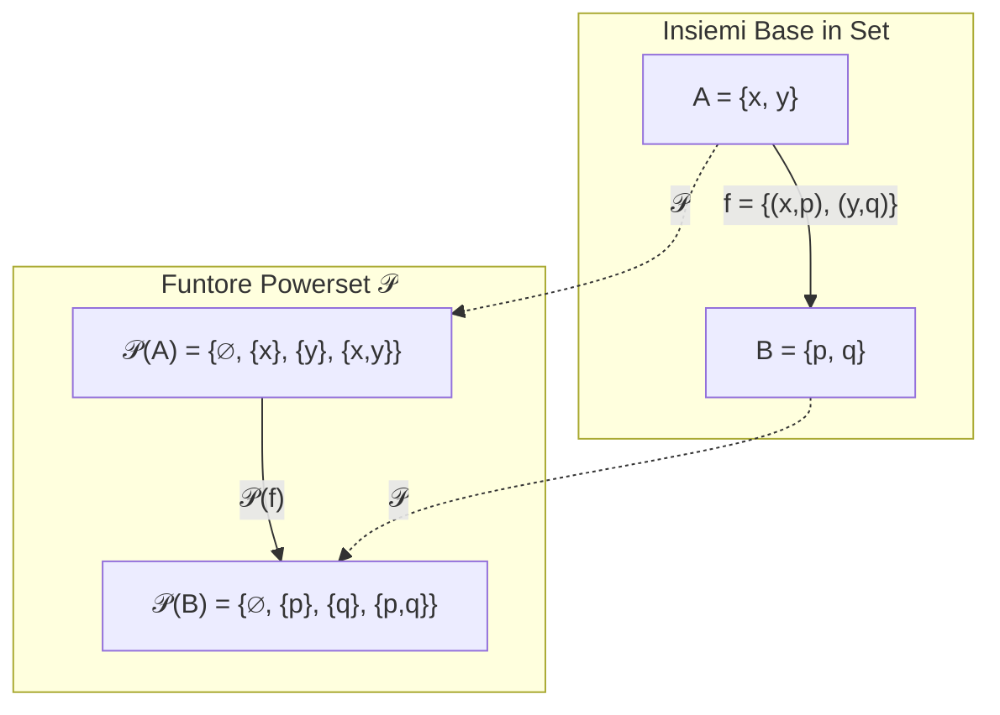
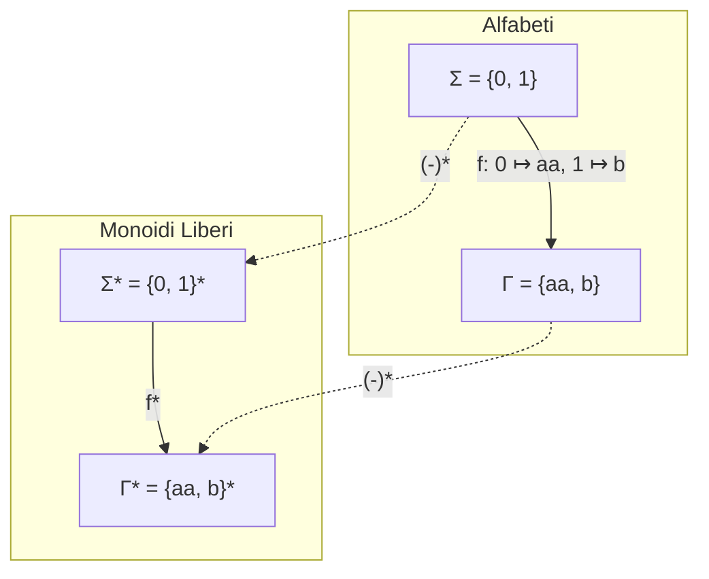
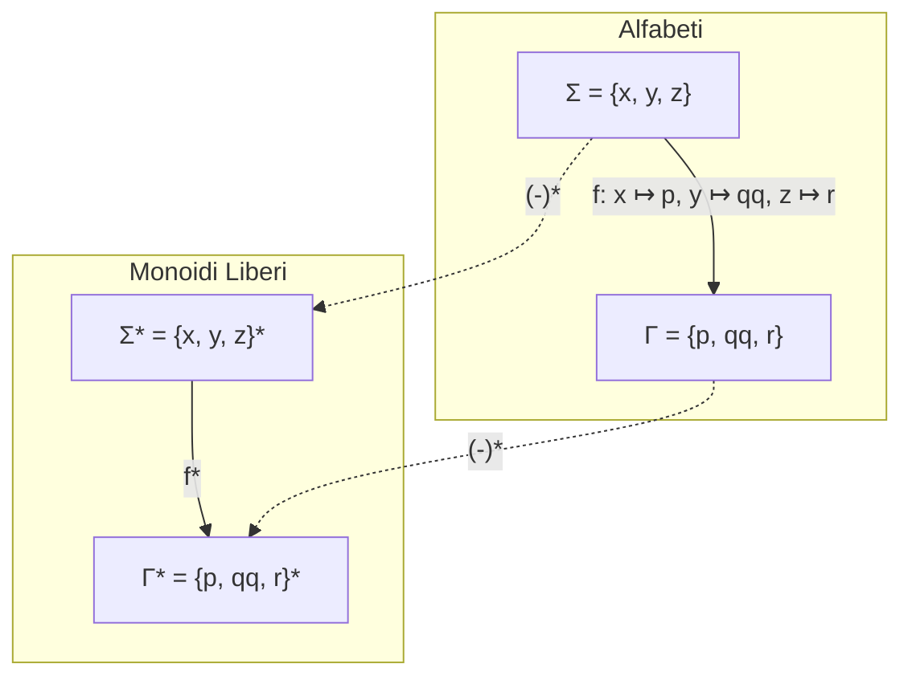
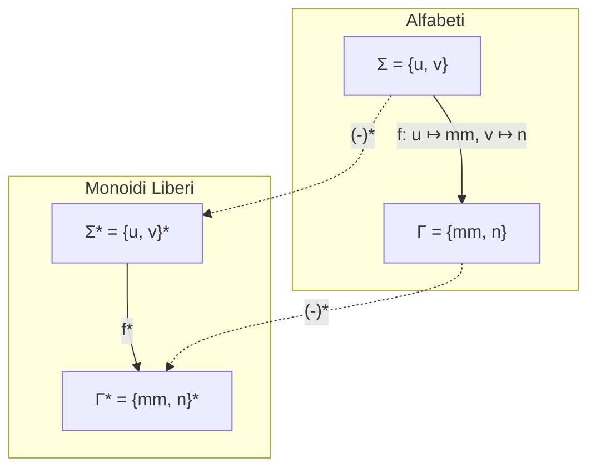
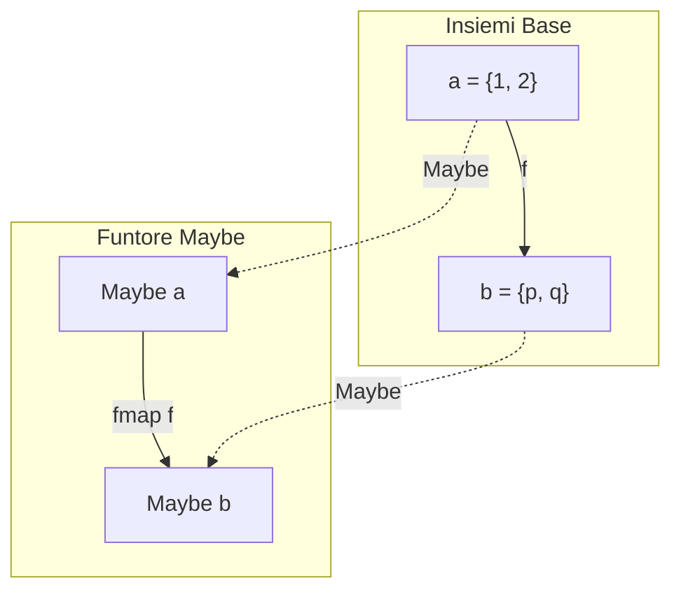
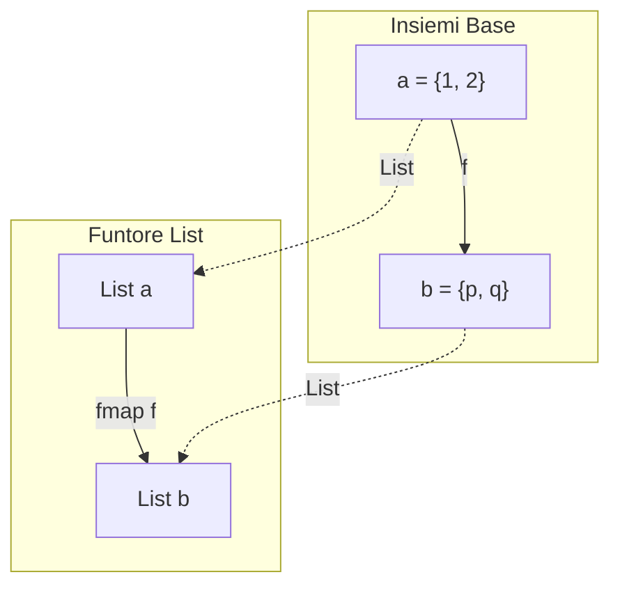
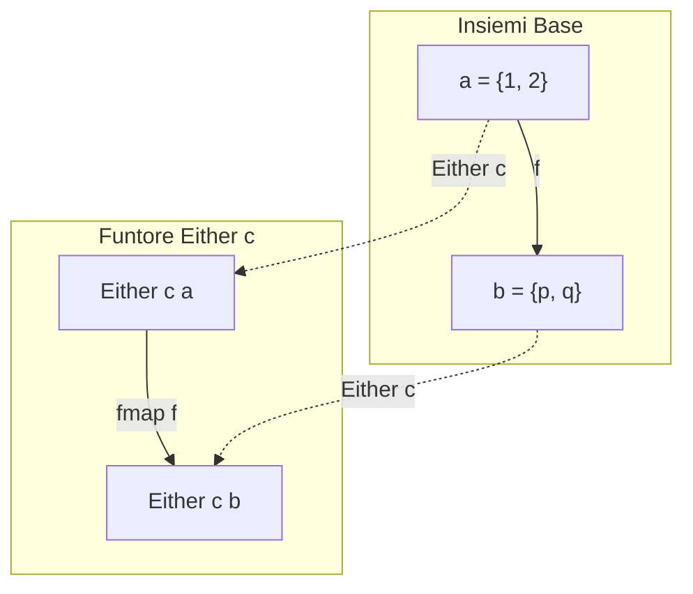
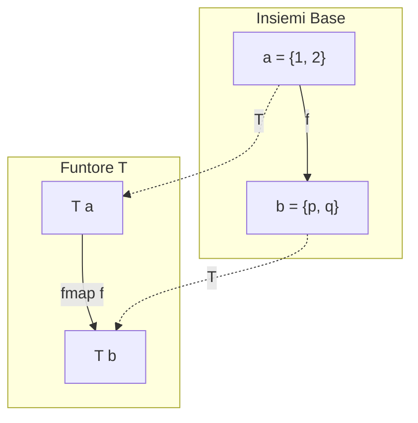
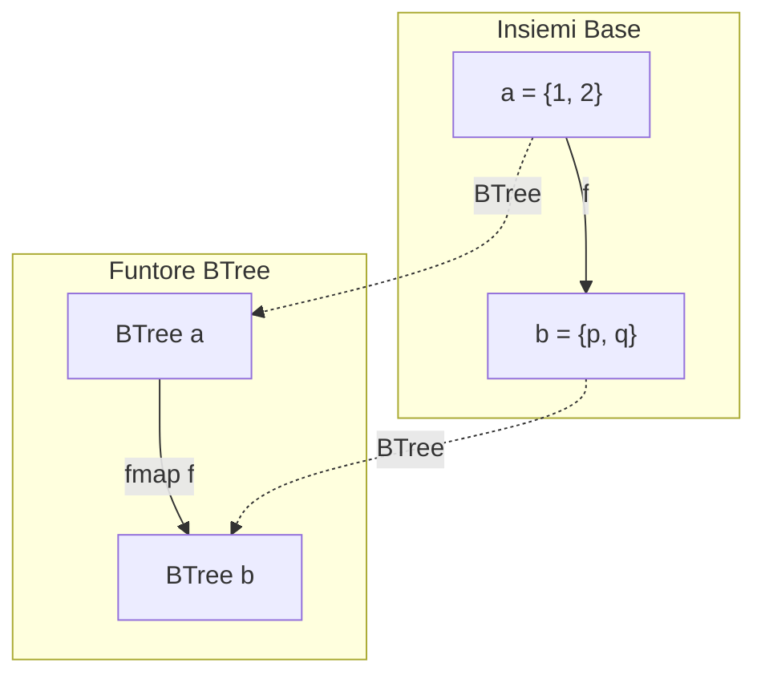
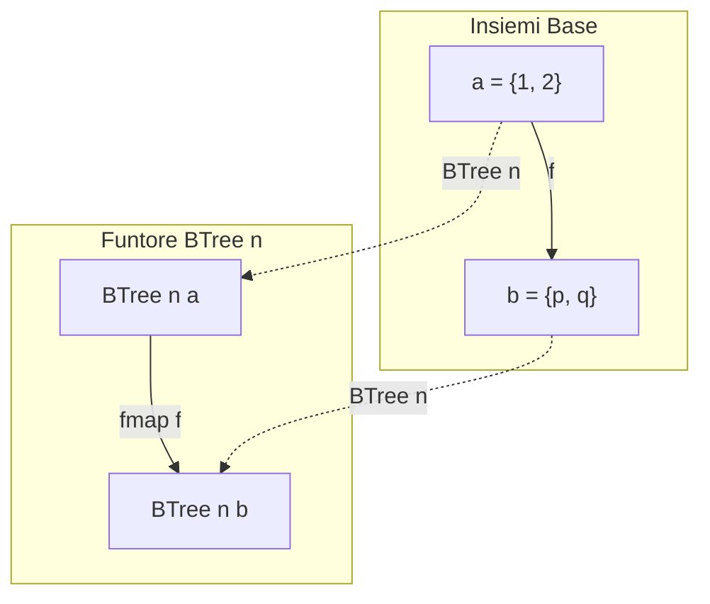

# Risoluzione Esercizi Esame — Parte 2
**Corso:** Linguaggi e Paradigmi di Programmazione (3 CFU)  
**Docente:** Prof. Luca Roversi  
**Argomenti:** Funtori matematici e in Haskell, Funtore Powerset, Funtore Kleene Star, Leggi dei Funtori (Identità e Composizione) con dimostrazioni per casi e per induzione strutturale (`Maybe`, `List`, `Either`, `BTree`, `T`, `U`), Diagrammi categoriali di funtori in $\mathbf{Set}$.

---

## CT0300: Funtori Algebrici e Matematici

### Esercizio 1 (Funtore Powerset)
> **Testo:** Let $A = \{x, y\}$ and $B = \{p, q\}$ be sets. Let $f = \{(x, p), (y, q)\}$ be a function on sets.
> • Draw the diagram resulting from the application of the “Powerset” functor to $A$, $B$, and $f$.
> • Decorate the diagram with the elements $\mathcal{P}f(\{x\})$ and $\mathcal{P}f(\{x, y\})$.

**Soluzione:**
1. **Definizione del Funtore Powerset $\mathcal{P}: \mathbf{Set} \to \mathbf{Set}$:**
   - Sugli oggetti (insiemi): mappa un insieme $X$ nell'insieme delle sue parti:
     $$\mathcal{P}(X) = \{s \mid s \subseteq X\}$$
   - Sui morfismi (funzioni): data $f: X \to Y$, la funzione $\mathcal{P}f: \mathcal{P}(X) \to \mathcal{P}(Y)$ è definita dall'immagine diretta:
     $$\mathcal{P}f(s) = \{f(u) \mid u \in s\}$$
2. **Applicazione agli insiemi $A$ e $B$:**
   - $A = \{x, y\} \implies \mathcal{P}(A) = \{\emptyset, \{x\}, \{y\}, \{x, y\}\}$
   - $B = \{p, q\} \implies \mathcal{P}(B) = \{\emptyset, \{p\}, \{q\}, \{p, q\}\}$
3. **Calcolo degli elementi decorati:**
   - $\mathcal{P}f(\{x\}) = \{f(x)\} = \{p\} \in \mathcal{P}(B)$
   - $\mathcal{P}f(\{x, y\}) = \{f(x), f(y)\} = \{p, q\} \in \mathcal{P}(B)$
4. **Diagramma commutativo:**



*Decorazione degli elementi:*
- $\{x\} \in \mathcal{P}(A) \xrightarrow{\mathcal{P}f} \{p\} \in \mathcal{P}(B)$
- $\{x, y\} \in \mathcal{P}(A) \xrightarrow{\mathcal{P}f} \{p, q\} \in \mathcal{P}(B)$

---

### Esercizi 2, 3, 4 (Funtore Stella di Kleene $(-)^*$)

> **Principio del Funtore $(-)^*: \mathbf{Alphabet} \to \mathbf{Monoid}$ (Roversi):**
> - Dato un alfabeto (insieme) $\Sigma$, $\Sigma^*$ è il monoide libero generato da $\Sigma$ con la concatenazione $\cdot$ ed elemento neutro $\epsilon$.
> - Data una funzione tra alfabeti $f: \Sigma \to \Gamma^*$, il funtore la estende a un omomorfismo tra monoidi $f^*: \Sigma^* \to \Gamma^*$ definito induttivamente da:
>   $$f^*(\epsilon) = \epsilon, \quad f^*(w \cdot \sigma) = f^*(w) \cdot f(\sigma)$$

#### Esercizio 2
> **Testo:** Let $\Sigma = \{0, 1\}$, $\Gamma = \{aa, b\}$ be two alphabets. Let $f(0) = aa, f(1) = b$.
> • Draw the diagram resulting from the application of the Kleene Star functor to $\Sigma$, $\Gamma$, and $f$.
> • Can $aabaa$ be an element of $\Gamma^*$ generated by the Kleene Star functor $(-)^*$? Justify the answer.

**Soluzione:**
1. **Diagramma:**



2. **Analisi della stringa $aabaa$:**
   Scomponiamo la stringa $aabaa$ rispetto ai simboli generabili tramite $f$:
   $$aabaa = (aa) \cdot (b) \cdot (aa) = f(0) \cdot f(1) \cdot f(0) = f^*(0 \cdot 1 \cdot 0) = f^*(010)$$
   **Risposta:** **SÌ.** La stringa $010$ appartiene a $\Sigma^*$, e la sua immagine tramite l'estensione funtoriale $f^*$ è esattamente $f^*(010) = aabaa \in \Gamma^*$.

---

#### Esercizio 3
> **Testo:** Let $\Sigma = \{x, y, z\}$, $\Gamma = \{p, qq, r\}$. Let $f(x) = p, f(y) = qq, f(z) = r$.
> • Draw the diagram.
> • Is $pqqrqqp$ an element of $\Gamma^*$ obtained via the Kleene Star construction? Explain your reasoning.

**Soluzione:**
1. **Diagramma:**



2. **Analisi della stringa $pqqrqqp$:**
   Scomponiamo:
   $$pqqrqqp = (p) \cdot (qq) \cdot (r) \cdot (qq) \cdot (p) = f(x) \cdot f(y) \cdot f(z) \cdot f(y) \cdot f(x) = f^*(xyzyx)$$
   Poiché la stringa $xyzyx$ appartiene al dominio $\Sigma^*$, la stringa $pqqrqqp$ appartiene a $\Gamma^*$ ed è generata esattamente dall'applicazione del funtore $f^*$ a $xyzyx$.
   **Risposta:** **SÌ.**

---

#### Esercizio 4
> **Testo:** Let $\Sigma = \{u, v\}$, $\Gamma = \{mm, n\}$. Let $f(u) = mm, f(v) = n$.
> • Draw the diagram.
> • Determine whether $mmnmmn$ belongs to $\Gamma^*$ under the Kleene Star functor $(-)^*$. Provide justification.

**Soluzione:**
1. **Diagramma:**



2. **Analisi della stringa $mmnmmn$:**
   Scomponiamo $mmnmmn$:
   $$mmnmmn = (mm) \cdot (n) \cdot (mm) \cdot (n) = f(u) \cdot f(v) \cdot f(u) \cdot f(v) = f^*(uvuv)$$
   Poiché la stringa sorgente $uvuv \in \Sigma^*$, $f^*(uvuv) = mmnmmn \in \Gamma^*$.
   **Risposta:** **SÌ.**

---

## CT0300: Dimostrazioni delle Leggi dei Funtori in Haskell

> **Le due leggi dei funtori:**
> 1. **Identità:** `fmap id = id` $\iff \forall x.\; \text{fmap id } x = x$
> 2. **Composizione:** `fmap (g . f) = fmap g . fmap f` $\iff \forall x.\; \text{fmap (g . f) } x = \text{fmap g (fmap f } x)$

### Esercizio 5 (Funtore `Maybe a`)
> **Testo:** Recall the definition of the data-type `Maybe a`. Prove that it is a functor by:
> 1. defining a function `fmap`;
> 2. proving that `fmap` enjoys the identity law;
> 3. proving that `fmap` enjoys the composition law.

**Soluzione:**
Definizione del tipo:
```haskell
data Maybe a = Nothing | Just a
```
1. **Definizione di `fmap`:**
   ```haskell
   instance Functor Maybe where
     fmap :: (a -> b) -> Maybe a -> Maybe b
     fmap _ Nothing  = Nothing
     fmap f (Just x) = Just (f x)
   ```
2. **Dimostrazione della Legge di Identità (`fmap id = id`):**
   Dimostriamo per casi sui due costruttori di `Maybe`:
   - **Caso `Nothing`:**
     $$\text{fmap id Nothing} = \text{Nothing} \quad (\text{per def. di fmap})$$
     $$= \text{id Nothing} \quad (\text{per def. di id})$$
   - **Caso `Just x`:**
     $$\text{fmap id (Just } x) = \text{Just (id } x) \quad (\text{per def. di fmap})$$
     $$= \text{Just } x \quad (\text{poiché id } x = x)$$
     $$= \text{id (Just } x)$$
   La legge vale per tutti i costruttori. $\blacksquare$

3. **Dimostrazione della Legge di Composizione (`fmap (g . f) = fmap g . fmap f`):**
   - **Caso `Nothing`:**
     $$\text{LHS} = \text{fmap } (g \circ f)\; \text{Nothing} = \text{Nothing}$$
     $$\text{RHS} = (\text{fmap } g \circ \text{fmap } f)\; \text{Nothing} = \text{fmap } g\; (\text{fmap } f\; \text{Nothing}) = \text{fmap } g\; \text{Nothing} = \text{Nothing}$$
     $\text{LHS} = \text{RHS}$.
   - **Caso `Just x`:**
     $$\text{LHS} = \text{fmap } (g \circ f)\; (\text{Just } x) = \text{Just } ((g \circ f)\; x) = \text{Just } (g(f(x)))$$
     $$\text{RHS} = \text{fmap } g\; (\text{fmap } f\; (\text{Just } x)) = \text{fmap } g\; (\text{Just } (f(x))) = \text{Just } (g(f(x)))$$
     $\text{LHS} = \text{RHS}$. $\blacksquare$

---

### Esercizio 6 (Funtore `List a`)
> **Testo:** Define a data-type `List a` that recursively formalizes the corresponding concept. Then prove that it is a functor (fmap, identity, composition).

**Soluzione:**
Definizione ricorsiva del tipo:
```haskell
data List a = Nil | Cons a (List a)
```
1. **Definizione di `fmap`:**
   ```haskell
   instance Functor List where
     fmap :: (a -> b) -> List a -> List b
     fmap _ Nil         = Nil
     fmap f (Cons x xs) = Cons (f x) (fmap f xs)
   ```
2. **Dimostrazione della Legge di Identità per induzione strutturale su `List a`:**
   - **Caso Base (`Nil`):**
     $$\text{fmap id Nil} = \text{Nil} = \text{id Nil}$$
   - **Passo Induttivo (`Cons x xs`):**
     *Ipotesi Induttiva (I.H.):* assumiamo che $\text{fmap id } xs = xs$.
     $$\text{fmap id (Cons } x\; xs) = \text{Cons (id } x)\; (\text{fmap id } xs) \quad (\text{def. fmap})$$
     $$= \text{Cons } x\; (\text{fmap id } xs) \quad (\text{def. id})$$
     $$= \text{Cons } x\; xs \quad (\text{applicando I.H.})$$
     $$= \text{id (Cons } x\; xs)$$
   La legge vale per ogni lista finita. $\blacksquare$

3. **Dimostrazione della Legge di Composizione per induzione strutturale:**
   - **Caso Base (`Nil`):**
     $$\text{fmap } (g \circ f)\; \text{Nil} = \text{Nil} = \text{fmap } g\; \text{Nil} = \text{fmap } g\; (\text{fmap } f\; \text{Nil})$$
   - **Passo Induttivo (`Cons x xs`):**
     *Ipotesi Induttiva (I.H.):* $\text{fmap } (g \circ f)\; xs = \text{fmap } g\; (\text{fmap } f\; xs)$.
     $$\text{LHS} = \text{fmap } (g \circ f)\; (\text{Cons } x\; xs) = \text{Cons } ((g \circ f)\; x)\; (\text{fmap } (g \circ f)\; xs)$$
     $$= \text{Cons } (g(f(x)))\; (\text{fmap } g\; (\text{fmap } f\; xs)) \quad (\text{per def. } \circ \text{ e I.H.})$$
     Valutiamo RHS:
     $$\text{fmap } f\; (\text{Cons } x\; xs) = \text{Cons } (f(x))\; (\text{fmap } f\; xs)$$
     $$\text{RHS} = \text{fmap } g\; (\text{Cons } (f(x))\; (\text{fmap } f\; xs)) = \text{Cons } (g(f(x)))\; (\text{fmap } g\; (\text{fmap } f\; xs))$$
     $\text{LHS} = \text{RHS}$. $\blacksquare$

---

### Esercizio 7 (Funtore `Either a b`)
> **Testo:** Recall the definition of `Either a b` and prove that `Either a` is a functor.

**Soluzione:**
```haskell
data Either a b = Left a | Right b
```
*(Nota: `Either` ha kind `* -> * -> *`. Fissando il primo argomento di tipo `a`, `Either a` ha kind `* -> *` ed è funtore sul secondo tipo).*

1. **Definizione di `fmap`:**
   ```haskell
   instance Functor (Either a) where
     fmap :: (b -> c) -> Either a b -> Either a c
     fmap _ (Left x)  = Left x
     fmap f (Right y) = Right (f y)
   ```
2. **Legge di Identità:**
   - `Left x`: $\text{fmap id (Left } x) = \text{Left } x = \text{id (Left } x)$
   - `Right y`: $\text{fmap id (Right } y) = \text{Right (id } y) = \text{Right } y = \text{id (Right } y)$
3. **Legge di Composizione:**
   - `Left x`:
     $$\text{LHS} = \text{fmap } (g \circ f)\; (\text{Left } x) = \text{Left } x$$
     $$\text{RHS} = \text{fmap } g\; (\text{fmap } f\; (\text{Left } x)) = \text{fmap } g\; (\text{Left } x) = \text{Left } x$$
   - `Right y`:
     $$\text{LHS} = \text{fmap } (g \circ f)\; (\text{Right } y) = \text{Right } ((g \circ f)\; y) = \text{Right } (g(f(y)))$$
     $$\text{RHS} = \text{fmap } g\; (\text{fmap } f\; (\text{Right } y)) = \text{fmap } g\; (\text{Right } (f(y))) = \text{Right } (g(f(y)))$$
   In entrambi i casi $\text{LHS} = \text{RHS}$. $\blacksquare$

---

### Esercizi 8 & 9 (Albero con valori sulle foglie: `BTree n l`)
```haskell
data BTree n l where
  Leaf :: l -> BTree n l
  Node :: BTree n l -> BTree n l -> BTree n l
```
*(Il tipo contiene valori di tipo `l` sulle foglie).*

#### Esercizio 8 (Definizione di `fmap` e Legge di Identità):
1. **Definizione di `fmap`:**
   ```haskell
   instance Functor (BTree n) where
     fmap :: (l -> m) -> BTree n l -> BTree n m
     fmap f (Leaf x)     = Leaf (f x)
     fmap f (Node t1 t2) = Node (fmap f t1) (fmap f t2)
   ```
2. **Dimostrazione Legge di Identità per induzione strutturale:**
   - **Caso Base (`Leaf x`):**
     $$\text{fmap id (Leaf } x) = \text{Leaf (id } x) = \text{Leaf } x = \text{id (Leaf } x)$$
   - **Passo Induttivo (`Node t1 t2`):**
     *I.H.:* $\text{fmap id } t_1 = t_1$ e $\text{fmap id } t_2 = t_2$.
     $$\text{fmap id (Node } t_1\; t_2) = \text{Node } (\text{fmap id } t_1)\; (\text{fmap id } t_2) = \text{Node } t_1\; t_2 = \text{id (Node } t_1\; t_2) \quad \blacksquare$$

#### Esercizio 9 (Dimostrazione Legge di Composizione):
- **Caso Base (`Leaf x`):**
  $$\text{fmap } (g \circ f)\; (\text{Leaf } x) = \text{Leaf } ((g \circ f)\; x) = \text{Leaf } (g(f(x)))$$
  $$\text{fmap } g\; (\text{fmap } f\; (\text{Leaf } x)) = \text{fmap } g\; (\text{Leaf } (f(x))) = \text{Leaf } (g(f(x)))$$
- **Passo Induttivo (`Node t1 t2`):**
  *I.H.:* vale la legge per i sottoalberi $t_1$ e $t_2$.
  $$\text{fmap } (g \circ f)\; (\text{Node } t_1\; t_2) = \text{Node } (\text{fmap } (g \circ f)\; t_1)\; (\text{fmap } (g \circ f)\; t_2)$$
  $$= \text{Node } (\text{fmap } g\; (\text{fmap } f\; t_1))\; (\text{fmap } g\; (\text{fmap } f\; t_2)) \quad (\text{per I.H.})$$
  $$= \text{fmap } g\; (\text{Node } (\text{fmap } f\; t_1)\; (\text{fmap } f\; t_2)) = \text{fmap } g\; (\text{fmap } f\; (\text{Node } t_1\; t_2)) \quad \blacksquare$$

---

### Esercizi 10 & 11 (Albero con valori sui nodi interni: `BTree n`)
```haskell
data BTree n where
  Leaf :: BTree n
  Node :: n -> BTree n -> BTree n -> BTree n
```

1. **Definizione di `fmap`:**
   ```haskell
   instance Functor BTree where
     fmap :: (a -> b) -> BTree a -> BTree b
     fmap _ Leaf           = Leaf
     fmap f (Node x t1 t2) = Node (f x) (fmap f t1) (fmap f t2)
   ```
2. **Esercizio 10 (Legge di Identità):**
   - Caso `Leaf`: $\text{fmap id Leaf} = \text{Leaf}$.
   - Caso `Node x t1 t2`: per I.H. sui sottoalberi:
     $$\text{fmap id (Node } x\; t_1\; t_2) = \text{Node (id } x)\; (\text{fmap id } t_1)\; (\text{fmap id } t_2) = \text{Node } x\; t_1\; t_2 \quad \blacksquare$$
3. **Esercizio 11 (Legge di Composizione):**
   - Caso `Leaf`: banale $\text{Leaf} = \text{Leaf}$.
   - Caso `Node x t1 t2`:
     $$\text{fmap } (g \circ f)\; (\text{Node } x\; t_1\; t_2) = \text{Node } (g(f(x)))\; (\text{fmap } (g \circ f)\; t_1)\; (\text{fmap } (g \circ f)\; t_2)$$
     $$= \text{Node } (g(f(x)))\; (\text{fmap } g\; (\text{fmap } f\; t_1))\; (\text{fmap } g\; (\text{fmap } f\; t_2))$$
     $$= \text{fmap } g\; (\text{Node } (f(x))\; (\text{fmap } f\; t_1)\; (\text{fmap } f\; t_2))$$
     $$= \text{fmap } g\; (\text{fmap } f\; (\text{Node } x\; t_1\; t_2)) \quad \blacksquare$$

---

### Esercizi 12 & 13 (Tipo ad albero multiforcato `T a`)
```haskell
data T a where
  TL :: a -> T a
  TN :: [T a] -> T a
```

1. **Definizione di `fmap`:**
   ```haskell
   instance Functor T where
     fmap :: (a -> b) -> T a -> T b
     fmap f (TL x)  = TL (f x)
     fmap f (TN ts) = TN (map (fmap f) ts)
   ```
2. **Esercizio 12 (Legge di Identità):**
   - Caso `TL x`: $\text{fmap id (TL } x) = \text{TL (id } x) = \text{TL } x$.
   - Caso `TN ts`: per induzione strutturale e per la proprietà della funzione `map id = id` sulle liste:
     $$\text{fmap id (TN } ts) = \text{TN } (\text{map } (\text{fmap id})\; ts) \overset{\text{I.H.}}{=} \text{TN } (\text{map id } ts) = \text{TN } ts \quad \blacksquare$$
3. **Esercizio 13 (Legge di Composizione):**
   - Caso `TL x`: $\text{fmap } (g \circ f)\; (\text{TL } x) = \text{TL } (g(f(x))) = \text{fmap } g\; (\text{fmap } f\; (\text{TL } x))$.
   - Caso `TN ts`:
     $$\text{fmap } (g \circ f)\; (\text{TN } ts) = \text{TN } (\text{map } (\text{fmap } (g \circ f))\; ts)$$
     $$\overset{\text{I.H.}}{=} \text{TN } (\text{map } (\text{fmap } g \circ \text{fmap } f)\; ts)$$
     $$= \text{TN } (\text{map } (\text{fmap } g)\; (\text{map } (\text{fmap } f)\; ts)) \quad (\text{functorialità di list})$$
     $$= \text{fmap } g\; (\text{TN } (\text{map } (\text{fmap } f)\; ts)) = \text{fmap } g\; (\text{fmap } f\; (\text{TN } ts)) \quad \blacksquare$$

---

### Esercizi 14 & 15 (Tipo `U a b`)
```haskell
data U a b where
  UL :: Either a b -> U a b
  UN :: (U a b, U a b) -> U a b
```
*(Funtore rispetto al parametro $b$: tipo `U a`).*

1. **Definizione di `fmap`:**
   ```haskell
   instance Functor (U a) where
     fmap :: (b -> c) -> U a b -> U a c
     fmap f (UL e)          = UL (fmap f e)  -- usa fmap di Either a
     fmap f (UN (u1, u2))   = UN (fmap f u1, fmap f u2)
   ```
2. **Esercizio 14 (Identità):**
   - Caso `UL e`: $\text{fmap id (UL } e) = \text{UL (fmap id } e) = \text{UL } e$ (per identità di `Either`).
   - Caso `UN (u1, u2)`: per I.H. su $u_1, u_2$:
     $$\text{fmap id (UN } (u_1, u_2)) = \text{UN } (\text{fmap id } u_1, \text{fmap id } u_2) = \text{UN } (u_1, u_2) \quad \blacksquare$$
3. **Esercizio 15 (Composizione):**
   - Caso `UL e`: $\text{fmap } (g \circ f)\; (\text{UL } e) = \text{UL } (\text{fmap } (g \circ f)\; e) = \text{UL } (\text{fmap } g\; (\text{fmap } f\; e)) = \text{fmap } g\; (\text{fmap } f\; (\text{UL } e))$.
   - Caso `UN (u1, u2)`:
     $$\text{fmap } (g \circ f)\; (\text{UN } (u_1, u_2)) = \text{UN } (\text{fmap } (g \circ f)\; u_1, \text{fmap } (g \circ f)\; u_2)$$
     $$= \text{UN } (\text{fmap } g\; (\text{fmap } f\; u_1), \text{fmap } g\; (\text{fmap } f\; u_2)) = \text{fmap } g\; (\text{fmap } f\; (\text{UN } (u_1, u_2))) \quad \blacksquare$$

---

## CT0300: Diagrammi Categoriali in $\mathbf{Set}$ per Funtori (Esercizi 16 - 21)

> **Contesto comune per gli Esercizi 16–21:**
> Siamo nella categoria $\mathbf{Set}$. Consideriamo come insiemi base semplici:
> $$a = \{1, 2\}, \quad b = \{p, q\}$$
> e come funzione $f: a \to b$:
> $$f(1) = p, \quad f(2) = q$$
> Il suo **grafo** (inteso in teoria degli insiemi come sottoinsieme del prodotto cartesiano $a \times b$) è:
> $$\mathrm{graph}(f) = \{(1, p), (2, q)\} \subseteq a \times b$$

---

### Esercizio 16 (`Maybe a`)
> **Testo:** Let us assume that we are in the category $\mathbf{Set}$.
> 1. Recall the definition of `Maybe a`.
> 2. Draw the corresponding diagram, starting from an arrow `f :: a -> b`.
> 3. Decorate the diagram objects with simple instances.
> 4. Define a simple graph for `f :: a -> b`.
> 5. Describe how `fmap f` would work, without explicitly defining it.

**Soluzione:**
1. **Definizione di `Maybe a`:**
   ```haskell
   data Maybe a = Nothing | Just a
   ```
2. **Diagramma commutativo del funtore:**



3. **Decorazione del diagramma con istanze semplici:**
   - Istanze in $a$: $1, 2 \in a$. Istanze in $b$: $p, q \in b$.
   - Istanze in $\text{Maybe } a$: $\text{Nothing}, \text{Just } 1, \text{Just } 2$.
   - Azione di $\text{fmap } f$:
     - $\text{fmap } f \text{ Nothing} = \text{Nothing}$
     - $\text{fmap } f (\text{Just } 1) = \text{Just } (f(1)) = \text{Just } p$
     - $\text{fmap } f (\text{Just } 2) = \text{Just } (f(2)) = \text{Just } q$
4. **Grafo semplice per $f: a \to b$:**
   $$\mathrm{graph}(f) = \{(1, p), (2, q)\} \subset \{1, 2\} \times \{p, q\}$$
   Rappresentato come grafo orientato: $1 \xrightarrow{f} p$ e $2 \xrightarrow{f} q$.
5. **Descrizione del funzionamento di `fmap f`:**
   `fmap f` esamina il valore opzionale incapsulato: se la struttura è vuota (`Nothing`), la lascia invariata restituendo `Nothing`; se contiene un elemento (`Just x`), preserva il costruttore `Just` applicando la funzione $f$ al valore interno, producendo `Just (f x)`.

---

### Esercizio 17 (`List a`)
> **Testo:** Let us assume that we are in the category $\mathbf{Set}$.
> 1. Define a data-type `List a` that recursively formalizes the corresponding concept.
> 2. Draw the corresponding diagram, starting from an arrow `f :: a -> b`.
> 3. Decorate the diagram objects with simple instances.
> 4. Define a simple graph for `f :: a -> b`.
> 5. Describe how `fmap f` would work, without explicitly defining it.

**Soluzione:**
1. **Definizione ricorsiva di `List a`:**
   ```haskell
   data List a = Nil | Cons a (List a)
   ```
2. **Diagramma commutativo del funtore:**



3. **Decorazione del diagramma con istanze semplici:**
   - Istanze in $\text{List } a$: $\text{Nil}$, $\text{Cons } 1 \text{ Nil}$, $\text{Cons } 1 (\text{Cons } 2 \text{ Nil})$.
   - Azione di $\text{fmap } f$:
     - $\text{Nil} \mapsto \text{Nil}$
     - $\text{Cons } 1 \text{ Nil} \mapsto \text{Cons } p \text{ Nil}$
     - $\text{Cons } 1 (\text{Cons } 2 \text{ Nil}) \mapsto \text{Cons } p (\text{Cons } q \text{ Nil})$
4. **Grafo semplice per $f: a \to b$:**
   $$\mathrm{graph}(f) = \{(1, p), (2, q)\}$$
5. **Descrizione del funzionamento di `fmap f`:**
   `fmap f` scorre ricorsivamente la lista mantenendo invariata la lunghezza, l'ordine sequenziale e i collegamenti tra i nodi (`Cons` e terminatore `Nil`), sostituendo ciascun elemento $x$ memorizzato in testa con $f(x)$.

---

### Esercizio 18 (`Either a b`)
> **Testo:** Let us assume that we are in the category $\mathbf{Set}$.
> 1. Recall the definition of `Either a b`.
> 2. Draw the corresponding diagram, starting from an arrow `f :: a -> b`.
> 3. Decorate the diagram objects with simple instances.
> 4. Define a simple graph for `f :: a -> b`.
> 5. Describe how `fmap f` would work, without explicitly defining it.

**Soluzione:**
1. **Definizione di `Either a b`:**
   ```haskell
   data Either a b = Left a | Right b
   ```
   *(Nota: per essere un funtore di kind `* -> *`, il funtore è parzialmente applicato al primo tipo: `Either c`, mappando il secondo parametro: $f: a \to b \implies \text{Either } c\; a \to \text{Either } c\; b$. Sia $c = \{c_0\}$).*
2. **Diagramma commutativo del funtore:**



3. **Decorazione del diagramma con istanze semplici:**
   - Istanze in $\text{Either } c\; a$: $\text{Left } c_0$, $\text{Right } 1$, $\text{Right } 2$.
   - Azione di $\text{fmap } f$:
     - $\text{Left } c_0 \mapsto \text{Left } c_0$
     - $\text{Right } 1 \mapsto \text{Right } (f(1)) = \text{Right } p$
     - $\text{Right } 2 \mapsto \text{Right } (f(2)) = \text{Right } q$
4. **Grafo semplice per $f: a \to b$:**
   $$\mathrm{graph}(f) = \{(1, p), (2, q)\}$$
5. **Descrizione del funzionamento di `fmap f`:**
   Se il valore è incapsulato dal costruttore sinistro (`Left x`), `fmap f` lo ignora e lo propaga identico; se il valore è incapsulato nel costruttore destro (`Right x`), preserva il costruttore `Right` applicando la funzione $f$ al valore $x$, restituendo `Right (f x)`.

---

### Esercizio 19 (`T a`)
> **Testo:** Consider the following Haskell data-type:
> ```haskell
> data T a where
>   TL :: a -> T a
>   TN :: [T a] -> T a
> ```
> 1. Draw the corresponding diagram, starting from an arrow `f :: a -> b`.
> 2. Decorate the diagram objects with simple instances.
> 3. Define a simple graph for `f :: a -> b`.
> 4. Describe how `fmap f` would work, without explicitly defining it.

**Soluzione:**
1. **Diagramma commutativo del funtore:**



2. **Decorazione del diagramma con istanze semplici:**
   - Istanze foglia in $T\, a$: $\text{TL } 1, \text{TL } 2$.
   - Istanza albero ramificato in $T\, a$: $\text{TN } [\text{TL } 1, \text{TL } 2]$.
   - Azione di $\text{fmap } f$:
     - $\text{TL } 1 \mapsto \text{TL } p$
     - $\text{TL } 2 \mapsto \text{TL } q$
     - $\text{TN } [\text{TL } 1, \text{TL } 2] \mapsto \text{TN } [\text{TL } p, \text{TL } q]$
3. **Grafo semplice per $f: a \to b$:**
   $$\mathrm{graph}(f) = \{(1, p), (2, q)\}$$
4. **Descrizione del funzionamento di `fmap f`:**
   `fmap f` attraversa ricorsivamente la struttura dell'albero: per le foglie (`TL x`), trasforma il valore interno applicando $f(x)$; per i nodi interni (`TN ts`), mantiene inalterata la struttura della lista di sottoalberi e applica ricorsivamente `fmap f` a ciascun sottoalbero della lista.

---

### Esercizio 20 (`BTree n`, valori sui nodi)
> **Testo:** Consider the following Haskell data-type:
> ```haskell
> data BTree n where
>   Leaf :: BTree n
>   Node :: n -> BTree n -> BTree n -> BTree n
> ```
> 1. Draw the corresponding diagram, starting from an arrow `f :: a -> b`.
> 2. Decorate the diagram objects with simple instances.
> 3. Define a simple graph for `f :: a -> b`.
> 4. Describe how `fmap f` would work, without explicitly defining it.

**Soluzione:**
1. **Diagramma commutativo del funtore:**



2. **Decorazione del diagramma con istanze semplici:**
   - Istanza vuota: $\text{Leaf} \in \text{BTree } a$.
   - Istanza con nodi: $\text{Node } 1 \text{ Leaf Leaf} \in \text{BTree } a$, e $\text{Node } 1 (\text{Node } 2 \text{ Leaf Leaf}) \text{ Leaf} \in \text{BTree } a$.
   - Azione di $\text{fmap } f$:
     - $\text{Leaf} \mapsto \text{Leaf}$
     - $\text{Node } 1 \text{ Leaf Leaf} \mapsto \text{Node } p \text{ Leaf Leaf}$
     - $\text{Node } 1 (\text{Node } 2 \text{ Leaf Leaf}) \text{ Leaf} \mapsto \text{Node } p (\text{Node } q \text{ Leaf Leaf}) \text{ Leaf}$
3. **Grafo semplice per $f: a \to b$:**
   $$\mathrm{graph}(f) = \{(1, p), (2, q)\}$$
4. **Descrizione del funzionamento di `fmap f`:**
   `fmap f` visita l'albero binario: le foglie vuote `Leaf` rimangono invariate; su ogni nodo `Node x left right`, sostituisce il valore memorizzato $x$ con $f(x)$ e richiama ricorsivamente `fmap f` sul sottoalbero sinistro e sul sottoalbero destro, preservando esattamente la topologia dell'albero.

---

### Esercizio 21 (`BTree n l`, valori sulle foglie)
> **Testo:** Consider the following Haskell data-type:
> ```haskell
> data BTree n l where
>   Leaf :: l -> BTree n l
>   Node :: BTree n l -> BTree n l -> BTree n l
> ```
> *(Funtore rispetto al tipo delle foglie $l$: $\text{BTree } n$).*
> 1. Draw the corresponding diagram, starting from an arrow `f :: a -> b`.
> 2. Decorate the diagram objects with simple instances.
> 3. Define a simple graph for `f :: a -> b`.
> 4. Describe how `fmap f` would work, without explicitly defining it.

**Soluzione:**
1. **Diagramma commutativo del funtore:**



2. **Decorazione del diagramma con istanze semplici:**
   - Istanze foglia in $\text{BTree } n\; a$: $\text{Leaf } 1, \text{Leaf } 2$.
   - Istanza albero in $\text{BTree } n\; a$: $\text{Node } (\text{Leaf } 1) (\text{Leaf } 2)$.
   - Azione di $\text{fmap } f$:
     - $\text{Leaf } 1 \mapsto \text{Leaf } p$
     - $\text{Leaf } 2 \mapsto \text{Leaf } q$
     - $\text{Node } (\text{Leaf } 1) (\text{Leaf } 2) \mapsto \text{Node } (\text{Leaf } p) (\text{Leaf } q)$
3. **Grafo semplice per $f: a \to b$:**
   $$\mathrm{graph}(f) = \{(1, p), (2, q)\}$$
4. **Descrizione del funzionamento di `fmap f`:**
   `fmap f` percorre la struttura ad albero: sui nodi intermedi di diramazione `Node left right`, propaga la chiamata ai due rami preservando la ramificazione; quando raggiunge una foglia `Leaf x`, applica la funzione $f$ al valore $x$ ottenendo `Leaf (f x)`.
