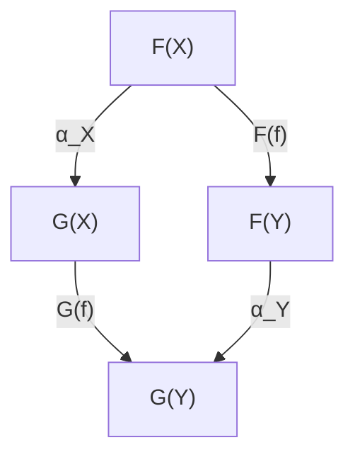
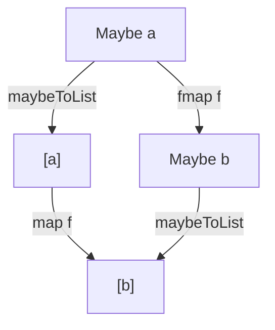

# Risoluzione Esercizi Esame — Parte 4
**Corso:** Linguaggi e Paradigmi di Programmazione (3 CFU)  
**Docente:** Prof. Luca Roversi  
**Argomenti:** Trasformazioni Naturali in Haskell (Definizione e verifiche del quadrato di naturalità), Monadi (Definizione di `(>>=)` e dimostrazioni della Legge di Associatività del Bind per `Maybe`, `Either`, `List`, `Diagonal`, `Const`, `Identity`), Monade `Reader` e Monade `State` (Definizioni di `fmap`, `pure`, `(<*>)`, `(>>=)` con giustificazioni formali ed essenziali).

---

## CT0450: Trasformazioni Naturali in Haskell

### Esercizio 1
> **Testo:** Recall the definition of natural transformation between two functors $F$ and $G$.

**Soluzione:**
1. **Definizione Categoriale:**
   Siano $\mathbf{C}$ e $\mathbf{D}$ due categorie, e siano $F, G: \mathbf{C} \to \mathbf{D}$ due funtori paralleli.
   Una **trasformazione naturale** $\alpha: F \Rightarrow G$ è una famiglia di morfismi in $\mathbf{D}$:
   $$\{\alpha_X: F(X) \to G(X)\}_{X \in \mathrm{obj}(\mathbf{C})}$$
   indicizzata dagli oggetti di $\mathbf{C}$, tale che per ogni morfismo $f: X \to Y$ in $\mathbf{C}$, il seguente quadrato commuta:



   Cioè:
   $$\alpha_Y \circ F(f) = G(f) \circ \alpha_X$$

2. **In Haskell (nella categoria $\mathbf{Hask}$):**
   Dati due funtori `F` e `G` (istanze di `Functor`), una trasformazione naturale polimorfa `alpha :: forall a. F a -> G a` soddisfa la **condizione di naturalità**:
   $$\text{alpha} \circ \text{fmap}_F(f) = \text{fmap}_G(f) \circ \text{alpha}$$
   ovvero, applicata a un generico elemento $x :: F\, a$:
   $$\text{alpha}(\text{fmap}_F\, f\, x) = \text{fmap}_G\, f\, (\text{alpha}\, x)$$

---

### Esercizio 2 (`maybeToList` su `Just x`)
> **Testo:** Let functors `Maybe` and `[]` be given. Consider:
> ```haskell
> maybeToList :: Maybe a -> [a]
> maybeToList Nothing  = []
> maybeToList (Just x) = [x]
> ```
> Prove the naturality law in the case where the argument is `Just x`.

**Soluzione:**
1. **Diagramma commutativo di naturalità:**



2. **Verifica algebrica sul caso `Just x`:**
   Dobbiamo verificare che:
   $$\text{maybeToList}(\text{fmap}_{Maybe}\, f\, (\text{Just } x)) = \text{fmap}_{[]}\, f\, (\text{maybeToList}(\text{Just } x))$$
   - **LHS (ramo sinistro):**
     $$\text{fmap}_{Maybe}\, f\, (\text{Just } x) = \text{Just } (f(x))$$
     $$\text{maybeToList}(\text{Just } (f(x))) = [f(x)]$$
   - **RHS (ramo destro):**
     $$\text{maybeToList}(\text{Just } x) = [x]$$
     $$\text{fmap}_{[]}\, f\, [x] = \text{map } f\, [x] = [f(x)]$$
   Poiché $\text{LHS} = [f(x)] = \text{RHS}$, la condizione di naturalità è verificata. $\blacksquare$

---

### Esercizio 3 (`listToMaybe` su `h:t`)
> **Testo:** Let functors `[]` and `Maybe` be given. Consider:
> ```haskell
> listToMaybe :: [a] -> Maybe a
> listToMaybe []    = Nothing
> listToMaybe (x:_) = Just x
> ```
> Prove the naturality law in the case where the argument is `h:t`.

**Soluzione:**
Dobbiamo verificare:
$$\text{listToMaybe}(\text{fmap}_{[]}\, f\, (h:t)) = \text{fmap}_{Maybe}\, f\, (\text{listToMaybe}(h:t))$$
- **LHS:**
  $$\text{fmap}_{[]}\, f\, (h:t) = \text{map } f\, (h:t) = f(h) : \text{map } f\, t$$
  $$\text{listToMaybe}(f(h) : \text{map } f\, t) = \text{Just } (f(h))$$
- **RHS:**
  $$\text{listToMaybe}(h:t) = \text{Just } h$$
  $$\text{fmap}_{Maybe}\, f\, (\text{Just } h) = \text{Just } (f(h))$$
$\text{LHS} = \text{RHS} = \text{Just } (f(h))$. $\blacksquare$

---

### Esercizi 4 & 5 (`toEitherUnit`)
```haskell
toEitherUnit :: Maybe a -> Either () a
toEitherUnit Nothing  = Left ()
toEitherUnit (Just x) = Right x
```

#### Esercizio 4 (Argomento `Just x`):
- **LHS:**
  $$\text{toEitherUnit}(\text{fmap}_{Maybe}\, f\, (\text{Just } x)) = \text{toEitherUnit}(\text{Just } (f(x))) = \text{Right } (f(x))$$
- **RHS:**
  $$\text{fmap}_{\text{Either ()}}\, f\, (\text{toEitherUnit}(\text{Just } x)) = \text{fmap}_{\text{Either ()}}\, f\, (\text{Right } x) = \text{Right } (f(x))$$
$\text{LHS} = \text{RHS}$. $\blacksquare$

#### Esercizio 5 (Argomento `Nothing`):
- **LHS:**
  $$\text{toEitherUnit}(\text{fmap}_{Maybe}\, f\, \text{Nothing}) = \text{toEitherUnit}(\text{Nothing}) = \text{Left } ()$$
- **RHS:**
  $$\text{fmap}_{\text{Either ()}}\, f\, (\text{toEitherUnit Nothing}) = \text{fmap}_{\text{Either ()}}\, f\, (\text{Left } ()) = \text{Left } ()$$
$\text{LHS} = \text{RHS} = \text{Left } ()$. $\blacksquare$

---

### Esercizio 6 (`fromEitherUnit` su `Right x`)
```haskell
fromEitherUnit :: Either () a -> Maybe a
fromEitherUnit (Left ()) = Nothing
fromEitherUnit (Right x) = Just x
```
**Dimostrazione su `Right x`:**
- **LHS:**
  $$\text{fromEitherUnit}(\text{fmap}_{\text{Either ()}}\, f\, (\text{Right } x)) = \text{fromEitherUnit}(\text{Right } (f(x))) = \text{Just } (f(x))$$
- **RHS:**
  $$\text{fmap}_{Maybe}\, f\, (\text{fromEitherUnit}(\text{Right } x)) = \text{fmap}_{Maybe}\, f\, (\text{Just } x) = \text{Just } (f(x))$$
$\text{LHS} = \text{RHS}$. $\blacksquare$

---

### Esercizio 7 (`headEither` su `h:t`)
```haskell
headEither :: [a] -> Either () a
headEither []    = Left ()
headEither (x:_) = Right x
```
**Dimostrazione su `h:t`:**
- **LHS:**
  $$\text{headEither}(\text{fmap}_{[]}\, f\, (h:t)) = \text{headEither}(f(h) : \text{map } f\, t) = \text{Right } (f(h))$$
- **RHS:**
  $$\text{fmap}_{\text{Either ()}}\, f\, (\text{headEither}(h:t)) = \text{fmap}_{\text{Either ()}}\, f\, (\text{Right } h) = \text{Right } (f(h))$$
$\text{LHS} = \text{RHS}$. $\blacksquare$

---

### Esercizio 8 (`eitherToList` su `Right x`)
```haskell
eitherToList :: Either () a -> [a]
eitherToList (Left ()) = []
eitherToList (Right x) = [x]
```
**Dimostrazione su `Right x`:**
- **LHS:**
  $$\text{eitherToList}(\text{fmap}_{\text{Either ()}}\, f\, (\text{Right } x)) = \text{eitherToList}(\text{Right } (f(x))) = [f(x)]$$
- **RHS:**
  $$\text{fmap}_{[]}\, f\, (\text{eitherToList}(\text{Right } x)) = \text{fmap}_{[]}\, f\, [x] = \text{map } f\, [x] = [f(x)]$$
$\text{LHS} = \text{RHS}$. $\blacksquare$

---

## CT0530: Monadi in Haskell e Associatività del Bind

> ### Legge di Associatività del Bind:
> $$(m \mathbin{>\!\!>=} f) \mathbin{>\!\!>=} g = m \mathbin{>\!\!>=} (\lambda x \to f\, x \mathbin{>\!\!>=} g)$$
> dove $m :: M\, a$, $f :: a \to M\, b$, $g :: b \to M\, c$.

---

### Esercizio 9 (`Maybe a`)
> **Testo:** Consider the applicative functor `Maybe a`.
> 1. Define the function `(>>=)`.
> 2. Prove the associativity law for `(>>=)`.

**Soluzione:**
1. **Definizione di `(>>=)`:**
   ```haskell
   instance Monad Maybe where
     (>>=) :: Maybe a -> (a -> Maybe b) -> Maybe b
     Nothing  >>= _ = Nothing
     (Just x) >>= f = f x
   ```
2. **Dimostrazione dell'Associatività:**
   - **Caso $m = \text{Nothing}$:**
     - $\text{LHS} = (\text{Nothing} \mathbin{>\!\!>=} f) \mathbin{>\!\!>=} g = \text{Nothing} \mathbin{>\!\!>=} g = \text{Nothing}$
     - $\text{RHS} = \text{Nothing} \mathbin{>\!\!>=} (\lambda x \to f\, x \mathbin{>\!\!>=} g) = \text{Nothing}$
     $\text{LHS} = \text{RHS} = \text{Nothing}$.
   - **Caso $m = \text{Just } x$:**
     - $\text{LHS} = (\text{Just } x \mathbin{>\!\!>=} f) \mathbin{>\!\!>=} g = (f\, x) \mathbin{>\!\!>=} g$
     - $\text{RHS} = \text{Just } x \mathbin{>\!\!>=} (\lambda w \to f\, w \mathbin{>\!\!>=} g) = (\lambda w \to f\, w \mathbin{>\!\!>=} g)\, x = (f\, x) \mathbin{>\!\!>=} g$
     $\text{LHS} = \text{RHS}$. $\blacksquare$

---

### Esercizio 10 (`Either u`)
> **Testo:** Consider the applicative functor `Either u`.
> 1. Define `(>>=)`.
> 2. Prove associativity for `(>>=)`.

**Soluzione:**
1. **Definizione:**
   ```haskell
   instance Monad (Either u) where
     (>>=) :: Either u a -> (a -> Either u b) -> Either u b
     Left err  >>= _ = Left err
     Right x   >>= f = f x
   ```
2. **Dimostrazione dell'Associatività:**
   - **Caso $m = \text{Left } e$:**
     - $\text{LHS} = (\text{Left } e \mathbin{>\!\!>=} f) \mathbin{>\!\!>=} g = \text{Left } e \mathbin{>\!\!>=} g = \text{Left } e$
     - $\text{RHS} = \text{Left } e \mathbin{>\!\!>=} (\lambda x \to f\, x \mathbin{>\!\!>=} g) = \text{Left } e$
     $\text{LHS} = \text{RHS} = \text{Left } e$.
   - **Caso $m = \text{Right } x$:**
     - $\text{LHS} = (\text{Right } x \mathbin{>\!\!>=} f) \mathbin{>\!\!>=} g = (f\, x) \mathbin{>\!\!>=} g$
     - $\text{RHS} = \text{Right } x \mathbin{>\!\!>=} (\lambda w \to f\, w \mathbin{>\!\!>=} g) = (f\, x) \mathbin{>\!\!>=} g$
     $\text{LHS} = \text{RHS}$. $\blacksquare$

---

### Esercizio 11 (`List a`)
> **Testo:** Assume `data List a = Nil | Cons a (List a)`.
> 1. Define `(>>=)`.
> 2. Prove the associativity law for `(>>=)`.

**Soluzione:**
1. **Definizione:**
   ```haskell
   append :: List a -> List a -> List a
   append Nil ys         = ys
   append (Cons x xs) ys = Cons x (append xs ys)

   instance Monad List where
     (>>=) :: List a -> (a -> List b) -> List b
     Nil         >>= _ = Nil
     (Cons x xs) >>= f = append (f x) (xs >>= f)
   ```
2. **Dimostrazione per induzione strutturale su $m$:**
   - **Lemma (Distributività del Bind su `append`):**
     $\text{append } ys\; zs \mathbin{>\!\!>=} g = \text{append } (ys \mathbin{>\!\!>=} g)\; (zs \mathbin{>\!\!>=} g)$.
   - **Caso Base ($m = \text{Nil}$):**
     - $\text{LHS} = (\text{Nil} \mathbin{>\!\!>=} f) \mathbin{>\!\!>=} g = \text{Nil} \mathbin{>\!\!>=} g = \text{Nil}$
     - $\text{RHS} = \text{Nil} \mathbin{>\!\!>=} (\lambda x \to f\, x \mathbin{>\!\!>=} g) = \text{Nil}$
     $\text{LHS} = \text{RHS}$.
   - **Passo Induttivo ($m = \text{Cons } x\; xs$):**
     - $\text{LHS} = ((\text{Cons } x\; xs) \mathbin{>\!\!>=} f) \mathbin{>\!\!>=} g$
       $$= (\text{append } (f\, x)\; (xs \mathbin{>\!\!>=} f)) \mathbin{>\!\!>=} g$$
       $$= \text{append } (f\, x \mathbin{>\!\!>=} g)\; ((xs \mathbin{>\!\!>=} f) \mathbin{>\!\!>=} g) \quad (\text{per il Lemma})$$
       $$= \text{append } (f\, x \mathbin{>\!\!>=} g)\; (xs \mathbin{>\!\!>=} (\lambda w \to f\, w \mathbin{>\!\!>=} g)) \quad (\text{applicando l'ipotesi induttiva su } xs)$$
     - $\text{RHS} = (\text{Cons } x\; xs) \mathbin{>\!\!>=} (\lambda w \to f\, w \mathbin{>\!\!>=} g)$
       $$= \text{append } ((\lambda w \to f\, w \mathbin{>\!\!>=} g)\, x)\; (xs \mathbin{>\!\!>=} (\lambda w \to f\, w \mathbin{>\!\!>=} g))$$
       $$= \text{append } (f\, x \mathbin{>\!\!>=} g)\; (xs \mathbin{>\!\!>=} (\lambda w \to f\, w \mathbin{>\!\!>=} g))$$
     $\text{LHS} = \text{RHS}$. $\blacksquare$

---

### Esercizio 12 (`Diagonal a`)
> **Testo:** `newtype Diagonal a = PutD {getD :: (,) a a}`
> 1. Define `(>>=)`.
> 2. Prove the associativity law for `(>>=)`.

**Soluzione:**
1. **Definizione:**
   ```haskell
   instance Monad Diagonal where
     (>>=) :: Diagonal a -> (a -> Diagonal b) -> Diagonal b
     PutD (x, y) >>= f =
       let (x', _) = getD (f x)
           (_, y') = getD (f y)
       in PutD (x', y')
   ```
2. **Dimostrazione dell'Associatività:**
   Siano $m = \text{PutD } (x, y)$.
   Poniamo $f\, x = \text{PutD } (x_1, x_2)$ e $f\, y = \text{PutD } (y_1, y_2)$.
   - $\text{LHS} = (\text{PutD } (x, y) \mathbin{>\!\!>=} f) \mathbin{>\!\!>=} g = \text{PutD } (x_1, y_2) \mathbin{>\!\!>=} g$.
     Poniamo $g\, x_1 = \text{PutD } (x_1', x_2')$ e $g\, y_2 = \text{PutD } (y_1', y_2')$.
     Allora $\text{LHS} = \text{PutD } (x_1', y_2')$.
   - $\text{RHS} = \text{PutD } (x, y) \mathbin{>\!\!>=} (\lambda w \to f\, w \mathbin{>\!\!>=} g)$.
     Calcoliamo la componente per $x$:
     $f\, x \mathbin{>\!\!>=} g = \text{PutD } (x_1, x_2) \mathbin{>\!\!>=} g = \text{PutD } (x_1', \dots)$ la cui prima componente è $x_1'$.
     Calcoliamo la componente per $y$:
     $f\, y \mathbin{>\!\!>=} g = \text{PutD } (y_1, y_2) \mathbin{>\!\!>=} g = \text{PutD } (\dots, y_2')$ la cui seconda componente è $y_2'$.
     Dunque $\text{RHS} = \text{PutD } (x_1', y_2')$.
   $\text{LHS} = \text{RHS}$. $\blacksquare$

---

### Esercizio 13 (`Const c a`)
> **Testo:** `newtype Const c a = Const { getConst :: c }`
> 1. Define `(>>=)`.
> 2. Prove associativity.

**Soluzione:**
1. **Definizione:**
   ```haskell
   instance Monad (Const c) where
     (>>=) :: Const c a -> (a -> Const c b) -> Const c b
     Const c >>= _ = Const c
   ```
2. **Dimostrazione:**
   Sia $m = \text{Const } c$.
   - $\text{LHS} = (\text{Const } c \mathbin{>\!\!>=} f) \mathbin{>\!\!>=} g = \text{Const } c \mathbin{>\!\!>=} g = \text{Const } c$
   - $\text{RHS} = \text{Const } c \mathbin{>\!\!>=} (\lambda x \to f\, x \mathbin{>\!\!>=} g) = \text{Const } c$
   $\text{LHS} = \text{RHS} = \text{Const } c$. $\blacksquare$

---

### Esercizio 14 (`Identity a`)
> **Testo:** `newtype Identity a = Identity { runIdentity :: a }`
> 1. Define `(>>=)`.
> 2. Prove associativity.

**Soluzione:**
1. **Definizione:**
   ```haskell
   instance Monad Identity where
     (>>=) :: Identity a -> (a -> Identity b) -> Identity b
     Identity x >>= f = f x
   ```
2. **Dimostrazione:**
   Sia $m = \text{Identity } x$.
   - $\text{LHS} = (\text{Identity } x \mathbin{>\!\!>=} f) \mathbin{>\!\!>=} g = (f\, x) \mathbin{>\!\!>=} g$
   - $\text{RHS} = \text{Identity } x \mathbin{>\!\!>=} (\lambda w \to f\, w \mathbin{>\!\!>=} g) = (\lambda w \to f\, w \mathbin{>\!\!>=} g)\, x = (f\, x) \mathbin{>\!\!>=} g$
   $\text{LHS} = \text{RHS}$. $\blacksquare$

---

### Esercizio 15 (`Reader r a`)
> **Testo:** `newtype Reader r a where Reader :: (r -> a) -> Reader r a`
> 1. Define `(>>=)` for `Reader r`.
> 2. Write the essential description that justifies the given definition of `(>>=)`.

**Soluzione:**
1. **Definizione:**
   ```haskell
   instance Monad (Reader r) where
     (>>=) :: Reader r a -> (a -> Reader r b) -> Reader r b
     Reader f >>= g = Reader $ \r ->
       let a = f r
           Reader h = g a
       in h r
   ```
2. **Descrizione Essenziale di Giustificazione:**
   La monade `Reader` modella computazioni che hanno accesso in sola lettura a un ambiente condiviso `r`.
   L'operatore di bind `(>>=)` esegue la sequenzializzazione:
   - **Fase 1:** Riceve l'ambiente iniziale $r$ e lo fornisce alla prima computazione $f$, estraendo il valore intermedio $a = f(r)$.
   - **Fase 2:** Applica la continuazione $g$ al valore $a$, ottenendo una nuova computazione reader $g(a) = \text{Reader } h$.
   - **Fase 3:** Fornisce lo **stesso identico ambiente** $r$ alla seconda computazione $h$, restituendo il valore finale $h(r)$.

---

### Esercizi 16, 17, 18 (`State s a`)
```haskell
newtype State s a = State { runState :: s -> (a, s) }
```

#### Esercizio 16 (Definizione e Giustificazione di `(>>=)`):
1. **Definizione di `(>>=)`:**
   ```haskell
   instance Monad (State s) where
     (>>=) :: State s a -> (a -> State s b) -> State s b
     f >>= g = State $ \s ->
       let (v, s') = runState f s
       in runState (g v) s'
   ```
2. **Descrizione Essenziale di Giustificazione (da Lucidi Roversi `LPP0700StateMonad`):**
   - **Step 1:** Si esegue la prima computazione `f` con lo stato iniziale `s`, ottenendo la coppia `(v, s')` formata dal risultato intermedio `v` e dallo stato aggiornato `s'`.
   - **Step 2:** Si passa il valore `v` alla funzione `g`, producendo una nuova computazione dipendente con stato `g v :: State s b`.
   - **Step 3:** Si esegue questa nuova computazione passando lo stato aggiornato `s'`, ottenendo il risultato finale e lo stato terminale `(b, s'')`.

---

#### Esercizio 17 (Definizione e Giustificazione di `fmap`):
1. **Definizione di `fmap`:**
   ```haskell
   instance Functor (State s) where
     fmap :: (a -> b) -> State s a -> State s b
     fmap h (State f) = State $ \s ->
       let (v, s') = f s
       in (h v, s')
   ```
2. **Descrizione Essenziale di Giustificazione:**
   Il funtore trasforma unicamente il dato restituito preservando l'effetto computazionale:
   - Esegue la computazione di stato `f` con lo stato iniziale `s`, producendo `(v, s')`.
   - Mantiene inalterata la transizione di stato verso `s'`.
   - Applica la funzione pura `h` unicamente al valore prodotto, restituendo `(h v, s')`.

---

#### Esercizio 18 (Definizione e Giustificazione di `pure` e `(<*>)`):
1. **Definizione di `pure` e `(<*>)`:**
   ```haskell
   instance Applicative (State s) where
     pure :: a -> State s a
     pure x = State $ \s -> (x, s)

     (<*>) :: State s (a -> b) -> State s a -> State s b
     State sf <*> State sx = State $ \s ->
       let (f, s')  = sf s
           (x, s'') = sx s'
       in (f x, s'')
   ```
2. **Descrizione Essenziale di Giustificazione:**
   - `pure x`: Inietta un valore puro senza modificare lo stato computazionale (stato in uscita uguale allo stato in ingresso).
   - `(<*>)`: Incanala ("threads") lo stato sequenzialmente attraverso le due computazioni indipendenti:
     1. Applica prima la computazione `sf` allo stato iniziale `s`, ottenendo la funzione `f` e lo stato intermedio `s'`.
     2. Passa lo stato intermedio `s'` alla seconda computazione `sx`, ottenendo il valore argomento `x` e lo stato finale `s''`.
     3. Applica la funzione al valore restituendo `(f x, s'')`.
