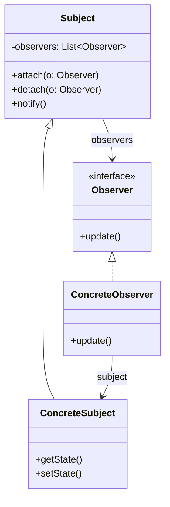

# Sviluppo delle Applicazioni Software (SAS) - Compendio Completo per l'Esame

Compendio integrale, ragionato e interconnesso di tutto il programma del corso di **Sviluppo delle Applicazioni Software (SAS)**, basato sui testi di Craig Larman (*Applicare UML e i Pattern*) e Ian Sommerville (*Ingegneria del Software*).

---

## 📑 Indice Generale del Corso

1. [[#1. Processi per lo Sviluppo Software e Attività Fondamentali]]
2. [[#2. Modelli di Sviluppo: Cascata vs Incrementale]]
3. [[#3. Sviluppo Iterativo, Evolutivo e Metodologie Agili (Scrum, XP)]]
4. [[#4. Unified Process (UP): Fasi, Discipline e Milestones]]
5. [[#5. Requisiti e Casi d'Uso]]
6. [[#6. Fase di Ideazione (Inception)]]
7. [[#7. Fase di Elaborazione (Elaboration)]]
8. [[#8. Modellazione del Dominio (Modello di Dominio)]]
9. [[#9. Diagrammi di Sequenza di Sistema (SSD) e Contratti delle Operazioni]]
10. [[#10. Architettura Logica e Principio di Separazione Modello-Vista]]
11. [[#11. Modellazione Dinamica vs Statica e Notazione UML]]
12. [[#12. I 9 Pattern GRASP (Responsibility-Driven Design)]]
13. [[#13. Esempio di Progettazione con GRASP (Caso Studio NextGen POS)]]
14. [[#14. I Design Pattern della Gang of Four (GoF)]]
15. [[#15. Dal Progetto al Codice, Testing Unitario e TDD]]
16. [[#16. Sezione Salva-Esame: Risoluzione Prove Reali e Trabocchetti]]

---

## 1. Processi per lo Sviluppo Software e Attività Fondamentali

Un **processo di sviluppo software** è un insieme strutturato di attività necessarie per sviluppare un sistema software.
Non esiste un unico processo universale, ma processi diversi per contesti e obiettivi diversi.

### Le 4 Attività Fondamentali di Processo (Ian Sommerville)
Qualsiasi processo software, dal più rigido al più agile, include sempre quattro attività cardine:
1. **Specifica del Software**: definizione dei requisiti funzionali, vincoli operativi e aspettative dei clienti/utenti.
2. **Sviluppo del Software (Progettazione e Implementazione)**: definizione dell'architettura, progettazione dettagliata degli oggetti e scrittura del codice sorgente.
3. **Convalida del Software (Validation & Testing)**: verifica e collaudo per garantire che il software rispetti le specifiche e soddisfi i bisogni del committente.
4. **Evoluzione del Software (Manutenzione)**: modifiche e adattamenti del software per soddisfare i cambiamenti dei requisiti di business e tecnologici.

---

## 2. Modelli di Sviluppo: Cascata vs Incrementale

### 2.1 Modello a Cascata (Waterfall / Sequenziale)
Derivato dai modelli classici dell'ingegneria civile e militare (approccio *plan-driven*).
- **Principio**: Le 4 attività fondamentali (**specifica, sviluppo, convalida ed evoluzione**) sono rappresentate come **fasi distinte, separate e rigidamente sequenziali**.
- **Funzionamento**:
  1. Definizione e approvazione formale di tutti i requisiti.
  2. Progettazione architetturale e dettagliata completa.
  3. Codifica dell'intero sistema.
  4. Test e collaudo integrato a fine progetto.
  5. Manutenzione post-rilascio.
- **Limiti**: Mancanza di flessibilità di fronte ai cambiamenti; il cliente vede il sistema solo al termine; ritardi nel rilevare difetti architetturali critici.

### 2.2 Sviluppo Incrementale
- **Principio**: Le 4 attività fondamentali (**specifica, sviluppo, convalida ed evoluzione**) sono **intrecciate** (*interleaved*).
- **Funzionamento**:
  - Il sistema viene sviluppato e rilasciato come una **serie di versioni successive (incrementi)**.
  - Ciascun incremento aggiunge nuove porzioni di funzionalità funzionanti.
  - Il cliente riceve rilasci anticipati (*early release*) e fornisce feedback continuo che guida l'evoluzione degli incrementi successivi.
- **Tipologie**:
  - *Plan-driven*: gli incrementi sono pianificati a priori.
  - *Agile*: gli incrementi successivi sono stabiliti dinamicamente in base all'avanzamento dei lavori.

> [!IMPORTANT]
> **Differenza Chiave d'Esame (Domanda da 5.5 Punti)**:
> Nel modello a cascata le attività di specifica, sviluppo, convalida ed evoluzione sono rigidamente separate in blocchi temporali sequenziali (nessuna fase successiva inizia prima dell'approvazione della precedente). Nello sviluppo incrementale, invece, queste 4 attività sono **intrecciate** all'interno di ogni singolo incremento, consentendo feedback veloci e riducendo il rischio di fallimento.

---

## 3. Sviluppo Iterativo, Evolutivo e Metodologie Agili (Scrum, XP)

### 3.1 Sviluppo Iterativo ed Evolutivo
- Lo sviluppo è organizzato in una serie di mini-progetti chiamati **iterazioni**, di durata breve e prefissata (**time-boxed**, tipicamente 2-6 settimane).
- Al termine di ogni singola iterazione si ottiene un sistema **eseguibile, testato e integrato**, seppur parziale.
- **Iterativo**: aggiunta progressiva di funzionalità; a ogni ciclo il prodotto viene perfezionato.
- **Evolutivo**: le specifiche e il progetto si adattano costantemente in base al feedback empirico.

### 3.2 Agile Modeling e Metodologie Agili
Puntano alla rapidità di consegna, alla soddisfazione del cliente e all'adattabilità al cambiamento:
- **Scrum**: framework manageriale agile incentrato su cicli di lavoro a durata fissa (**Sprint**).
  - *Ruoli*: **Product Owner** (gestisce il Product Backlog), **Dev Team** (sviluppa il software), **Scrum Master** (facilita e rimuove ostacoli).
  - *Cerimonie*: Sprint Planning, Daily Scrum, Sprint Review, Sprint Retrospective.
- **Extreme Programming (XP)**: metodologia focalizzata sull'eccellenza ingegneristica e pratiche di programmazione:
  - **Test-Driven Development (TDD)**: sviluppo preceduto dai test.
  - **Pair Programming**: programmazione a coppie per revisione continua del codice.
  - **Refactoring Continuo**: costante pulizia del codice per mantenerlo semplice.
  - **Integrazione Continua**: compilazione e test automatici a ogni commit.

---

## 4. Unified Process (UP): Fasi, Discipline e Milestones

Lo **Unified Process (UP)** è un processo di sviluppo iterativo ed evolutivo flessibile, le cui iterazioni iniziali sono guidate dal **rischio**, dal **cliente** e dall'**architettura**.

### La Struttura Bidimensionale di UP (Fasi vs Discipline)
UP organizza il ciclo di vita del software secondo due dimensioni ortogonali:
1. **Asse Temporale (Fasi e Iterazioni)**: mostra come il tempo scorre attraverso 4 fasi sequenziali.
2. **Asse Logico (Discipline)**: mostra le attività tecniche e manageriali svolte durante il progetto.

> [!WARNING]
> **Trabocchetto Frequente**: Le *Fasi* (Ideazione, Elaborazione, Costruzione, Transizione) sono sequenziali. Le *Discipline* (Requisiti, Progettazione, Implementazione, Test...), invece, **si svolgono in parallelo e si intrecciano in ogni singola iterazione**, variando unicamente l'intensità dello sforzo!

### Le 4 Fasi Temporali e le Loro Milestone:
1. **Ideazione (Inception)**:
   - Visione comune, studio di fattibilità economica e dei rischi maggiori.
   - Si definisce circa il 10% dei requisiti dettagliati.
   - *Milestone*: **Obiettivi del Ciclo di Vita** (*Lifecycle Objectives*).
2. **Elaborazione (Elaboration)**:
   - Serie iniziale di iterazioni per sviluppare il nucleo dell'architettura, mitigare i rischi tecnici elevati e specificare la maggior parte dei requisiti.
   - *Milestone*: **Architettura del Ciclo di Vita** (*Lifecycle Architecture*).
3. **Costruzione (Construction)**:
   - Implementazione iterativa di tutte le restanti funzionalità a minor rischio e preparazione al deployment.
   - *Milestone*: **Capacità Operativa Iniziale** (*Initial Operational Capability*).
4. **Transizione (Transition)**:
   - Beta testing, collaudo, migrazione dati, formazione utenti e rilascio finale.
   - *Milestone*: **Rilascio del Prodotto** (*Product Release*).

### Il Modello FURPS+ per i Requisiti
Acronimo usato in UP per categorizzare tutti i requisiti di sistema:
- **F (Functional)**: requisiti funzionali (capacità, funzionalità, sicurezza, casi d'uso).
- **U (Usability)**: usabilità, estetica, documentazione utente, ergonomia.
- **R (Reliability)**: affidabilità, frequenza dei guasti, tolleranza agli errori, recuperabilità.
- **P (Performance)**: tempi di risposta, throughput, latenza, uso delle risorse.
- **S (Supportability)**: manutenibilità, configurabilità, testabilità, estendibilità.
- **+ (Plus)**: vincoli ulteriori (vincoli di design, implementazione, interfacciamento esterno, vincoli fisici).

---

## 5. Requisiti e Casi d'Uso

Un **requisito** è una capacità o condizione a cui il sistema deve conformarsi.
In UP:
- I requisiti *funzionali* si catturano principalmente mediante i **Casi d'Uso**.
- I requisiti *non funzionali* e i vincoli generali si catturano nelle **Specifiche Supplementari**.

### Casi d'Uso (Use Cases)
Un caso d'uso è una **descrizione testuale** di una sequenza di azioni correlate condotte da un attore per raggiungere un obiettivo di valore.

#### Attori:
- **Attore Primario**: colui che interagisce direttamente col sistema per raggiungere il proprio obiettivo (es. Cassiere).
- **Attore di Supporto**: fornisce un servizio al sistema in esame (es. Servizio di Autorizzazione Pagamenti, Sistema Fiscale).
- **Attore Fuori Scena**: ha un interesse nei risultati del caso d'uso senza interagire direttamente (es. Agenzia delle Entrate, Direttore del Negozio).

#### Formati dei Casi d'Uso:
- **Breve**: riassunto di un solo paragrafo incentrato sul solo scenario di successo principale.
- **Informale**: diversi paragrafi che coprono informalmente vari scenari.
- **Dettagliato**: strutturato formalmente con pre-condizioni, garanzie di successo (post-condizioni), scenario principale e tutte le estensioni (scenari alternativi ed eccezioni).

#### Criteri di Validazione (Test dei Casi d'Uso):
- **Test del Capo**: *"Cosa hai fatto tutto il giorno?"* Se la risposta descrive il completamento di un caso d'uso significativo, il capo è soddisfatto.
- **Test EBP (Elementary Business Process)**: un compito svolto da una persona in un luogo e in un momento, che aggiunge valore misurabile al business e lascia i dati in uno stato consistente.
- **Test della Dimensione**: un caso d'uso dettagliato è composto tipicamente da 3 a 10 pagine di testo.

---

## 6. Fase di Ideazione (Inception)

L'**Ideazione** è la prima fase di UP. L'obiettivo **NON** è definire tutti i requisiti (sarebbe un errore in stile cascata!), bensì raccogliere informazioni sufficienti per decidere se il progetto merita un'indagine approfondita durante l'elaborazione.
- Durata tipicamente molto breve (1 o poche settimane).
- Si esamina circa il **10% dei casi d'uso** principali in dettaglio.
- *Elaborati avviati*: Visione e Studio Economico, Modello dei Casi d'Uso, Specifiche Supplementari, Glossario, Lista dei Rischi.

---

## 7. Fase di Elaborazione (Elaboration)

L'**Elaborazione** è la serie iniziale di iterazioni in cui:
1. Si affrontano e risolvono i rischi tecnici ed economici più elevati.
2. Si progetta, si implementa e si testa il **nucleo dell'architettura software**.
3. Si specifica in dettaglio la maggior parte dei requisiti (circa l'80-90%).

I requisiti da affrontare per primi nelle iterazioni di elaborazione sono selezionati in base a:
- **Rischio**: aspetti tecnici complessi o poco noti.
- **Copertura**: componenti cardine dell'architettura complessiva.
- **Criticità**: funzionalità ad alto valore strategico per il cliente.

---

## 8. Modellazione del Dominio (Modello di Dominio)

Il **Modello di Dominio** è una rappresentazione visuale delle **classi concettuali** del mondo reale (spazio del problema).
- Mostra: **Oggetti/Classi Concettuali**, **Associazioni** tra concetti e **Attributi**.
- **REGOLA FONDAMENTALE**: Nel Modello di Dominio **NON ci sono operazioni né metodi software**! Non è un diagramma di classi software, ma un modello del vocabolario reale.
- Funge da ispirazione per i nomi delle classi software dello strato del dominio (**Salto Rappresentazionale Ridotto**).

---

## 9. Diagrammi di Sequenza di Sistema (SSD) e Contratti delle Operazioni

### 9.1 Diagramma di Sequenza di Sistema (SSD)
Un **SSD** è un diagramma di sequenza UML che illustra gli eventi di input e output che gli attori esterni inviano al sistema in discussione.
- Tratta il sistema come una **scatola nera (black box)**.
- Mostra l'attore primario, la linea di vita `:Sistema` e i messaggi in ingresso, chiamati **Operazioni di Sistema** (es. `enterItem(id, quantity)`).
- Viene creato un SSD per ogni scenario principale e alternativo dei casi d'uso.

### 9.2 Contratti delle Operazioni
Specificano nel dettaglio cosa deve accadere allo stato del sistema a seguito dell'esecuzione di un'operazione di sistema complessa identificata negli SSD.
- **Struttura di un Contratto**:
  - **Operazione**: nome dell'operazione e parametri.
  - **Riferimenti**: casi d'uso correlati.
  - **Pre-condizioni**: assunzioni notevoli sullo stato del sistema o del dominio prima dell'operazione.
  - **Post-condizioni**: lo stato risultante degli oggetti al termine dell'operazione.
- **Le 3 Categorie di Post-Condizioni**:
  1. Istanze create o eliminate (es. *"È stata creata un'istanza `sli` di `SalesLineItem`"*).
  2. Associazioni formate o eliminate (es. *"L'istanza `sli` è stata associata a `Sale`"*).
  3. Attributi modificati (es. *"L'attributo `sli.quantity` è stato impostato a `quantity`"*).
- *Nota*: Le post-condizioni descrivono **stati risultanti**, non azioni o codice imperativo! Se un'operazione non modifica lo stato, si tratta di una pura interrogazione.

---

## 10. Architettura Logica e Principio di Separazione Modello-Vista

L'**Architettura Logica** è la macro-organizzazione su larga scala delle classi software in package, sottosistemi e **layer (strati)**.

### I Layer Tipici:
1. **User Interface (UI / Presentazione)**: finestre, pagine web, widget, listener di eventi grafici.
2. **Logica Applicativa / Dominio**: oggetti software che rappresentano i concetti di business (`Sale`, `Payment`).
3. **Servizi Tecnici (Technical Services)**: persistenza (DB), sicurezza, logging, autenticazione, servizi di rete.
4. **Fondamenta (Foundation)**: tipi di dati base, strutture dati, primitive del sistema operativo.

### Strict Layering vs Relaxed Layering:
- **Architettura a Strati Rigida (Strict Layering)**: uno strato superiore può accedere **solo** allo strato immediatamente inferiore.
- **Architettura a Strati Rilassata (Relaxed Layering)**: uno strato superiore può accedere liberamente a qualsiasi strato sottostante.

### Principio di Separazione Modello-Vista (Model-View Separation)
- **Regola 1**: Non relazionare o accoppiare oggetti non-UI (Modello) con oggetti UI (Vista). Il Modello non deve dipendere dalla GUI.
- **Regola 2**: Non inserire la logica di business nei metodi dell'interfaccia utente. La GUI deve limitarsi a catturare gli eventi e delegarli allo strato di dominio.
- **Come fa il Modello ad aggiornare la Vista?** Tramite il pattern **[[#7. Observer (Publish-Subscribe) ⭐|Observer]]** (il Modello notifica gli ascoltatori registrati senza conoscerne la classe concreta).
- **Vantaggi (Domanda d'Esame)**:
  - Sviluppo separato e indipendente tra grafici e sviluppatori di logica.
  - Viste multiple e simultanee sugli stessi dati.
  - Minimizzazione dell'impatto se cambia il framework grafico.
  - **Testabilità autonoma**: il dominio può essere testato con test unitari automatici senza avviare la GUI.

---

## 11. Modellazione Dinamica vs Statica e Notazione UML

| Tipo di Modellazione | Modelli Dinamici | Modelli Statici |
| :--- | :--- | :--- |
| **Scopo** | Mostra il comportamento nel tempo, lo scambio di messaggi e le collaborazioni. | Mostra la struttura permanente del codice, classi, attributi e relazioni. |
| **Diagrammi** | **Diagrammi di Sequenza**, Diagrammi di Comunicazione | **Design Class Diagram (DCD)**, Diagrammi dei Package |
| **Cosa definisce** | I metodi da eseguire e l'assegnazione delle responsabilità. | Le definizioni di classe, le firme dei metodi e la visibilità. |
| **Ordine logico** | **Si fa PRIMA** (qui si prendono le decisioni difficili applicando i pattern GRASP). | **Si fa DOPO** (riflette e sintetizza i risultati dei diagrammi di interazione). |

### Elementi dei Diagrammi di Sequenza:
- **Found Message (Messaggio Trovato)**: freccia orizzontale esterna che rappresenta l'operazione di sistema in ingresso.
- **Lifeline (Linea di Vita)**: rettangolo con nome oggetto (`nome:Tipo` o `:Tipo`) e linea tratteggiata verticale.
- **Activation Box**: barra verticale di attivazione.
- **Creazione di Oggetto**: messaggio `<<create>>` che punta direttamente al rettangolo dell'istanza.
- **Frame UML 2.x**:
  - `alt`: rami condizionali mutuamente esclusivi (`if-else`).
  - `opt`: esecuzione opzionale (`if` semplice).
  - `loop`: iterazione su una collezione.

### I 4 Tipi di Visibilità tra Oggetti:
1. **Visibilità per Attributo**: `B` è memorizzato come attributo/variabile d'istanza di `A`.
2. **Visibilità per Parametro**: `B` viene passato come argomento in un metodo di `A`.
3. **Visibilità Locale**: `B` è una variabile locale istanziata all'interno di un metodo di `A`.
4. **Visibilità Globale**: `B` è accessibile globalmente (variabile statica, singleton).

---

## 12. I 9 Pattern GRASP (Responsibility-Driven Design)

I pattern **GRASP** (*General Responsibility Assignment Software Patterns*) formalizzano i principi base per assegnare le responsabilità agli oggetti.

### Responsibility-Driven Design (RDD)
Il software è concepito come una comunità di oggetti collaboranti.
- **Responsabilità di Fare (*Doing*)**: creare oggetti, eseguire calcoli, coordinare attività.
- **Responsabilità di Conoscere (*Knowing*)**: conoscere dati privati, oggetti correlati, informazioni calcolabili.

---

### I 9 Pattern GRASP Dettagliati:

#### 1. Information Expert (Esperto dell'Informazione)
- **Problema**: Qual è il principio generale per assegnare una responsabilità?
- **Soluzione**: Assegnare la responsabilità alla classe che **possiede le informazioni necessarie** per adempierla.
- *Esempio POS*: `Sale` calcola il totale complessivo perché possiede la lista dei `SalesLineItem`. `SalesLineItem` calcola il subtotale perché ha la quantità e conosce `ProductDescription`. `ProductDescription` fornisce il prezzo unitario.

#### 2. Creator (Creatore)
- **Problema**: Chi deve creare una nuova istanza della classe `A`?
- **Soluzione**: Assegnare a `B` la creazione di `A` se `B` contiene/aggrega `A`, `B` registra `A`, `B` usa strettamente `A`, oppure `B` possiede i dati per inizializzare `A`.
- *Esempio POS*: `Sale` crea `SalesLineItem` perché contiene la lista delle righe.

#### 3. Low Coupling (Basso Accoppiamento)
- **Problema**: Come supportare una bassa dipendenza, facilità di riuso e basso impatto dei cambiamenti?
- **Soluzione**: Assegnare le responsabilità in modo tale che l'accoppiamento tra classi rimanga basso.
- *Caratteristica*: È un **principio valutativo** utilizzato per giudicare tra alternative progettuali.

#### 4. High Cohesion (Alta Coesione)
- **Problema**: Come mantenere le classi focalizzate, comprensibili e gestibili?
- **Soluzione**: Assegnare responsabilità strettamente correlate tra loro; evitare classi che svolgono troppi compiti disparati (*God Classes*). Lavora in tandem con Low Coupling.

#### 5. Controller (Controllore)
- **Problema**: Qual è il primo oggetto oltre lo strato UI che riceve e coordina un'operazione di sistema?
- **Soluzione**: Assegnare l'operazione a:
  - Un **Facade Controller**: rappresenta il sistema complessivo o il dispositivo radice (es. `Register`, `Store`).
  - Un **Use Case Controller**: rappresenta il gestore dello scenario del caso d'uso (es. `ProcessSaleHandler`).
- *Attenzione*: Evitare il **Fat Controller** (controller che contiene tutta la logica e non delega: soffre di pessima coesione).

#### 6. Polymorphism (Polimorfismo)
- **Problema**: Come gestire alternative di comportamento basate sul tipo senza cascate di `if-else` o `switch`?
- **Soluzione**: Assegnare la responsabilità del comportamento variabile usando **operazioni polimorfiche** su un'interfaccia o superclasse comune.

#### 7. Pure Fabrication (Invenzione Pura)
- **Problema**: A chi assegnare compiti tecnici (es. salvataggio su DB, logging) quando l'applicazione di Expert sporcherebbe la coesione delle classi del dominio reale?
- **Soluzione**: Creare una classe artificiale di servizio (es. `PersistentStorageDAO`, `Logger`) non presente nel dominio reale.

#### 8. Indirection (Indirezione)
- **Problema**: Dove assegnare la responsabilità per evitare accoppiamento diretto tra componenti?
- **Soluzione**: Introdurre un oggetto intermediario mediatore (alla base di Adapter, Facade, Observer).

#### 9. Protected Variations (Variazioni Protette)
- **Problema**: Come progettare elementi affinché variazioni o instabilità previste non impattino negativamente sul resto del sistema?
- **Soluzione**: Identificare i punti di instabilità e incapsularli dietro un'**interfaccia stabile** (fondamento di *Information Hiding* e *Open/Closed Principle*).

---

## 13. Esempio di Progettazione con GRASP (Caso Studio NextGen POS)

Analisi delle 4 operazioni di sistema del caso d'uso "Elabora Vendita":
1. `makeNewSale()`: Ricevuto dal Controller `Register`; applicando **Creator**, `Register` crea una nuova istanza di `Sale`.
2. `enterItem(itemID, quantity)`: Ricevuto dal Controller `Register`; interroga `ProductCatalog` (**Information Expert**) per ricavare la `ProductDescription`; poi `Sale` (**Creator**) crea `SalesLineItem(desc, quantity)`.
3. `endSale()`: Ricevuto da `Register`; aggiorna lo stato interno della vendita (`sale.becomeComplete()`).
4. `makePayment(amount)`: `Register` crea `Payment` e calcola l'eventuale resto; il totale viene calcolato tramite **Information Expert** delegando a cascata: `Sale.getTotal()` ➔ `SalesLineItem.getSubtotal()` ➔ `ProductDescription.getPrice()`.

---

## 14. I Design Pattern della Gang of Four (GoF)

Classificati in base al loro scopo in: **Creazionali**, **Strutturali** e **Comportamentali**.

### 14.1 Pattern Creazionali
- **Abstract Factory**: crea famiglie di oggetti correlati o dipendenti senza specificarne le classi concrete.
- **Singleton**: garantisce che una classe abbia una sola istanza globale (`getInstance()`, costruttore `private`). Supporta *Lazy Initialization* e *Double-Check Locking*.

### 14.2 Pattern Strutturali
- **Adapter**: converte l'interfaccia di una classe in un'altra attesa dal client (es. `SAPAdapter`, `TaxCalculatorAdapter`).
- **Composite**: organizza oggetti in strutture ad albero parte-tutto, trattando uniformemente oggetti singoli (`Leaf`) e raggruppamenti (`Composite`).
- **Decorator**: aggiunge dinamicamente responsabilità a un oggetto racchiudendolo in un involucro che rispetta la stessa interfaccia, senza usare l'ereditarietà (es. Stream Java I/O).
- **Facade**: fornisce un'interfaccia semplificata di alto livello per interagire con un sottosistema complesso.

### 14.3 Pattern Comportamentali
- **Observer (Publish-Subscribe)** ⭐:
  - *Problema*: Notificare più osservatori al cambio di stato di un oggetto senza accoppiamento diretto.
  - *Soluzione*: `Subject` mantiene una lista di `Observer`; con `attach()` si registrano, e `notify()` invoca `update()` su ciascuno.
  - *Ruolo Chiave*: Consente il disaccoppiamento tra Modello e Vista nell'[[#10. Architettura Logica e Principio di Separazione Modello-Vista|Architettura Logica]].
- **Strategy** ⭐:
  - *Problema*: Variare algoritmi indipendentemente dai client che li utilizzano.
  - *Soluzione*: Famiglia di algoritmi incapsulati in classi separate derivate da un'interfaccia comune, intercambiabili a runtime.
- **State** ⭐:
  - *Problema*: Permettere a un oggetto di cambiare comportamento quando il suo stato interno cambia.
  - *Soluzione*: Incapsula i singoli stati in classi dedicate; l'oggetto delega l'esecuzione allo stato corrente, che muta nel tempo.
- **Visitor**: permette di definire nuove operazioni su una struttura di elementi senza alterarne le classi (doppio dispatch).

### Confronto Cruciale d'Esame: Strategy vs State
- **Sintassi UML**: Identica (un contesto referenzia un'interfaccia astratta e delega l'operazione).
- **Differenza Semantica**:
  - **Strategy**: incapsula un *algoritmo intercambiabile* (configurato solitamente dal client all'inizio).
  - **State**: modella il *cambiamento di stato interno* nel ciclo di vita dell'oggetto (le transizioni avvengono automaticamente).

---

## 15. Dal Progetto al Codice, Testing Unitario e TDD

### Trasformazione da Progetto a Codice:
- Le classi del DCD diventano classi Java/C++.
- Le associazioni `1..*` diventano collezioni (`List<Item>`).
- I messaggi dei diagrammi di sequenza diventano i corpi e le chiamate dei metodi.

### Test-Driven Development (TDD)
Pratica promossa da **Extreme Programming (XP)**: si scrive il test unitario **prima** del codice funzionale.
- **Ciclo Red-Green-Refactor**:
  1. **Red**: scrivi un test unitario che fallisce.
  2. **Green**: scrivi il codice minimo per far passare il test.
  3. **Refactor**: pulisci e migliora il design mantenendo tutti i test verdi.

### I 4 Livelli di Test:
1. **Test Unitari**: collaudano singole unità isolate (classi e metodi).
2. **Test di Integrazione**: collaudano la comunicazione tra componenti cooperanti.
3. **Test End-to-End**: collaudano l'intero flusso di sistema da cima a fondo.
4. **Test di Accettazione**: collaudano il sistema complessivo rispetto ai requisiti del cliente.

### Le 4 Fasi del Test Unitario (xUnit / JUnit):
1. **Preparazione (Setup / Fixture)**: instanziazione e inizializzazione delle risorse.
2. **Esecuzione**: chiamata del metodo sotto test.
3. **Verifica (Asserzioni / Assert)**: controllo dei valori restituiti rispetto a quelli attesi.
4. **Rilascio (Teardown / Clean-up)**: rilascio di risorse esterne (file, socket, DB).

---

## 16. Sezione Salva-Esame: Risoluzione Prove Reali e Trabocchetti

### Risoluzione Domanda Aperta 1 (5.5 Punti):
> *Differenza sostanziale tra modello a cascata e incrementale con riferimento alle 4 attività fondamentali.*

**Risposta Perfetta**:
Le quattro attività fondamentali di processo sono **specifica, sviluppo, convalida ed evoluzione**. Nel **modello a cascata**, esse sono rigidamente separate in blocchi sequenziali consecutivi, dove ciascuna fase deve essere completata e approvata prima di passare alla successiva. Nello **sviluppo incrementale**, invece, queste quattro attività sono **intrecciate** all'interno di ciascun incremento, consentendo il rilascio continuo di versioni parziali e l'adattamento evolutivo del sistema guidato dal feedback empirico dell'utente.

### Risoluzione Domanda Aperta 2 (5.5 Punti):
> *Descrizione e diagramma UML del pattern GoF Observer.*
- **Nome**: Observer (Publish-Subscribe)
- **Problema**: Notificare una serie di oggetti dipendenti al variare dello stato di un oggetto di interesse, mantenendo un basso accoppiamento.
- **Soluzione**: Definire `Subject` (con `attach`, `detach`, `notify`) e `Observer` (con `update`). Il Subject notifica tutti gli osservatori registrati invocando `update()`.

### I Più Frequenti Trabocchetti "Vero o Falso":
1. *UP separa requisiti, progettazione e test in fasi diverse?* ➔ **FALSO**. Sono discipline e si svolgono in parallelo in ogni iterazione.
2. *I pattern GRASP si usano nella disciplina dei requisiti?* ➔ **FALSO**. Si usano nella Progettazione (Design).
3. *TDD e Refactoring nascono nel modello a cascata?* ➔ **FALSO**. Nascono in **Extreme Programming (XP)**.
4. *I test unitari verificano il collegamento tra tutti gli elementi del sistema?* ➔ **FALSO**. Questa è la definizione dei test end-to-end; i test unitari verificano singole classi/metodi isolati.
5. *Abstract Factory è un pattern GRASP?* ➔ **FALSO**. È un pattern GoF.
6. *State e Strategy sono sintatticamente equivalenti?* ➔ **VERO**. Hanno la stessa struttura di classi, ma diversa semantica d'applicazione.
