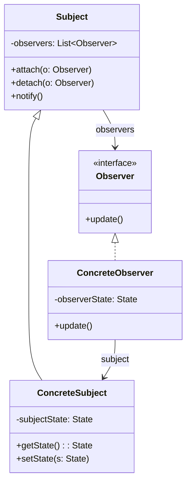

# Guida Strategica e Risoluzione Prove d'Esame - SAS

Guida intensiva di ripasso rapido per l'esame di **Sviluppo delle Applicazioni Software (SAS)**, con le risposte complete e commentate alle prove d'esame reali e i trabocchetti più frequenti.

---

## 🎯 Parte 1: Risposte Pronte per le Domande Aperte

### Domanda 1: Modello a Cascata vs Modello Incrementale (5.5 Punti)
> **Traccia**: *Spiegare in non più di 5 righe la differenza sostanziale tra modello di sviluppo a cascata e modello di sviluppo incrementale, facendo riferimento alle quattro attività fondamentali di un processo di sviluppo software.*

**Risposta Modello (in 4 righe)**:
Le quattro attività fondamentali del processo software sono **specifica, sviluppo, convalida ed evoluzione**. 
Nel **modello a cascata** esse sono rigidamente separate in fasi sequenziali distinte, dove ciascuna deve concludersi prima della successiva.
Nello **sviluppo incrementale**, invece, queste quattro attività sono **intrecciate** all'interno di ciascun incremento, consentendo di rilasciare versioni parziali e integrare il feedback continuo del cliente per guidare l'evoluzione del sistema.

---

### Domanda 2: Pattern GoF Observer (5.5 Punti)
> **Traccia**: *Completare la descrizione del pattern GoF Observer e disegnare la struttura del pattern utilizzando il linguaggio UML.*

- **Nome**: Observer (Publish-Subscribe)
- **Scopo**: Comportamentale
- **Problema**: Come notificare automaticamente una serie di oggetti dipendenti (*Observer*) quando lo stato di un oggetto di interesse (*Subject*) subisce una modifica, senza creare un forte accoppiamento diretto tra il Subject e le classi concrete degli Observer?
- **Soluzione**: Definire un'interfaccia o classe astratta `Subject` (con metodi `attach(Observer)`, `detach(Observer)`, `notify()`) e un'interfaccia `Observer` (con metodo `update()`). Il Subject mantiene una collezione di Observer registrati e, al cambio di stato, invoca `notify()` che chiama `update()` su ciascun osservatore.

**Diagramma UML della Struttura**:

---

### Domanda 3: Confronto Cruciale Strategy vs State
> **Traccia**: *Spiegare similitudini e differenze tra il pattern Strategy e il pattern State.*

- **Similitudine Strutturale**: Dal punto di vista sintattico e UML, i due pattern sono **identici**: entrambi prevedono una classe contesto (`Context`) che referenzia un'interfaccia polimorfica e delega ad essa l'esecuzione dell'operazione.
- **Differenza Sostanziale**:
  - **Strategy**: si occupa di **come** eseguire un compito, incapsulando una famiglia di *algoritmi intercambiabili*. La strategia viene tipicamente impostata o configurata dall'esterno (dal client) all'avvio.
  - **State**: si occupa di **quale stato** si trova l'oggetto, incapsulando il comportamento che varia in base al mutare del suo *stato interno*. Le transizioni di stato avvengono dinamicamente durante il ciclo di vita dell'oggetto e sono spesso guidate dalle classi stato concrete stesse.

---

## ⚡ Parte 2: Analisi dei Trabocchetti "Vero o Falso" (Prove d'Esame)

### Blocco 1: OOD, Responsabilità e Pattern GRASP
1. *"L'analisi orientata agli oggetti è guidata dalle responsabilità."* ➔ **VERO**. (RDD - Responsibility-Driven Design).
2. *"L'analisi orientata agli oggetti considera un progetto software come una 'comunità di oggetti' con responsabilità che collaborano."* ➔ **VERO**.
3. *"Identificazione delle responsabilità, assegnazione di queste responsabilità, indagine di come soddisfare queste responsabilità sono i passi della 'responsibility-driven development'."* ➔ **VERO**.
4. *"Controller, High Cohesion, Abstract Factory sono alcuni esempi di pattern GRASP."* ➔ **FALSO**. Abstract Factory è un pattern **GoF**, non GRASP! (I GRASP sono 9: Expert, Creator, Low Coupling, High Cohesion, Controller, Polymorphism, Pure Fabrication, Indirection, Protected Variations).
5. *"I pattern GRASP sono lo strumento principale utilizzato nella disciplina dei requisiti di UP."* ➔ **FALSO**. I pattern GRASP si usano nella **disciplina della progettazione (Design)**, non nei requisiti!

---

### Blocco 2: Unified Process (UP) - Fasi vs Discipline
1. *"UP organizza temporalmente il ciclo di sviluppo in quattro iterazioni e le iterazioni in diverse fasi."* ➔ **FALSO**. È il contrario: UP organizza temporalmente il ciclo in **quattro fasi** (Ideazione, Elaborazione, Costruzione, Transizione) e ciascuna fase è suddivisa in **iterazioni**!
2. *"Ideazione, elaborazione, costruzione e transizione di UP sono separate temporalmente e non si intrecciano mai."* ➔ **VERO**. Le 4 fasi si susseguono temporalmente (con le loro milestone).
3. *"Specifica, sviluppo, convalida ed evoluzione in UP sono attività separate temporalmente e non si intrecciano mai."* ➔ **FALSO**. In UP le attività fondamentali sono **intrecciate** ad ogni iterazione.
4. *"Durante lo sviluppo tramite UP non si fa uso di meccanismi di refactoring per far fronte ai cambiamenti."* ➔ **FALSO**. Il refactoring continuo è incoraggiato in ogni iterazione.
5. *"Modellazione del business, requisiti, progettazione, implementazione, test, rilascio in UP sono separate temporalmente e non si intrecciano mai."* ➔ **FALSO**. Queste sono le **discipline**, e si svolgono in parallelo/intrecciate all'interno di ciascuna iterazione!

---

### Blocco 3: Test, TDD e Extreme Programming
1. *"Il test-driven development è una pratica promossa dal metodo a cascata che prevede lo sviluppo preceduto dai test."* ➔ **FALSO**. È promosso da **XP (Extreme Programming)**, non dal metodo a cascata!
2. *"I test unitari hanno lo scopo di verificare la comunicazione tra specifiche parti del sistema."* ➔ **FALSO**. Questa è la definizione dei **test di integrazione**. I test unitari verificano le singole unità isolate (classi/metodi).
3. *"I test unitari hanno lo scopo di verificare il collegamento complessivo tra tutti gli elementi del sistema."* ➔ **FALSO**. Questa è la definizione dei **test end-to-end**.
4. *"I test unitari si compongono di preparazione, esecuzione, verifica e rilascio."* ➔ **VERO**. Le 4 fasi standard (Setup, Execution, Verification, Teardown).
5. *"Il test-driven development e il refactoring sono pratiche promosse in particolar modo dallo sviluppo noto come extreme programming."* ➔ **VERO**.

---

### Blocco 4: Pattern Strategy e State
1. *"Il pattern Strategy si occupa del modo in cui un oggetto esegue un determinato compito ed incapsula un algoritmo."* ➔ **VERO**.
2. *"Il pattern State si occupa del modo in cui un oggetto esegue un determinato compito ed incapsula un algoritmo."* ➔ **FALSO**. State si occupa del comportamento che varia in base allo stato interno.
3. *"Il pattern State consente la definizione di una famiglia di algoritmi, intercambiabili tra loro."* ➔ **FALSO**. Questa è la definizione di **Strategy**!
4. *"Il pattern State disaccoppia gli algoritmi dei clienti che vogliono usarli dinamicamente."* ➔ **FALSO**. Anche questa è prerogativa di Strategy.
5. *"Il pattern State e il pattern Strategy sono sintatticamente equivalenti ma differiscono nell'applicazione."* ➔ **VERO**. Hanno la stessa struttura di classi, ma diverso intento semantico.

---

## 📊 Parte 3: Tavola Sinottica Rapida dei 9 Pattern GRASP

| Pattern GRASP | Domanda Guida | A chi assegnare la responsabilità? |
| :--- | :--- | :--- |
| **Information Expert** | Chi calcola o elabora? | Alla classe che **possiede le informazioni necessarie**. |
| **Creator** | Chi crea un'istanza di A? | A chi contiene, aggrega, registra, usa strettamente A o possiede i dati per inizializzarlo. |
| **Low Coupling** | Criterio di valutazione | Assegnare le responsabilità in modo da **minimizzare le dipendenze** tra classi. |
| **High Cohesion** | Criterio di valutazione | Mantenere le classi **focalizzate su compiti correlati**, evitando "God classes". |
| **Controller** | Chi riceve l'evento dalla UI? | A un oggetto che rappresenta il sistema/dispositivo (**Facade**) o il caso d'uso (**Handler**). |
| **Polymorphism** | Come gestire varianti di tipo? | Tramite **metodi polimorfici**, eliminando catene di `if-else` o `switch`. |
| **Pure Fabrication** | Expert sporca il dominio? | A una **classe artificiale/servizio** (es. DAO, Logger, Storage) per preservare la coesione. |
| **Indirection** | Come evitare legami diretti? | A un **oggetto intermediario** che fa da ponte tra due componenti. |
| **Protected Variations** | Come isolarsi dai cambiamenti? | Incapsulando i punti di instabilità dietro un'**interfaccia stabile**. |

---

## 🏗️ Parte 4: Tavola Sinottica dei Pattern GoF

| Categoria | Pattern GoF | Scopo / Intento in Breve | Esempio Chiave del Corso |
| :--- | :--- | :--- | :--- |
| **Creazionale** | **Abstract Factory** | Crea famiglie di oggetti correlati senza specificare le classi concrete. | Widget UI o famiglie di servizi contabili |
| **Creazionale** | **Singleton** | Garantisce una sola istanza globale di una classe (`getInstance()`). | `ServicesFactory`, `Register` |
| **Strutturale** | **Adapter** | Converte un'interfaccia in un'altra attesa dal client. | Servizi esterni contabili (`SAPAdapter`) |
| **Strutturale** | **Composite** | Struttura ad albero per trattare oggetti singoli e composti in modo uniforme. | Sconti composti, categorie prodotti |
| **Strutturale** | **Decorator** | Aggiunge responsabilità dinamicamente a un oggetto senza ereditarietà. | Stream I/O in Java, sconti speciali |
| **Strutturale** | **Facade** | Fornisce un'interfaccia semplice a un sottosistema complesso. | Interfaccia di un modulo bancario |
| **Comportamentale** | **Observer** | Notifica 1-a-molti al cambio di stato; disaccoppia Modello e Vista. | GUI che ascolta il Dominio (MVC) |
| **Comportamentale** | **Strategy** | Famiglia di algoritmi intercambiabili configurati dal client. | Calcolo sconti (`PercentDiscountStrategy`) |
| **Comportamentale** | **State** | Comportamento che varia al mutare dello stato interno dell'oggetto. | Connessione TCP, stati di una vendita |
| **Comportamentale** | **Visitor** | Aggiunge nuove operazioni a una struttura dati senza modificarne le classi. | Analisi AST o calcoli su collezioni eterogenee |

---

## 📌 Parte 5: Mappa delle Milestone e Modello FURPS+

### Le 4 Milestone delle Fasi UP:
1. **Ideazione (Inception)** ➔ Milestone: **Obiettivi del Ciclo di Vita** (*Lifecycle Objectives*).
2. **Elaborazione (Elaboration)** ➔ Milestone: **Architettura del Ciclo di Vita** (*Lifecycle Architecture*).
3. **Costruzione (Construction)** ➔ Milestone: **Capacità Operativa Iniziale** (*Initial Operational Capability*).
4. **Transizione (Transition)** ➔ Milestone: **Rilascio del Prodotto** (*Product Release*).

### Modello FURPS+ per la Classificazione dei Requisiti:
- **F (Functional)**: Requisiti funzionali, funzionalità e capacità del sistema (catturati dai [[Requisiti & Casi d'uso|Casi d'Uso]]).
- **U (Usability)**: Usabilità, interfaccia umana, facilità d'uso e documentazione.
- **R (Reliability)**: Affidabilità, frequenza dei guasti, recuperabilità, prevedibilità.
- **P (Performance)**: Prestazioni, tempi di risposta, throughput, consumo risorse.
- **S (Supportability)**: Sostenibilità, manutenibilità, configurabilità, estendibilità.
- **+ (Plus)**: Vincoli addizionali (design, vincoli di implementazione, interfacciamento, vincoli fisici).

---
#### Correlati:
- [[UP (unified process)]] | [[Ideazione]] | [[Elaborazione]]
- [[Processi per lo sviluppo Software]] | [[Modello a Cascata (Sequenziale)]] | [[Sviluppo incrementale]] | [[XP (extreme programing)]]
- [[Architettura Logica]] | [[Modellazione dinamica e statica con UML]]
- [[Pattern GRASP]] | [[Esempio di Progettazione con GRASP]] | [[Pattern GoF]] | [[Codice e Test - TDD]]
