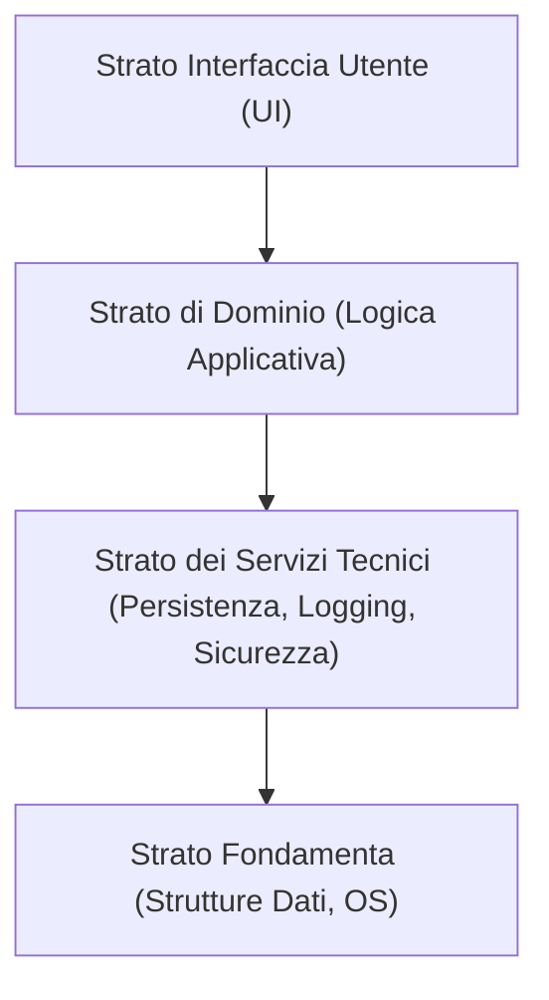

Macro-organizzazione su larga scala delle classi software in package (o namespace), sottoinsiemi e strati (**layer**).

Illustrata tipicamente tramite i **Diagrammi dei Package** di [[OOD A - UML e Pattern|UML]].

---

### Cos'è un Layer (Strato)?
Un **layer** (strato) è un gruppo coeso di classi software, package o sottosistemi che condividono una responsabilità su un aspetto rilevante del sistema.

#### Strati Tipici di un'Applicazione OO:
1. **Interfaccia Utente (UI / Presentazione)**:
   - Classi GUI, finestre, pagine web, widget, controlli interattivi.
   - Responsabile della presentazione dei dati all'utente e della cattura degli input/eventi UI.
2. **Logica Applicativa / Dominio**:
   - Classi software che gestiscono i processi e le regole di business (es. `Sale`, `Payment`, `ProductCatalog`).
   - Ispirata concettualmente al [[Modello di Dominio]].
3. **Servizi Tecnici (Technical Services)**:
   - Funzionalità generali a supporto degli strati superiori: persistenza su database, sicurezza, logging, autenticazione, gestione delle transazioni.
4. **Fondamenta (Foundation)**:
   - Strutture dati di base, librerie matematiche, wrapper del sistema operativo.

---

### Tipologie di Architettura a Strati

- **Architettura a Strati Rigida (Strict Layering)**:
  - Uno strato superiore può chiamare servizi **esclusivamente** dello strato immediatamente sottostante.
  - *Vantaggio*: massimo disaccoppiamento e manutenibilità.
  - *Svantaggio*: possibile sovraccarico di prestazioni per il passaggio a cascata di chiamate.

- **Architettura a Strati Rilassata (Relaxed Layering)**:
  - Uno strato superiore può accedere liberamente a qualsiasi strato sottostante (es. la UI può chiamare sia la Logica Applicativa sia i Servizi Tecnici di base).
  - Molto comune nella pratica dei sistemi software commerciali per ragioni di efficienza e praticità.

---

### Strato di Dominio e "Salto Rappresentazionale Ridotto"

Un oggetto software è *oggetto di dominio* se rappresenta una cosa nello spazio di dominio del problema e ha una logica applicativa o di business correlata.

Lo **Strato del Dominio** fa riferimento al [[Modello di Dominio]] per trarre ispirazione sui nomi e sulle responsabilità delle classi software.
- Nel *Modello di Dominio* (analisi concettuale): `Vendita` e `Articolo` sono concetti del mondo reale.
- Nello *Strato di Dominio* (progettazione software): `Sale` e `SalesLineItem` sono classi software con attributi e metodi.

![[Strati di Dominio.png]]

> [!NOTE]
> **Low Representational Gap (Salto Rappresentazionale Ridotto)**: riduce la distanza tra il modello concettuale del problema e l'implementazione software, facilitando la comprensione, la manutenibilità e l'estendibilità del codice.

---

### Principio di Separazione Modello-Vista (Model-View Separation)

Il principio stabilisce che:
1. **Non relazionare o accoppiare oggetti non-UI (Modello) con oggetti UI (Vista)**:
   - Il *Modello* (Strato di Dominio) non deve avere alcuna dipendenza diretta verso le classi della *Vista* (GUI).
2. **Non incapsulare la logica dell'applicazione nei metodi dell'interfaccia utente**:
   - I metodi della UI devono solo catturare gli eventi e **delegare** le richieste allo strato del dominio.
   - I messaggi inviati dalla UI al dominio corrispondono alle operazioni di sistema modellate negli [[Diagramma di Sequenza di Sistema (SSD)]].

#### Come fa il Modello ad aggiornare la Vista senza conoscerla?
Quando un oggetto di dominio cambia stato (es. il totale di una vendita aumenta), la UI deve aggiornare la schermata. Per non violare la separazione Modello-Vista:
- Si applica il pattern comportamentale **[[Pattern GoF#Observer|Observer]]** (Publish-Subscribe): la UI si registra come osservatore (*Observer*) presso gli oggetti del Dominio (*Subject*), ricevendone notifiche di aggiornamento senza che il Dominio conosca i dettagli della UI concreta.

#### Vantaggi del Principio Modello-Vista (Domanda d'Esame):
- **Sviluppo Separato**: team diversi possono lavorare contemporaneamente su UI e Dominio.
- **Minimizzazione dell'Impatto dei Cambiamenti**: cambiare framework grafico (es. passare da desktop a web) non impatta minimamente la logica di business.
- **Viste Multiple e Simultanee**: è possibile collegare più viste allo stesso modello di dominio (es. vista tabellare e vista a grafico).
- **Testabilità Autonoma**: la logica di dominio può essere testata completamente senza GUI grafica (fondamentale per i test unitari in [[Codice e Test - TDD]]).

---
#### Correlati:
- [[UP (unified process)]]
- Fase di: [[Elaborazione]]
- Ispirato dal: [[Modello di Dominio]]
- Riceve gli eventi definiti in: [[Diagramma di Sequenza di Sistema (SSD)]]
- Progettato con: [[Modellazione dinamica e statica con UML]] e [[Pattern GRASP]]
- Disaccoppiato mediante: [[Pattern GoF]] (Observer)
