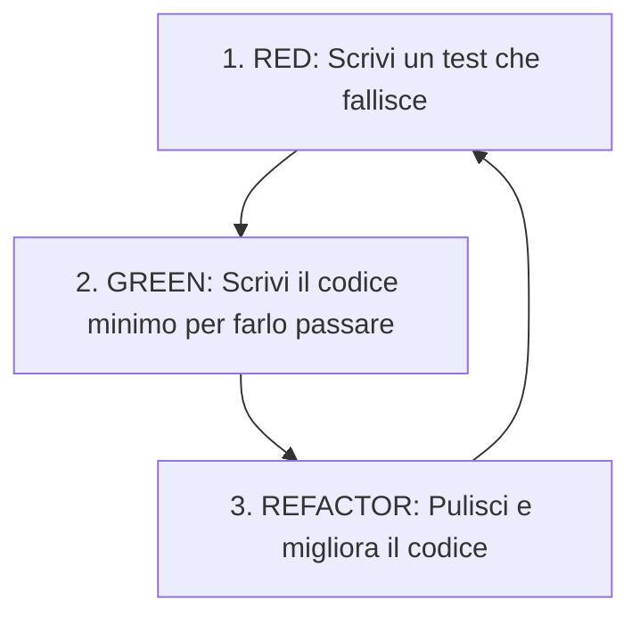

Dalla progettazione alla realizzazione software: come trasformare i diagrammi di progetto (DCD e diagrammi di interazione) in codice eseguibile e come garantire la qualità del software attraverso il **Test-Driven Development (TDD)** e il **Refactoring**.

---

### 1. Trasformare i Progetti in Codice

#### Mappatura dal Design Class Diagram (DCD) al Codice:
- **Definizione della Classe**: nome della classe e visibilità (`public class Sale { ... }`).
- **Attributi e Variabili di Istanza**: derivati dalla sezione attributi del DCD e dalle associazioni uscenti.
- **Mappatura delle Associazioni**:
  - *Molteplicità 1 a 1 (o 0..1)*: implementata come riferimento diretto a un singolo oggetto (es. `private Payment payment;`).
  - *Molteplicità 1 a Molti (1..\* o \*)*: implementata tramite strutture dati/collezioni (es. `private List<SalesLineItem> lineItems = new ArrayList<>();`).
- **Mappatura dei Metodi**:
  - La firma del metodo (nome, parametri, tipo di ritorno) deriva dal DCD.
  - Il **corpo del metodo** deriva direttamente dal corrispondente **diagramma di sequenza**: ogni messaggio inviato nel diagramma di sequenza corrisponde a un'invocazione di metodo nel codice!

---

### 2. Extreme Programming (XP) e la Pratica dei Test

Il metodo agile [[XP (extreme programing)]] ha introdotto e reso celebre la pratica dello **sviluppo preceduto dai test** (*test-first programming*).
Invece di scrivere prima il codice e poi i test (approccio che porta spesso a non scrivere affatto i test), si scrivono i test prima del codice funzionale.

#### Test-Driven Development (TDD)
Approccio iterativo in cui lo sviluppo è guidato dalla scrittura preventiva dei test unitari.

#### Il Ciclo Red-Green-Refactor:
1. **Red**: Scrivi un piccolo test unitario che fallisce (dimostrando l'assenza di una funzionalità o del codice da testare).
2. **Green**: Scrivi il codice minimo e più semplice possibile per far superare il test.
3. **Refactor**: Ristruttura e pulisci il codice (eliminando duplicazioni, migliorando coesione e nomi), verificando costantemente che tutti i test continuino a passare.

---

### 3. Tassonomia dei Test nel Software (Domanda d'Esame) ⭐

In ingegneria del software e in TDD si utilizzano diversi livelli di test:

| Tipo di Test | Scopo e Ambito di Verifica |
| :--- | :--- |
| **Test Unitari** | Verificano il funzionamento isolato delle singole unità di codice (**singole classi e metodi**). |
| **Test di Integrazione** | Verificano la comunicazione e la collaborazione tra specifiche parti o componenti cooperanti del sistema. |
| **Test End-to-End** | Verificano il collegamento complessivo tra tutti gli elementi del sistema, dall'interfaccia utente fino al database. |
| **Test di Accettazione** | Verificano il funzionamento complessivo del sistema rispetto alle specifiche e alle **aspettative del cliente/committente**. |

---

### 4. Struttura e Ciclo di Vita di un Test Unitario (xUnit / JUnit) ⭐

Ogni metodo di test unitario è logicamente composto da **quattro fasi**:

1. **Preparazione (Setup / Fixture)**:
   - Crea gli oggetti, istanzia le classi di supporto e prepara l'ambiente necessario per eseguire il test.
2. **Esecuzione**:
   - Invoca il metodo specifico sotto collaudo con gli opportuni argomenti.
3. **Verifica (Asserzioni / Assertions)**:
   - Controlla che i valori restituiti o lo stato degli oggetti corrispondano esattamente a quanto atteso (es. `assertEquals(expected, actual)`, `assertTrue(...)`).
4. **Rilascio (Teardown / Clean-up)**:
   - Opzionalmente rilascia risorse esterne (chiusura file, connessioni a database temporanei, socket) per evitare che un test sporchi l'ambiente di esecuzione dei test successivi.

---

### 5. Refactoring Continuo

Il **Refactoring** è un metodo strutturato e disciplinato per ristrutturare il codice esistente applicando **piccole trasformazioni che preservano il comportamento esterno**.

- **Obiettivo**: migliorare il design interno, eliminare il codice duplicato (*Don't Repeat Yourself - DRY*), aumentare la coesione e rendere il codice più leggibile e manutenibile.
- **Relazione Simbiotica con TDD**: il refactoring continuo è sicuro solo se accompagnato da una ricca suite di test unitari automatici; dopo ogni piccola trasformazione, i test vengono eseguiti per dimostrare all'istante che non vi sono state regressioni.

---
#### Correlati:
- Promosso da: [[XP (extreme programing)]]
- Integrato in: [[UP (unified process)]]
- Fase di: [[Elaborazione]] e Costruzione
- Derivato da: [[Modellazione dinamica e statica con UML]] (DCD e diagrammi di sequenza)
- Guidato dai principi di: [[Pattern GRASP]] e [[Pattern GoF]]
- Rispetto dell'[[Architettura Logica]] (testabilità autonoma del dominio)
