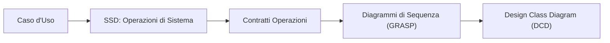
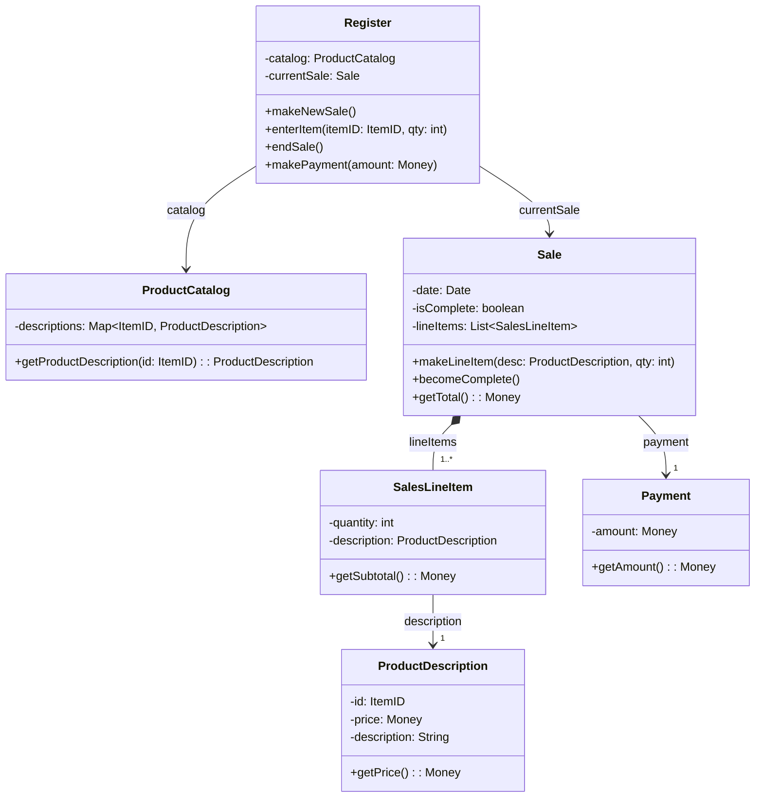

Studio del caso applicativo fondamentale del corso (**NextGen POS**) per comprendere come trasformare i requisiti ([[Requisiti & Casi d'uso]]), gli [[Diagramma di Sequenza di Sistema (SSD)]] e i [[Contratti delle Operazioni]] in progetti software concreti applicando i [[Pattern GRASP]].

---

### Il Flusso di Progettazione
1. Il caso d'uso suggerisce le **operazioni di sistema**, illustrate negli **SSD**.
2. Le operazioni di sistema sono specificate nei **Contratti delle Operazioni** tramite pre- e post-condizioni.
3. Ciascuna operazione di sistema diventa il **messaggio iniziale entrante** (messaggio trovato) in un diagramma di sequenza per lo strato del dominio.
4. Si applicano i pattern [[Pattern GRASP]] per decidere quali classi creano oggetti, quali metodi aggiungere e come gli oggetti collaborano.
5. Dal comportamento dinamico emergono i metodi e le relazioni per il **Design Class Diagram (DCD)**.

---

### Le 4 Operazioni di Sistema di "Elabora Vendita"

#### 1. `makeNewSale()`
- **Scelta del Controller**:
  - Applicando **Controller**, si assegna l'operazione a `Register` (registratore di cassa, un *Facade Controller* che rappresenta il dispositivo radice).
- **Creazione dell'istanza `Sale`**:
  - `Register` crea una nuova istanza di `Sale`.
  - *Motivazione GRASP*: pattern **Creator** (`Register` registra vendite) e **Low Coupling**.

#### 2. `enterItem(itemID, quantity)`
L'operazione più complessa: l'operatore inserisce un codice a barre e una quantità.
- **Controller**: `Register` riceve la chiamata dalla UI.
- **Ricerca della Descrizione del Prodotto**:
  - Chi deve conoscere la descrizione e il prezzo a partire dall'`itemID`?
  - Si introduce `ProductCatalog` (catalogo prodotti). In base a **Information Expert**, `ProductCatalog` possiede la mappa/archivio dei prodotti e risponde al metodo `getProductDescription(itemID)`.
- **Creazione della Riga di Vendita (`SalesLineItem`)**:
  - Chi crea `SalesLineItem`?
  - Applicando **Creator**, è `Sale` che deve creare `SalesLineItem`, perché `Sale` contiene, aggrega e gestisce la collezione di righe di vendita.
  - `Register` invoca `sale.makeLineItem(desc, quantity)`.

#### 3. `endSale()`
- **Controller**: `Register` riceve la chiamata di fine vendita.
- **Azione**: `Register` notifica l'oggetto `Sale` corrente invocando `sale.becomeComplete()`, che aggiorna lo stato interno della vendita per bloccare l'aggiunta di ulteriori articoli e calcolare il saldo finale.

#### 4. `makePayment(amount)` e Calcolo del Totale
- **Calcolo del Totale di Vendita (`getTotal()`)**:
  - Applicazione ricorsiva di **Information Expert**:
    1. `Sale` cicla sulla propria collezione di `SalesLineItem` chiedendo a ciascuno `sli.getSubtotal()`.
    2. Ciascun `SalesLineItem` calcola il subtotale invocando `desc.getPrice()` su `ProductDescription` e moltiplicando per `quantity`.
    3. `Sale` somma tutti i parziali e calcola il totale complessivo.
- **Creazione di `Payment`**:
  - `Register` crea l'istanza `Payment` associata alla vendita (`Sale`) verificando che l'importo sia sufficiente e calcolando l'eventuale resto (*change*).

---

### Sintesi nel Design Class Diagram (DCD)

Dai diagrammi di interazione scaturisce la struttura statica delle classi di progetto:

---

### Tipologie di Visibilità Riscontrate nell'Esempio
- **Visibilità per Attributo**: `Register` ha una variabile di istanza `currentSale` per ricordarsi la vendita in corso tra un'operazione di sistema e la successiva.
- **Visibilità per Parametro**: la `ProductDescription` viene passata come parametro da `Register` al metodo `makeLineItem(desc, quantity)` di `Sale`.
- **Visibilità Locale**: all'interno del metodo `makePayment(amount)`, una variabile temporanea `p = new Payment(amount)` viene creata e poi collegata a `Sale`.

---
#### Correlati:
- [[UP (unified process)]]
- Fase di: [[Elaborazione]]
- Teoria dei pattern: [[Pattern GRASP]]
- Modellazione: [[Modellazione dinamica e statica con UML]]
- Derivato da: [[Diagramma di Sequenza di Sistema (SSD)]] e [[Contratti delle Operazioni]]
- Evoluzione avanzata: [[Pattern GoF]]
- Traduzione in codice e test: [[Codice e Test - TDD]]
