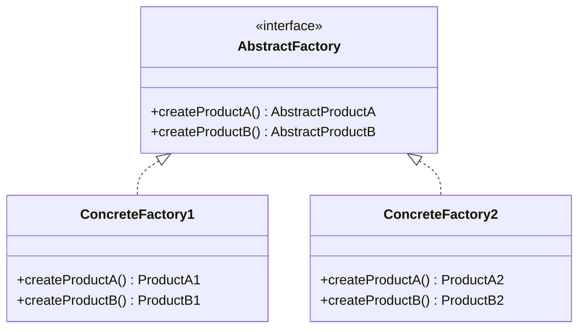
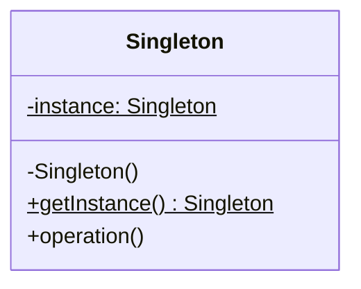
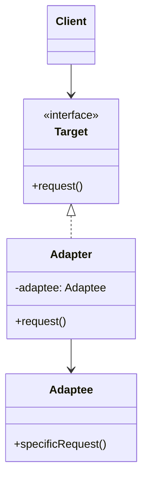
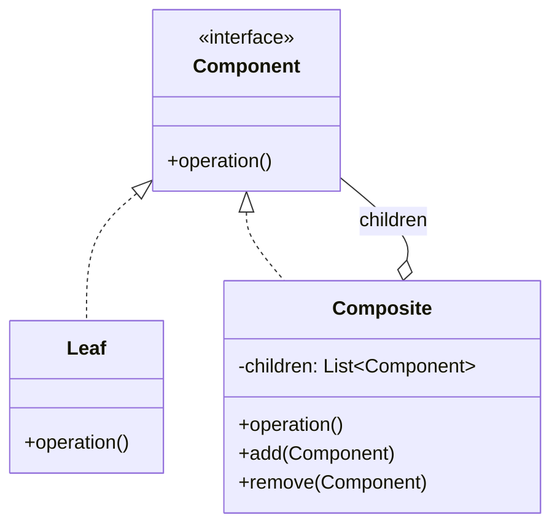
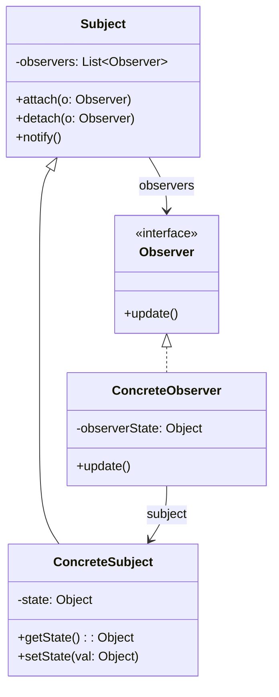

I **Design Pattern GoF** (*Gang of Four* - Erich Gamma, Richard Helm, Ralph Johnson, John Vlissides, 1994) rappresentano soluzioni progettuali collaudate e riutilizzabili a problemi ricorrenti nella progettazione software ad oggetti.

---

### Tassonomia dei Pattern GoF
I pattern GoF sono classificati in base al loro **scopo**:
1. **Creazionali**: riguardano il processo di creazione degli oggetti, disaccoppiando il sistema da come gli oggetti sono creati, composti e rappresentati.
2. **Strutturali**: riguardano la composizione di classi e oggetti per formare strutture più grandi e complesse.
3. **Comportamentali**: riguardano gli algoritmi, la comunicazione e l'assegnazione delle responsabilità tra oggetti.

---

### Pattern Creazionali

#### 1. Abstract Factory
- **Scopo**: Creazionale.
- **Problema**: Come creare famiglie di oggetti correlati o dipendenti senza specificarne le classi concrete?
- **Soluzione**: Definire un'interfaccia astratta `AbstractFactory` con metodi per creare ciascun prodotto della famiglia. I client usano l'interfaccia della factory senza dipendere dalle classi concrete dei prodotti.
- **Esempio del Corso**: Creazione di diversi servizi contabili/fiscali o famiglie di widget UI (es. `WindowsWidgetFactory` vs `MacWidgetFactory`).
- **Diagramma UML**:

---

#### 2. Singleton
- **Scopo**: Creazionale.
- **Problema**: Come garantire che una classe abbia **una sola istanza** e fornire un punto di accesso globale ad essa?
- **Soluzione**: Rendere il costruttore della classe `private`; mantenere un'istanza statica privata della classe; fornire un metodo pubblico e statico `getInstance()` che restituisce l'unica istanza.
- **Varianti**:
  - *Eager Initialization*: istanza creata al caricamento della classe.
  - *Lazy Initialization*: istanza creata solo alla prima invocazione di `getInstance()`.
  - *Double-Check Locking*: per ambienti multi-threading sicuri con lazy initialization.
- **Esempi nel Corso**: `ServicesFactory.getInstance()`, `Register.getInstance()`.
- **Diagramma UML**:

---

### Pattern Strutturali

#### 3. Adapter (Adattatore)
- **Scopo**: Strutturale.
- **Problema**: Come risolvere l'incompatibilità tra l'interfaccia richiesta da un client e l'interfaccia fornita da un componente esistente (es. libreria di terze parti)?
- **Soluzione**: Creare una classe intermedia `Adapter` che implementa l'interfaccia attesa dal client (`TargetInterface`) e traduce le chiamate nel protocollo della classe esistente (`Adaptee`).
- **Esempio nel Corso**: Servizi esterni di autorizzazione contabile o calcolo tasse (es. `SAPAdapter`, `GreatPlainsAdapter`).
- **Diagramma UML**:

---

#### 4. Composite
- **Scopo**: Strutturale.
- **Problema**: Come trattare una gerarchia di oggetti parte-tutto (struttura ad albero) in modo uniforme, senza distinguere tra oggetti singoli e composizioni di oggetti?
- **Soluzione**: Definire una classe o interfaccia comune `Component` sia per gli elementi foglia (`Leaf`) sia per i nodi contenitori (`Composite`). Il nodo `Composite` delega le operazioni ai propri figli.
- **Esempio nel Corso**: Calcolo di sconti composti o raggruppamento di prodotti e confezioni regalo.
- **Diagramma UML**:

---

#### 5. Decorator
- **Scopo**: Strutturale.
- **Problema**: Come aggiungere dinamicamente responsabilità a un oggetto senza modificare il codice della classe o creare una proliferazione ingestibile di sottoclassi per ogni combinazione?
- **Soluzione**: Incapsulare l'oggetto originale dentro un oggetto `Decorator` che implementa la stessa interfaccia del componente originale, aggiungendo il comportamento extra prima o dopo la delega.
- **Esempio**: Aggiunta di imposte, sconti personalizzati o flussi I/O in Java (`BufferedInputStream(FileInputStream)`).

---

#### 6. Facade
- **Scopo**: Strutturale.
- **Problema**: Come semplificare l'accesso a un sottosistema complesso composto da numerose classi interconnesse e ridurre l'accoppiamento verso di esso?
- **Soluzione**: Creare una classe `Facade` che fornisce un'interfaccia unica, unificata e semplificata per le operazioni più comuni del sottosistema.

---

### Pattern Comportamentali

#### 7. Observer (Publish-Subscribe) ⭐ *[Domanda d'Esame]*
- **Scopo**: Comportamentale.
- **Problema**: Come informare un insieme dinamico di oggetti dipendenti (*Observer*) che lo stato di un oggetto di interesse (*Subject*) è cambiato, mantenendo basso l'accoppiamento e senza che il Subject conosca le classi concrete degli Observer?
- **Soluzione**:
  - Definire un'interfaccia `Subject` con metodi `attach(Observer)`, `detach(Observer)` e `notify()`.
  - Definire un'interfaccia `Observer` con il metodo `update()`.
  - Il Subject concreto notifica tutti gli observer registrati invocando `update()` ogni volta che il proprio stato interno cambia.
- **Applicazione Cruciale**: È il meccanismo cardine che permette di rispettare il [[Architettura Logica#Principio di Separazione Modello-Vista|Principio di Separazione Modello-Vista]] (la GUI osserva il modello di dominio senza che il dominio dipenda dalla GUI).
- **Diagramma UML del Pattern Observer**:

---

#### 8. Strategy ⭐
- **Scopo**: Comportamentale.
- **Problema**: Come variare algoritmi o modalità di calcolo indipendentemente dai client che li utilizzano?
- **Soluzione**: Definire una famiglia di algoritmi, incapsulare ciascuno in una classe separata (`ConcreteStrategy`) che implementa un'interfaccia comune (`Strategy`), e renderli intercambiabili a runtime.
- **Esempio**: Algoritmi di sconto sulle vendite (`PercentDiscountStrategy`, `AbsoluteDiscountStrategy`).

---

#### 9. State ⭐
- **Scopo**: Comportamentale.
- **Problema**: Come permettere a un oggetto di alterare il proprio comportamento quando il suo stato interno cambia, facendo sembrare che l'oggetto abbia cambiato classe?
- **Soluzione**: Incapsulare gli stati possibili in classi separate (`ConcreteState`) derivate da un'interfaccia `State`. L'oggetto `Context` delega l'esecuzione dei metodi allo stato corrente. Quando si verifica una transizione, il riferimento allo stato corrente viene sostituito.

---

### Confronto Fondamentale d'Esame: Strategy vs State ⭐

| Caratteristica | **Strategy Pattern** | **State Pattern** |
| :--- | :--- | :--- |
| **Struttura UML** | **Sintatticamente equivalente**: un oggetto `Context` referenzia un'interfaccia polimorfica. | **Sintatticamente equivalente**: un oggetto `Context` referenzia un'interfaccia polimorfica. |
| **Intento Progettuale** | Incapsulare una **famiglia di algoritmi intercambiabili** che svolgono lo stesso compito in modi diversi. | Incapsulare il **comportamento dipendente dallo stato interno** di un oggetto che muta nel tempo. |
| **Scelta/Transizione** | L'algoritmo viene solitamente configurato o passato dal client all'inizio (o scambiato su richiesta esplicita). | Le transizioni di stato avvengono dinamicamente durante il ciclo di vita dell'oggetto, spesso guidate dagli stati stessi. |
| **Esempio Tipico** | Algoritmi di calcolo sconti, ordinamento, hashing, compressione. | Ciclo di vita di una connessione TCP (Open, Closed, Listening) o di una vendita (New, InProgress, Completed). |

---

#### 10. Visitor
- **Scopo**: Comportamentale.
- **Problema**: Come definire una nuova operazione su una struttura di elementi senza modificare le classi degli elementi su cui opera?
- **Soluzione**: Incapsulare la nuova operazione in una classe `Visitor`. Gli elementi accettano il visitatore (`accept(Visitor)`) e invocano il metodo appropriato su di esso (meccanismo del **doppio dispatch**).

---
#### Correlati:
- [[UP (unified process)]]
- Fase di: [[Elaborazione]]
- Fondamenti di assegnazione responsabilità: [[Pattern GRASP]]
- Diagrammi di sequenza e DCD: [[Modellazione dinamica e statica con UML]]
- Applicazione nell'[[Architettura Logica]] (Model-View Separation con Observer)
- Implementazione e test: [[Codice e Test - TDD]]
